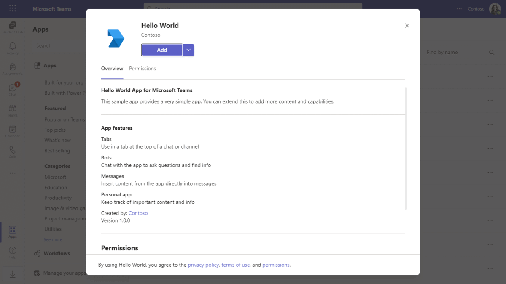
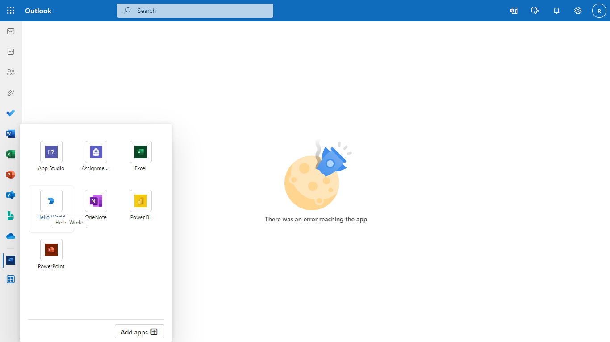
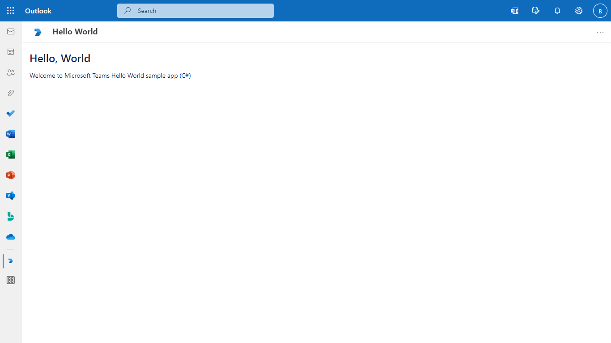
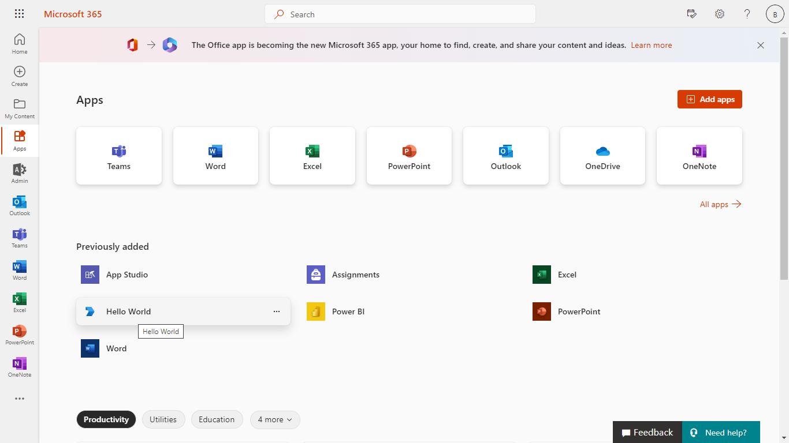
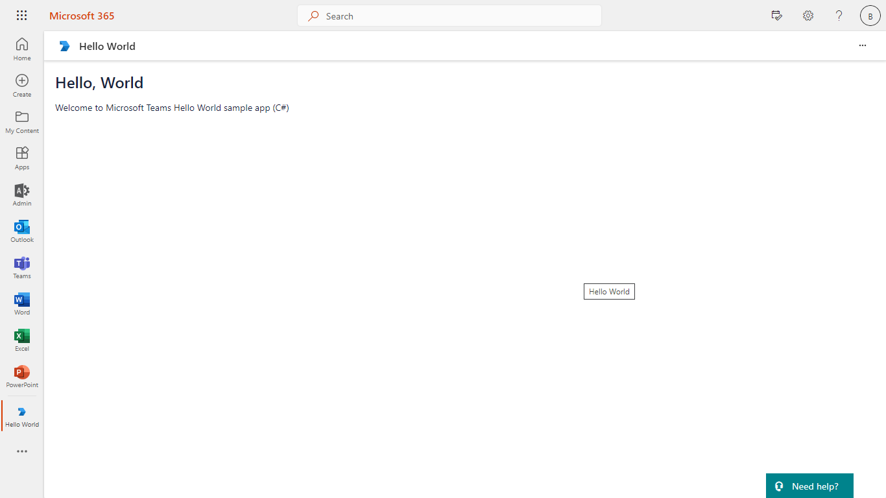

# Microsoft Teams hello world sample app.

- Microsoft Teams hello world sample app.

## Interaction with app



## Prerequisites

- [.NET Core SDK](https://dotnet.microsoft.com/download) version 6.0

  ```bash
  # determine dotnet version
  dotnet --version
  ```
- Publicly addressable https url or tunnel such as [ngrok](https://ngrok.com/) or [Tunnel Relay](https://github.com/OfficeDev/microsoft-teams-tunnelrelay)

## Setup

### 1. Setup for Bot
- Register a bot with Azure Bot Service, following the instructions [here](https://docs.microsoft.com/en-us/azure/bot-service/bot-service-quickstart-registration?view=azure-bot-service-3.0).

- Ensure that you've [enabled the Teams Channel](https://docs.microsoft.com/en-us/azure/bot-service/channel-connect-teams?view=azure-bot-service-4.0)

- While registering the bot, use `https://<your_ngrok_url>/api/messages` as the messaging endpoint.
    > NOTE: When you create your bot you will create an App ID and App password - make sure you keep these for later.

### 2. Setup NGROK
1) Run ngrok - point to port 5000

    ```bash
    # ngrok http -host-header=rewrite 5000
    ```
### 3. Setup for code
- Clone the repository

    ```bash
    git clone https://github.com/OfficeDev/Microsoft-Teams-Samples.git
    ```
 Run the bot from a terminal or from Visual Studio:

  A) From a terminal, navigate to `Microsoft.Teams.Samples.HelloWorld.Web`

  ```bash
  # run the bot
  dotnet run
  ```

  B) Or from Visual Studio

  - Launch Visual Studio
  - File -> Open -> Project/Solution
  - Navigate to `Microsoft.Teams.Samples.HelloWorld.Web` folder
  - Select `Microsoft.Teams.Samples.HelloWorld.Web.csproj` file
  - Press `F5` to run the project   


### 4. Setup Manifest for Teams

- **This step is specific to Teams.**

1) Modify the `manifest.json` in the `/Manifest` folder and replace the following details:
  - `{{Microsoft-App-Id}}` with Application id generated from Step 1
  - `{{domain-name}}` with base Url domain. E.g. if you are using ngrok it would be `1234.ngrok.io`

  **Note:** If you want to test your app across multi hub like: Outlook/Office.com, please update the `manifest.json` in the `/Manifest_Hub` folder with the required values.

2) Zip the contents of `Manifest` or `Manifest_Hub` folder into a `manifest.zip`.

3) Modify the `/appsettings.json` and fill in the following details:
  - `{{Microsoft-App-Id}}` - Generated from Step 1 is the application app id
  - `{{ Microsoft-App-Password}}` - Generated from Step 1, also referred to as Client secret
  - `{{ Application Base Url }}` - Your application's base url. E.g. https://12345.ngrok.io if you are using ngrok.
  
5) Upload the manifest.zip to Teams (in the Apps view click "Upload a custom app")
   - Go to Microsoft Teams. From the lower left corner, select Apps
   - From the lower left corner, choose Upload a custom App
   - Go to your project directory, the ./Manifest folder, select the zip folder, and choose Open.
   - Select Add in the pop-up dialog box. Your app is uploaded to Teams.

**Note**: If you are facing any issue in your app, please uncomment [this](https://github.com/OfficeDev/Microsoft-Teams-Samples/blob/main/samples/app-hello-world/csharp/Microsoft.Teams.Samples.HelloWorld.Web/AdapterWithErrorHandler.cs#L24) line and put your debugger for local debug.

## Running the sample

**Install App:**


**Welcome UI:**


## Outlook on the web

- To view your app in Outlook on the web.

- Go to [Outlook on the web](https://outlook.office.com/mail/)and sign in using your dev tenant account.

**On the side bar, select More Apps. Your sideloaded app title appears among your installed apps**



**Select your app icon to launch and preview your app running in Outlook on the web**



**Note:** Similarly, you can test your application in the Outlook desktop app as well.

## Office on the web

- To preview your app running in Office on the web.

- Log into office.com with test tenant credentials

**Select the Apps icon on the side bar. Your sideloaded app title appears among your installed apps**



**Select your app icon to launch your app in Office on the web**

 

**Note:** Similarly, you can test your application in the Office 365 desktop app as well.

## Deploy the bot to Azure

To learn more about deploying a bot to Azure, see [Deploy your bot to Azure](https://aka.ms/azuredeployment) for a complete list of deployment instructions.

## Further reading

- [Bot Framework Documentation](https://docs.botframework.com)
- [Bot Basics](https://docs.microsoft.com/azure/bot-service/bot-builder-basics?view=azure-bot-service-4.0)
- [Azure Portal](https://portal.azure.com)
- [Add Authentication to Your Bot Via Azure Bot Service](https://docs.microsoft.com/en-us/azure/bot-service/bot-builder-authentication?view=azure-bot-service-4.0&tabs=csharp)
- [Activity processing](https://docs.microsoft.com/en-us/azure/bot-service/bot-builder-concept-activity-processing?view=azure-bot-service-4.0)
- [Azure Bot Service Introduction](https://docs.microsoft.com/azure/bot-service/bot-service-overview-introduction?view=azure-bot-service-4.0)
- [Azure Bot Service Documentation](https://docs.microsoft.com/azure/bot-service/?view=azure-bot-service-4.0)
- [.NET Core CLI tools](https://docs.microsoft.com/en-us/dotnet/core/tools/?tabs=netcore2x)
- [Azure CLI](https://docs.microsoft.com/cli/azure/?view=azure-cli-latest)
- [Azure Portal](https://portal.azure.com)
- [Language Understanding using LUIS](https://docs.microsoft.com/en-us/azure/cognitive-services/luis/)
- [Channels and Bot Connector Service](https://docs.microsoft.com/en-us/azure/bot-service/bot-concepts?view=azure-bot-service-4.0)
- [Microsoft Teams Developer Platform](https://docs.microsoft.com/en-us/microsoftteams/platform/)
- [Extend Teams apps across Microsoft 365](https://learn.microsoft.com/en-us/microsoftteams/platform/m365-apps/overview)