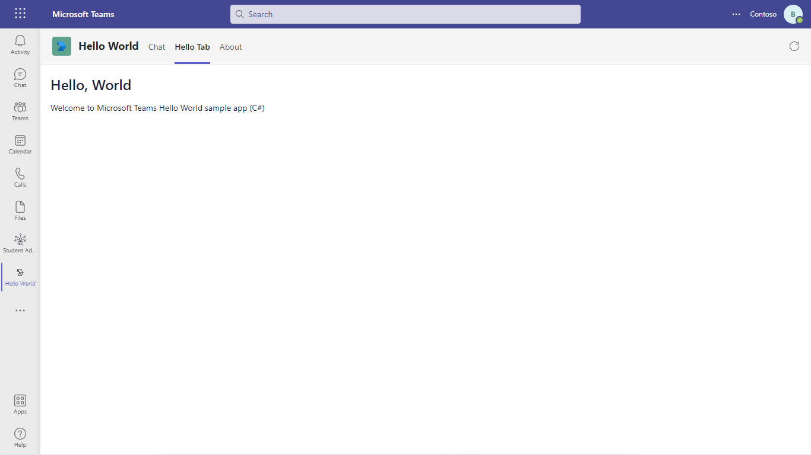

# Microsoft Teams hello world sample app.

## Interaction with app



## Prerequisites

- Microsoft Teams is installed and you have an account (not a guest account)
- To test locally, [NodeJS](https://nodejs.org/en/download/) must be installed on your development machine (version 16.14.2  or higher)
- [ngrok](https://ngrok.com/) or equivalent tunneling solution
- [M365 developer account](https://docs.microsoft.com/en-us/microsoftteams/platform/concepts/build-and-test/prepare-your-o365-tenant) or access to a Teams account with the 

## Setup
1. Register a new application in the [Azure Active Directory – App Registrations](https://go.microsoft.com/fwlink/?linkid=2083908) portal.

2. Create a Bot Registration
   In Azure portal, create a [Bot Framework registration resource](https://docs.microsoft.com/en-us/azure/bot-service/bot-builder-authentication?view=azure-bot-service-4.0&tabs=csharp%2Caadv2).
   - Ensure that you've [enabled the Teams Channel](https://docs.microsoft.com/en-us/azure/bot-service/channel-connect-teams?view=azure-bot-service-4.0)
   - While registering the bot, use `https://<your_ngrok_url>/api/messages` as the messaging endpoint.

  **NOTE:** When you create your bot you will create an App ID and App password - make sure you keep these for later.
   
3. Run ngrok - point to port 3978

    ```bash
    # ngrok http -host-header=rewrite 3978
    ```
4. Setup for code

- Clone the repository

    ```bash
    git clone https://github.com/OfficeDev/Microsoft-Teams-Samples.git
    ```

 Modify the `/appsettings.json` and fill in the following details:
  - `{{MicrosoftAppId}}` - Generated from Step 1 is the application app id
  - `{{ MicrosoftAppPassword}}` - Generated from Step 1, also referred to as Client secret
  
- Run the bot from a terminal or from Visual Studio, choose option A or B.
 
   A) From a terminal
     ```bash
     # run the bot
     dotnet run
     ```

   B) Or from Visual Studio
     - Launch Visual Studio
     - File -> Open -> Project/Solution
     - Navigate to `Microsoft.Teams.Samples.HelloWorld.Web` folder
     - Select `Microsoft.Teams.Samples.HelloWorld.Web.csproj` file
     - Press `F5` to run the project 
     
5.  Setup Manifest for Teams
- __*This step is specific to Teams.*__
    - **Edit** the `manifest.json` contained in the ./Manifest folder to replace your Microsoft App Id (that was created when you registered your app registration earlier) *everywhere* you see the place holder string `{{Microsoft-App-Id}}` (depending on the scenario the Microsoft App Id may occur multiple times in the `manifest.json`)
    - **Edit** the `manifest.json` for `validDomains` and replace `{{domain-name}}` with base Url of your domain. E.g. if you are using ngrok it would be `https://1234.ngrok.io` then your domain-name will be `1234.ngrok.io`.
    - **Zip** up the contents of the `Manifest` folder to create a `manifest.zip` (Make sure that zip file does not contains any subfolder otherwise you will get error while uploading your .zip package)

- Upload the manifest.zip to Teams (in the Apps view click "Upload a custom app")
   - Go to Microsoft Teams. From the lower left corner, select Apps
   - From the lower left corner, choose Upload a custom App
   - Go to your project directory, the ./Manifest folder, select the zip folder, and choose Open.
   - Select Add in the pop-up dialog box. Your app is uploaded to Teams.

## Deploy the bot to Azure

To learn more about deploying a bot to Azure, see [Deploy your bot to Azure](https://aka.ms/azuredeployment) for a complete list of deployment instructions.

## Further reading

- [Bot Framework Documentation](https://docs.botframework.com)
- [Bot Basics](https://docs.microsoft.com/azure/bot-service/bot-builder-basics?view=azure-bot-service-4.0)
- [Azure Portal](https://portal.azure.com)
- [Add Authentication to Your Bot Via Azure Bot Service](https://docs.microsoft.com/en-us/azure/bot-service/bot-builder-authentication?view=azure-bot-service-4.0&tabs=csharp)
- [Activity processing](https://docs.microsoft.com/en-us/azure/bot-service/bot-builder-concept-activity-processing?view=azure-bot-service-4.0)
- [Azure Bot Service Introduction](https://docs.microsoft.com/azure/bot-service/bot-service-overview-introduction?view=azure-bot-service-4.0)
- [Azure Bot Service Documentation](https://docs.microsoft.com/azure/bot-service/?view=azure-bot-service-4.0)
- [.NET Core CLI tools](https://docs.microsoft.com/en-us/dotnet/core/tools/?tabs=netcore2x)
- [Azure CLI](https://docs.microsoft.com/cli/azure/?view=azure-cli-latest)
- [Azure Portal](https://portal.azure.com)
- [Language Understanding using LUIS](https://docs.microsoft.com/en-us/azure/cognitive-services/luis/)
- [Channels and Bot Connector Service](https://docs.microsoft.com/en-us/azure/bot-service/bot-concepts?view=azure-bot-service-4.0)
- [Microsoft Teams Developer Platform](https://docs.microsoft.com/en-us/microsoftteams/platform/)
