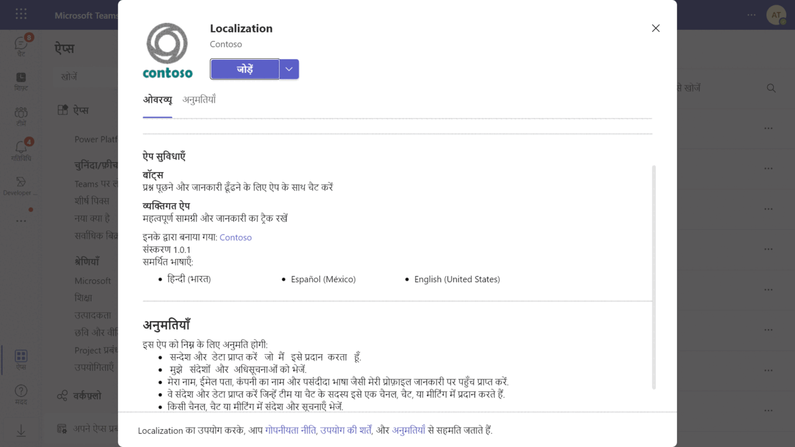
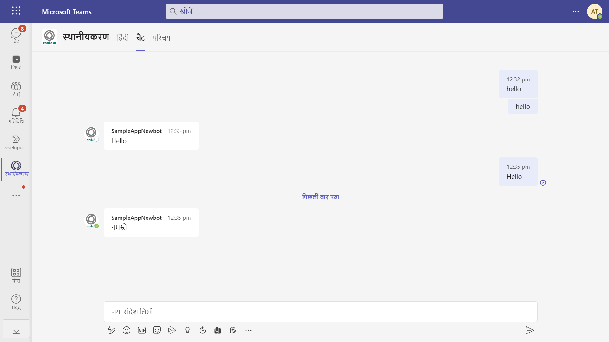

# Teams App Localization
This sample illustrates how to implement [Localization for Microsoft Teams apps](https://docs.microsoft.com/en-us/microsoftteams/platform/concepts/build-and-test/apps-localization).

## Interaction with app.



## Prerequisites

Verify you have the right account for building Teams apps and install some recommended development tools.

- You need a Teams account that allows [custom app sideloading](https://docs.microsoft.com/en-us/microsoftteams/platform/build-your-first-app/build-first-app-overview#set-up-your-development-account).
- [.NET Core SDK](https://dotnet.microsoft.com/download) version 6.0
- [ngrok](https://ngrok.com/download) or equivalent tunnelling solution

## Setup
1. Register a new application in the [Azure Active Directory – App Registrations](https://go.microsoft.com/fwlink/?linkid=2083908) portal.

2. Setup for Bot
	
	- Also, register a bot with Azure Bot Service, following the instructions [here](https://docs.microsoft.com/en-us/azure/bot-service/bot-service-quickstart-               registration?view=azure-bot-service-3.0).
	- Ensure that you've [enabled the Teams Channel](https://docs.microsoft.com/en-us/azure/bot-service/channel-connect-teams?view=azure-bot-service-4.0)
	- While registering the bot, use `https://<your_ngrok_url>/api/messages` as the messaging endpoint.

    > NOTE: When you create your app registration, you will create an App ID and App password - make sure you keep these for later.

3. Setup NGROK
      - Run ngrok - point to port 3978

	```bash
	ngrok http -host-header=rewrite 3978
	```   
4. Setup for code

  - Clone the repository

    ```bash
    git clone https://github.com/OfficeDev/Microsoft-Teams-Samples.git
    ```
  - Modify the `/appsettings.json` and fill in the following details:
  - `{{MicrosoftAppId}}` - Generated from Step 1 while doing AAd app registration in Azure portal.
  - `{{ClientSecret}}` - Generated from Step 1, also referred to as Client secret 

- Run the bot from a terminal or from Visual Studio:

5. If you are using Visual Studio
  - Launch Visual Studio
  - File -> Open -> Project/Solution
  - Navigate to `app-localization\csharp` folder
  - Select `Localization.csproj` file

6. This step is related to Microsoft Teams app manifest
    - **Edit** the `manifest.json` contained in the `Manifest` folder to replace your Microsoft App Id (that was created when you registered your bot earlier) *everywhere* you see the place holder string `<<YOUR-MICROSOFT-APP-ID>>` and <<Azure Bot ID>> and for the contentUrl "<<1234.ngrok.io>>?culture={locale}" (depending on the scenario the Microsoft App Id may occur multiple times in the `manifest.json`)
    - **Provide ngrok Url** (turnnelling Url) in `manifest.json` for contentUrl in case of tabs and for messaging endpoint in case of bots if enabled. 
    - **Zip** up the contents of the `teamsAppManifest` folder to create a `manifest.zip`
    - **Upload** the `manifest.zip` to Teams (in the Apps view click "Upload a custom app")

# Running the sample

In Teams, Once the app is successfully installed, you can interact with tab and bot in your preferred language.

#### To change language in Teams
To change the language in Microsoft Teams, please click your profile picture at the top of the app, then select Settings -> General and go to the Language section. Choose the preferred language and restart to apply the change. This sample supports en-US, fr-CA, hi-IN and es-MX.
1. **Installation**: You should see your app installation screen content in selected language. 


1. **Bot**: send any message to see localized 

1. **Tab**: click on tab to see localized info.  


#### To Add more languages for localization in Teams through Code.
 
 Add Resource files for the respective languages, Check culture fallback behaviour and how to add other cultures refer [Globalization and localization Fundamentals](https://docs.microsoft.com/en-us/aspnet/core/fundamentals/localization?view=aspnetcore-5.0). 


  

