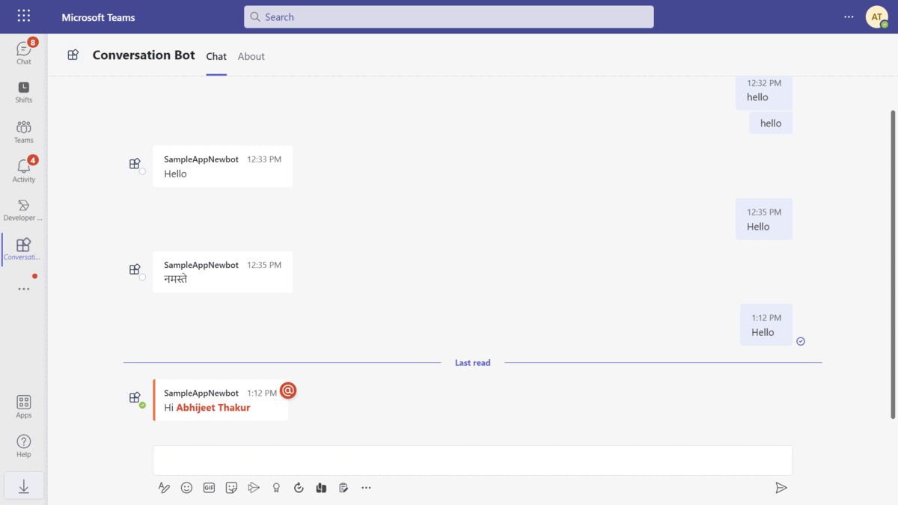

# Bots/Messaging Extension

*Bots* allow users to interact with your web service through text, interactive cards, and task modules. *Messaging extensions* allow users to interact with your web service through buttons and forms in the Microsoft Teams client. They can search, or initiate actions, in an external system from the compose message area, the command box, or directly from a message.

## Included Features
* Bots
* Adaptive Cards
* Teams Conversation Events

## Interaction with app



## Prerequisites

**Dependencies**
-  [NodeJS](https://nodejs.org/en/)
-  [ngrok](https://ngrok.com/download) or equivalent tunneling solution
-  [M365 developer account](https://docs.microsoft.com/en-us/microsoftteams/platform/concepts/build-and-test/prepare-your-o365-tenant) or access to a Teams account with the appropriate permissions to install an app.

## Setup

1. Register a new application in the [Azure Active Directory – App Registrations](https://go.microsoft.com/fwlink/?linkid=2083908) portal.
   
2. Setup for Bot
   In Azure portal, create a [Bot Framework registration resource](https://docs.microsoft.com/en-us/azure/bot-service/bot-builder-authentication?view=azure-bot-service-4.0&tabs=csharp%2Caadv2).
   - Ensure that you've [enabled the Teams Channel](https://docs.microsoft.com/en-us/azure/bot-service/channel-connect-teams?view=azure-bot-service-4.0)
   - For the Messaging endpoint URL, use the current `https` URL you were given by running ngrok and append it with the path `/api/messages`. It should like something work `https://{subdomain}.ngrok-free.app/api/messages`. 

  **NOTE:** When you create your bot you will create an App ID and App password - make sure you keep these for later.

- Click on the `Bots` menu item from the toolkit and select the bot you are using for this project.  Update the messaging endpoint and press enter to save the value in the Bot Framework.

- Ensure that you've [enabled the Teams Channel](https://docs.microsoft.com/en-us/azure/bot-service/channel-connect-teams?view=azure-bot-service-4.0)

3. Setup NGROK
      - Run ngrok - point to port 3978

	```bash
	 ngrok http 3978 --host-header="localhost:3978"
	```   
4. Setup for code

  - Clone the repository

    ```bash
    git clone https://github.com/OfficeDev/Microsoft-Teams-Samples.git
    
   - In a terminal, navigate to `samples/bot-conversation-quickstart/js`
   
  -  Build
  
     `npm install`
     
   - Run your app 
    
      `npm start`

5. Update the `.env` configuration for the bot to use the `BotId` and `BotPassword` (Note the BotId is the AppId created in step 1 (Setup for Bot), the BotPassword is referred to as the "client secret" in step 1 (Setup for Bot) and you can always create a new client secret anytime.)


6. Setup Manifest for Teams

- **This step is specific to Teams.**
    - Edit the `manifest.json` contained in the `appPackage/` folder to replace with your MicrosoftAppId (that was created in step1.1 and is the same value of MicrosoftAppId in `.env` file) *everywhere* you see the place holder string `{MicrosoftAppId}` (depending on the scenario the Microsoft App Id may occur multiple times in the `manifest.json`)
    - Zip up the contents of the `appPackage/` folder to create a `manifest.zip`
    - Upload the `manifest.zip` to Teams (in the left-bottom *Apps* view, click "Upload a custom app")

**Note**: If you are facing any issue in your app, please uncomment [this](https://github.com/OfficeDev/Microsoft-Teams-Samples/blob/main/samples/bot-conversation-quickstart/js/index.js#L43) line and put your debugger for local debug.

## Running the sample


## Deploy to Teams (Visual Studio Toolkit Only)
Start debugging the project by hitting the `F5` key or click the debug icon in Visual Studio Code and click the `Start Debugging` green arrow button.


