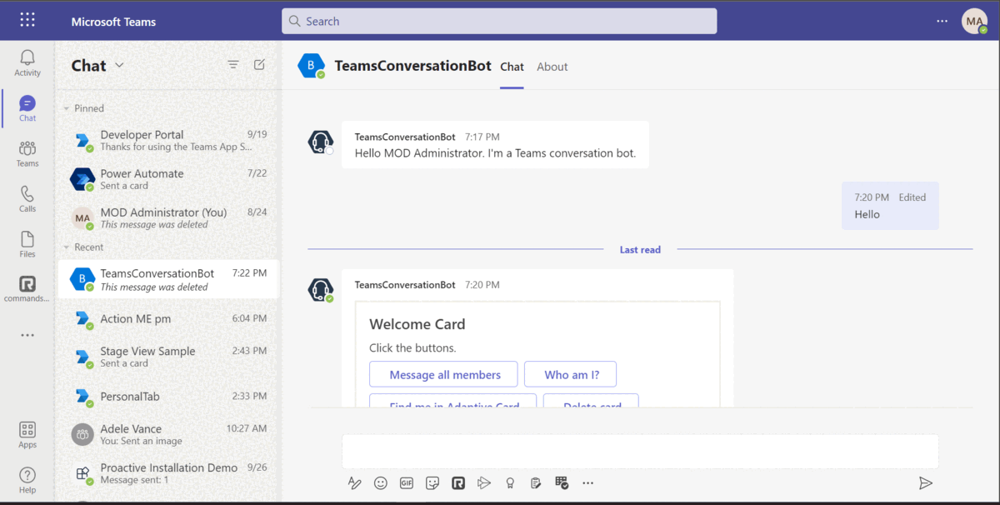
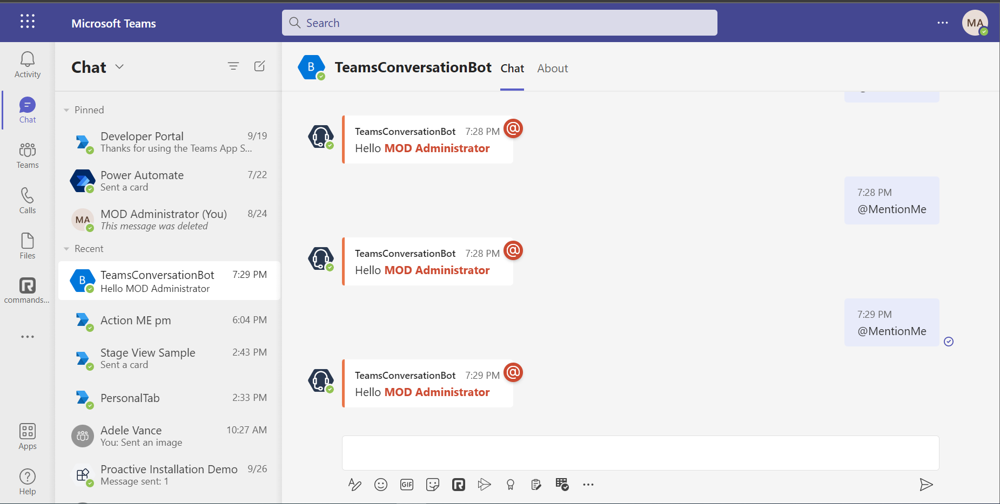

---
page_type: sample
description: This sample app demonstrate is how to incorporate basic conversational flow into a Teams application.
products:
- office-teams
- office
- office-365
languages:
- java
extensions:
 contentType: samples
 createdDate: "12-12-2019 13:38:25"
urlFragment: officedev-microsoft-teams-samples-bot-conversation-java

---

# Teams Conversation Bot

Bot Framework v4 Conversation Bot sample for Teams.

This bot has been created using [Bot Framework](https://dev.botframework.com). This sample shows
how to incorporate basic conversational flow into a Teams application. It also illustrates a few of the Teams specific calls you can make from your bot.

This sample is a Spring Boot app and uses the Azure CLI and azure-webapp Maven plugin to deploy to Azure.

## Prerequisites

- Java 1.8+
- Install [Maven](https://maven.apache.org/)
- An account on [Azure](https://azure.microsoft.com) if you want to deploy to Azure.
- Microsoft Teams is installed and you have an account
- [ngrok](https://ngrok.com/) or equivalent tunnelling solution

## Concepts introduced in this sample


## To try this sample

> Note these instructions are for running the sample on your local machine, the tunnelling solution is required because
the Teams service needs to call into the bot.

-  Run ngrok http -host-header=rewrite 3978

- Create [Bot Framework registration resource](https://docs.microsoft.com/en-us/azure/bot-service/bot-service-quickstart-registration) in Azure
    - Use the current `https` URL you were given by running ngrok. Append with the path `/api/messages` used by this sample
    - Ensure that you've [enabled the Teams Channel](https://docs.microsoft.com/en-us/azure/bot-service/channel-connect-teams?view=azure-bot-service-4.0)
    - __*If you don't have an Azure account*__ you can use this [Bot Framework registration](https://docs.microsoft.com/en-us/microsoftteams/platform/bots/how-to/create-a-bot-for-teams#register-your-web-service-with-the-bot-framework)

- Update the `resources/application.properties` configuration for the bot to use the Microsoft App Id and App Password from the Bot Framework registration. (Note the App Password is referred to as the "client secret" in the azure portal and you can always create a new client secret anytime.)

- __*This step is specific to Teams.*__
    - **Edit** the `manifest.json` contained in the  `teamsAppManifest` folder to replace your Microsoft App Id (that was created when you registered your bot earlier) *everywhere* you see the place holder string `<<YOUR-MICROSOFT-APP-ID>>` (depending on the scenario the Microsoft App Id may occur multiple times in the `manifest.json`)
    - **Zip** up the contents of the `teamsAppManifest` folder to create a `manifest.zip`
    - **Upload** the `manifest.zip` to Teams (in the Apps view click "Upload a custom app")

- From the root of this project folder:
    - Build the sample using `mvn package`
    - Unless done previously, install the packages in the local cache by using `mvn install`
    - Run it by using `java -jar .\target\bot-teams-conversation-sample.jar`


## Interacting with the bot

You can interact with this bot by sending it a message, or selecting a command from the command list. The bot will respond to the following strings. 

1. **Show Welcome**
    
  - **Result:** The bot will send the welcome card for you to interact with
  - **Valid Scopes:** personal, group chat, team chat

2. **MentionMe**
    
  - **Result:** The bot will respond to the message and mention the user
  - **Valid Scopes:** personal, group chat, team chat

3. **MessageAllMembers**
    
  - **Result:** The bot will send a 1-on-1 message to each member in the current conversation (aka on the conversation's roster).
  - **Valid Scopes:** personal, group chat, team chat

You can select an option from the command list by typing ```@TeamsConversationBot``` into the compose message area and ```What can I do?``` text above the compose area.

### Avoiding Permission-Related Errors

You may encounter permission-related errors when sending a proactive message. This can often be mitigated by using `MicrosoftAppCredentials.TrustServiceUrl()`. See [the documentation](https://docs.microsoft.com/en-us/azure/bot-service/bot-builder-howto-proactive-message?view=azure-bot-service-4.0&tabs=csharp#avoiding-401-unauthorized-errors) for more information.

## Deploy the bot to Azure

To learn more about deploying a bot to Azure, see [Deploy your bot to Azure](https://aka.ms/azuredeployment) for a complete list of deployment instructions.
## Further reading

- [Spring Boot](https://spring.io/projects/spring-boot)
- [Maven Plugin for Azure App Service](https://github.com/microsoft/azure-maven-plugins/tree/develop/azure-webapp-maven-plugin)
- [How Microsoft Teams bots work](https://docs.microsoft.com/en-us/azure/bot-service/bot-builder-basics-teams?view=azure-bot-service-4.0&tabs=javascript)
- [Azure for Java cloud developers](https://docs.microsoft.com/en-us/azure/java/?view=azure-java-stable)
