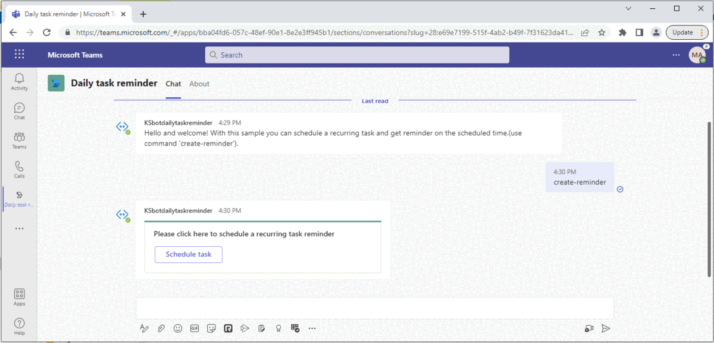

# Bot daily task reminder

This sample shows a feature where user can schedule a recurring task and get the reminder at scheduled time using bot.

## Included Features
* Bots
* Adaptive Cards
* Task Modules
* Quartz Scheduler (for scheduling)

## Interaction with app



## Try it yourself - experience the App in your Microsoft Teams client
Please find below demo manifest which is deployed on Microsoft Azure and you can try it yourself by uploading the app package (.zip file link below) to your teams and/or as a personal app. (Sideloading must be enabled for your tenant, [see steps here](https://docs.microsoft.com/microsoftteams/platform/concepts/build-and-test/prepare-your-o365-tenant#enable-custom-teams-apps-and-turn-on-custom-app-uploading)).

**Bot daily task reminder:** [Manifest](/samples/bot-daily-task-reminder/csharp/demo-manifest/Bot-Daily-Task-Reminder.zip)

## Prerequisites

- [.NET Core SDK](https://dotnet.microsoft.com/download) version 6.0

  determine dotnet version
  ```bash
  dotnet --version
  ```
- [Ngrok](https://ngrok.com/download) (For local environment testing) Latest (any other tunneling software can also be used)

- [Teams](https://teams.microsoft.com) Microsoft Teams is installed and you have an account

## Setup

1. Register a new application in the [Azure Active Directory – App Registrations](https://go.microsoft.com/fwlink/?linkid=2083908) portal.

2. Setup for Bot
  - Also, register a bot with Azure Bot Service, following the instructions [here](https://docs.microsoft.com/azure/bot-service/bot-service-quickstart-registration?view=azure-bot-service-3.0).
	- Ensure that you've [enabled the Teams Channel](https://docs.microsoft.com/azure/bot-service/channel-connect-teams?view=azure-bot-service-4.0)
	- While registering the bot, use `https://<your_ngrok_url>/api/messages` as the messaging endpoint.

3. Run ngrok - point to port 3978

    ```bash
    # ngrok http --host-header=rewrite 3978
    ```

4. Setup for code
   - Clone the repository
     ```bash
     git clone https://github.com/OfficeDev/Microsoft-Teams-Samples.git
     ```
   - Launch Visual Studio
      - File -> Open -> Project/Solution
      - Navigate to folder where repository is cloned then `samples/bot-daily-task-reminder/csharp/BotDailyTaskReminder.sln`

   - Modify the `appsettings.json` and fill in the following details:
      - `{{Microsoft-App-Id}}` - Generated from Step 1 is the application app id
      - `{{ Microsoft-App-Password}}` - Generated from Step 1, also referred to as Client secret
      - `{{ Application Base Url }}` - Your application's base url. E.g. https://12345.ngrok.io if you are using ngrok.
      - Press `F5` to run the project

5. Setup Manifest for Teams
   - __*This step is specific to Teams.*__
      - **Edit** the `manifest.json` contained in the ./AppPackage folder to replace your Microsoft App Id (that was created when you registered your app registration earlier) *everywhere* you see the place holder string `{{Microsoft-App-Id}}` (depending on the scenario the Microsoft App Id may occur multiple times in the `manifest.json`)
      - **Edit** the `manifest.json` for `validDomains` and replace `{{domain-name}}` with base Url of your domain. E.g. if you are using ngrok it would be `https://1234.ngrok.io` then your domain-name will be `1234.ngrok.io`.
      - **Zip** up the contents of the `AppPackage` folder to create a `manifest.zip` (Make sure that zip file does not contains any subfolder otherwise you will get error while uploading your .zip package)

   - Upload the manifest.zip to Teams (in the Apps view click "Upload a custom app")
      - Go to Microsoft Teams. From the lower left corner, select Apps
      - From the lower left corner, choose Upload a custom App
      - Go to your project directory, the ./AppPackage folder, select the zip folder, and choose Open.
      - Select Add in the pop-up dialog box. Your app is uploaded to Teams.

**Note**: If you are facing any issue in your app, please uncomment [this](https://github.com/OfficeDev/Microsoft-Teams-Samples/blob/main/samples/bot-daily-task-reminder/csharp/BotDailyTaskReminder/AdapterWithErrorHandler.cs#L30) line and put your debugger for local debug.

## Running the sample

- Use command `create-reminder` to get card with action `Schedule task`.

  

- Task module to add task details.

  

- User will get a task reminder card at scheduled time.

  


## Deploy the bot to Azure

To learn more about deploying a bot to Azure, see [Deploy your bot to Azure](https://aka.ms/azuredeployment) for a complete list of deployment instructions.

## Further reading

- [Bot Framework Documentation](https://docs.botframework.com)
- [Bot Basics](https://docs.microsoft.com/azure/bot-service/bot-builder-basics?view=azure-bot-service-4.0)
- [Activity processing](https://docs.microsoft.com/azure/bot-service/bot-builder-concept-activity-processing?view=azure-bot-service-4.0)
- [Azure Bot Service Introduction](https://docs.microsoft.com/azure/bot-service/bot-service-overview-introduction?view=azure-bot-service-4.0)
- [Azure Bot Service Documentation](https://docs.microsoft.com/azure/bot-service/?view=azure-bot-service-4.0)

