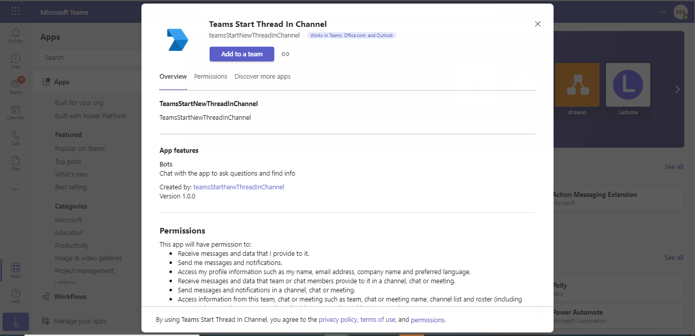
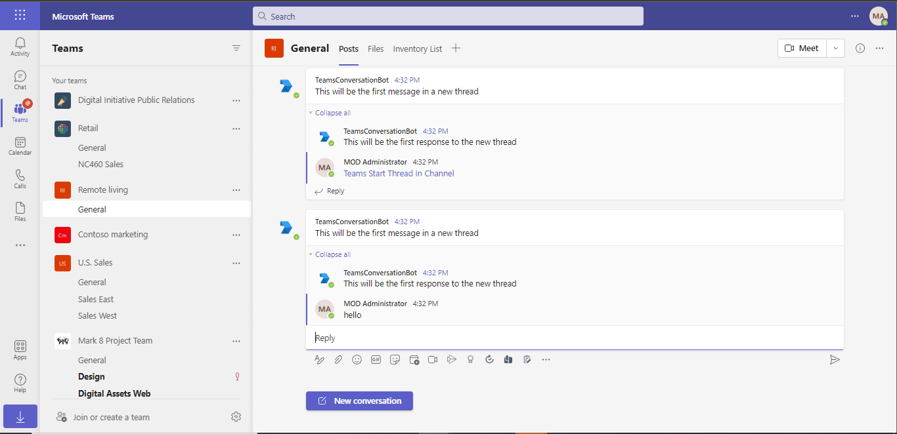

# Teams Starting Thread In Team

Bot Framework v4 Conversation Bot sample for Teams.

This bot has been created using [Bot Framework](https://dev.botframework.com). This sample shows
how to incorporate basic conversational flow into a Teams application. It also illustrates a few of the Teams specific calls you can make from your bot.

## Prerequisites

- Microsoft Teams is installed and you have an account
- [Python SDK](https://www.python.org/downloads/) min version 3.6
- [ngrok](https://ngrok.com/) or equivalent tunnelling solution

## Included Features
* Bots
* Adaptive Cards
* Initiate thread in Teams Channel

## Interaction with bot


## Try it yourself - experience the App in your Microsoft Teams client
Please find below demo manifest which is deployed on Microsoft Azure and you can try it yourself by uploading the app package (.zip file link below) to your teams and/or as a personal app. (Sideloading must be enabled for your tenant, [see steps here](https://docs.microsoft.com/microsoftteams/platform/concepts/build-and-test/prepare-your-o365-tenant#enable-custom-teams-apps-and-turn-on-custom-app-uploading)).

**Start Thread In A Specific Channel of a Team:** [Manifest](/samples/bot-initiate-thread-in-channel/csharp/demo-manifest/bot-initiate-thread-in-channel.zip)

## To try this sample

> Note these instructions are for running the sample on your local machine, the tunnelling solution is required because
the Teams service needs to call into the bot.

1) Clone the repository

    ```bash
    git clone https://github.com/OfficeDev/Microsoft-Teams-Samples.git
    ```

1) Run ngrok - point to port 3978

    ```bash
    ngrok http --host-header=rewrite 3978
    ```

1) Create [Bot Framework registration resource](https://docs.microsoft.com/azure/bot-service/bot-service-quickstart-registration) in Azure
    - Use the current `https` URL you were given by running ngrok. Append with the path `/api/messages` used by this sample
    - Ensure that you've [enabled the Teams Channel](https://docs.microsoft.com/azure/bot-service/channel-connect-teams?view=azure-bot-service-4.0)
    - __*If you don't have an Azure account*__ you can use this [Bot Framework registration](https://docs.microsoft.com/microsoftteams/platform/bots/how-to/create-a-bot-for-teams#register-your-web-service-with-the-bot-framework)

1) In a terminal, go to `samples\python\58.teams-start-thread-in-channel`

1) Activate your desired virtual environment

1) Install dependencies by running ```pip install -r requirements.txt``` in the project folder.

1) Update the `config.py` configuration for the bot to use the Microsoft App Id and App Password from the Bot Framework registration. (Note the App Password is referred to as the "client secret" in the azure portal and you can always create a new client secret anytime.)

1) __*This step is specific to Teams.*__
    - **Edit** the `manifest.json` contained in the `teamsAppManifest` folder to replace your Microsoft App Id (that was created when you registered your bot earlier) *everywhere* you see the place holder string `<<YOUR-MICROSOFT-APP-ID>>` (depending on the scenario the Microsoft App Id may occur multiple times in the `manifest.json`)
    - **Zip** up the contents of the `teamsAppManifest` folder to create a `manifest.zip`
    - **Upload** the `manifest.zip` to Teams (in the Apps view click "Upload a custom app")

1) Run your bot with `python app.py`

## Running the sample

You can interact with this bot by sending it a message. It will respond by creating a new thread within the channel and replying to the new thread it just started.

**Adding the bot to a team's channel :**





## Deploy the bot to Azure

To learn more about deploying a bot to Azure, see [Deploy your bot to Azure](https://aka.ms/azuredeployment) for a complete list of deployment instructions.

# Further reading

- [Bot Framework Documentation](https://docs.botframework.com)
- [Bot Basics](https://docs.microsoft.com/azure/bot-service/bot-builder-basics?view=azure-bot-service-4.0)
- [Azure Bot Service Introduction](https://docs.microsoft.com/azure/bot-service/bot-service-overview-introduction?view=azure-bot-service-4.0)
- [Azure Bot Service Documentation](https://docs.microsoft.com/azure/bot-service/?view=azure-bot-service-4.0)
- [Get Channel Details](https://learn.microsoft.com/en-us/microsoftteams/platform/bots/how-to/get-teams-context?tabs=dotnet#get-the-list-of-channels-in-a-team)

