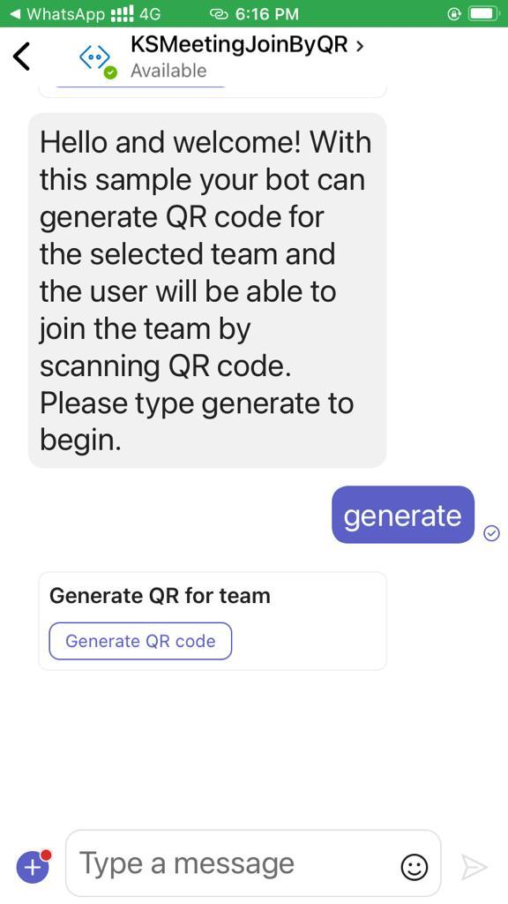
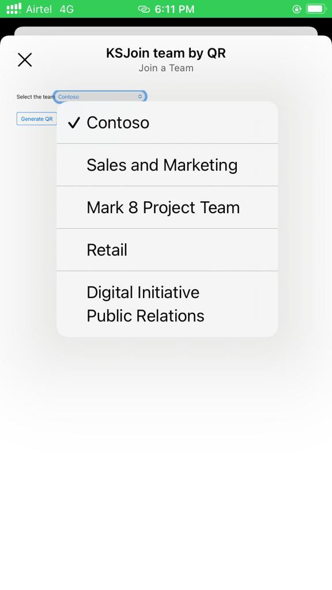

# Join a team using QR code sample

This sample demos a feature where user can join a team using QR code containing the team's id.

User can generate a new QR code (contains team id information) and then scan the QR code to join the team.

`Currently, Microsoft Teams support for QR or barcode scanner capability is only supported for mobile clients`

## Interaction with app.

 

## Prerequisites

- [.NET Core SDK](https://dotnet.microsoft.com/download) version 3.1

  ```bash
  # determine dotnet version
  dotnet --version
  ```
- Publicly addressable https url or tunnel such as [ngrok](https://ngrok.com/) or [Tunnel Relay](https://github.com/OfficeDev/microsoft-teams-tunnelrelay) 

## Setup

1. Clone the repository

    ```bash
    git clone https://github.com/OfficeDev/Microsoft-Teams-Samples.git
    ```

2. In a terminal, navigate to `samples/bot-join-team-using-qr-code/csharp`

3. Run ngrok - point to port 3978

   ```bash
   # ngrok http -host-header=rewrite 3978
   ```
   
4. Register a new application in the [Azure Active Directory – App Registrations](https://go.microsoft.com/fwlink/?linkid=2083908) portal.

5. Create a Azure Bot resource

  a) In Azure portal, create a [Azure Bot resource](https://docs.microsoft.com/en-us/azure/bot-service/bot-builder-authentication?   view=azure-bot-service-4.0&tabs=userassigned%2Caadv2%2Ccsharp).

   - Ensure that you've [enabled the Teams Channel](https://docs.microsoft.com/en-us/azure/bot-service/channel-connect-teams?view=azure-bot-service-4.0)

  b) Navigate to **API Permissions**, and make sure to add the follow permissions:
   - Select Add a permission
   - Select Microsoft Graph -\> Delegated permissions.
       * User.Read (enabled by default)
       * Directory.AccessAsUser.All
       * TeamMember.ReadWrite.All

   - Click on Add permissions.

   

6. Modify the `manifest.json` in the `/AppManifest` folder and replace the `<<Microsoft-App-Id>>` with the id from step 2.

7. Zip the contents of `AppManifest` folder into a `manifest.zip`, and use the `manifest.zip` to deploy in app store or add to Teams as in step 

8. Modify the `/appsettings.json` and fill in the following details:
   - `{{ MicrosoftAppId }}` - Generated from Step 4.a is the application app id
   - `{{ MicrosoftAppPassword }}` - Generated from Step 4.a, also referred to as Client secret
   - `{{ ConnectionName }}` - Generated from Step 4.a, is the name that we provide while adding OAuth connection setting in Azure Bot resource.
    Please follow [Add authentication to bot](https://docs.microsoft.com/en-us/microsoftteams/platform/bots/how-to/authentication/add-authentication?tabs=dotnet%2Cdotnet-sample#azure-ad-v2) to configure the connection.
   - `{{ ApplicationBaseUrl }}` - Your application's base url. E.g. https://12345.ngrok.io if you are using ngrok.

9. Upload the manifest.zip to Teams (in the Apps view click "Upload a custom app")
   - Go to Microsoft Teams. From the lower left corner, select Apps
   - From the lower left corner, choose Upload a custom App
   - Go to your project directory, the ./appPackage folder, select the zip folder, and choose Open.
   - Select Add in the pop-up dialog box. Your tab is uploaded to Teams

## To try this sample

- In a terminal, navigate to `JoinTeamByQR`

    ```bash
    # change into project folder
    cd # JoinTeamByQR
    ```

- Run the bot from a terminal or from Visual Studio, choose option A or B.

  A) From a terminal

  ```bash
  # run the bot
  dotnet run
  ```

  B) Or from Visual Studio

  - Launch Visual Studio
  - File -> Open -> Project/Solution
  - Navigate to `samples/bot-join-team-using-qr-code/csharp` folder
  - Select `JoinTeamByQR.csproj` file
  - Press `F5` to run the project
  
## Running the sample.

- Type a message to get a card to generate the QR code.

 

- Select the team from dropdown list for which you want to generate the QR code and then click on 'Generate QR' button.

 

- Scan the generated QR code to join the team.

 

- After Scan the Qr Code Added user in team successfully.

 


## Deploy the bot to Azure

To learn more about deploying a bot to Azure, see [Deploy your bot to Azure](https://aka.ms/azuredeployment) for a complete list of deployment instructions.
