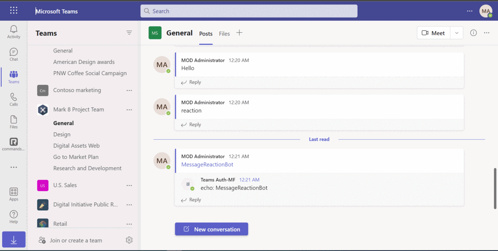
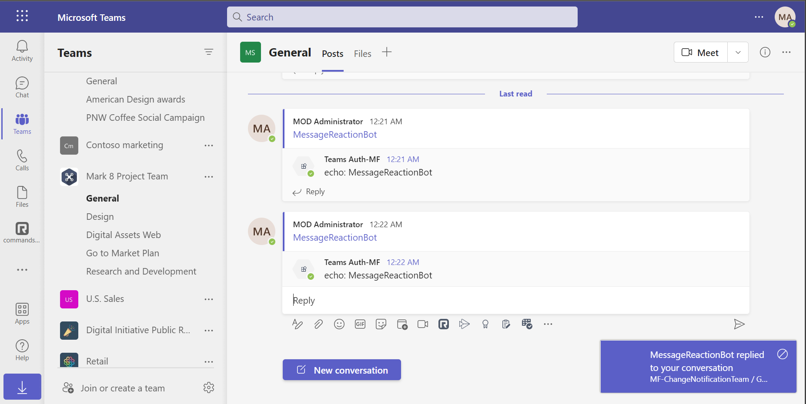

## Message Reactions Bot

Bot Framework v4 core bot sample.

Bot Framework [message reactions](https://docs.microsoft.com/en-us/microsoftteams/platform/bots/how-to/conversations/subscribe-to-conversation-events?tabs=dotnet#message-reaction-events) bot sample.

This bot has been created using [Bot Framework](https://dev.botframework.com), it shows how to create a simple bot that responds to Message Reactions.

This sample is a Spring Boot app and uses the Azure CLI and azure-webapp Maven plugin to deploy to Azure.

## Prerequisites

- Java 1.8+
- Install [Maven](https://maven.apache.org/)
- An account on [Azure](https://azure.microsoft.com) if you want to deploy to Azure.
- Microsoft Teams is installed and you have an account
- [ngrok](https://ngrok.com/) or equivalent tunnelling solution

## Concepts introduced in this sample


## To try this sample

> Note these instructions are for running the sample on your local machine, the tunnelling solution is required because
the Teams service needs to call into the bot.

1) Clone the repository

    ```bash
    git clone https://github.com/Microsoft/botbuilder-java.git
    ```

1) Run ngrok - point to port 3978

    ```bash
    ngrok http --host-header=rewrite 3978
    ```

1) Create [Bot Framework registration resource](https://docs.microsoft.com/en-us/azure/bot-service/bot-service-quickstart-registration) in Azure
    - Use the current `https` URL you were given by running ngrok. Append with the path `/api/messages` used by this sample
    - Ensure that you've [enabled the Teams Channel](https://docs.microsoft.com/en-us/azure/bot-service/channel-connect-teams?view=azure-bot-service-4.0)
    - __*If you don't have an Azure account*__ you can use this [Bot Framework registration](https://docs.microsoft.com/en-us/microsoftteams/platform/bots/how-to/create-a-bot-for-teams#register-your-web-service-with-the-bot-framework)

1) Update the `resources/application.properties` configuration for the bot to use the Microsoft App Id and App Password from the Bot Framework registration. (Note the App Password is referred to as the "client secret" in the azure portal and you can always create a new client secret anytime.)

1) __*This step is specific to Teams.*__
    - **Edit** the `manifest.json` contained in the `teamsAppManifest` folder to replace your Microsoft App Id (that was created when you registered your bot earlier) *everywhere* you see the place holder string `<<YOUR-MICROSOFT-APP-ID>>` (depending on the scenario the Microsoft App Id may occur multiple times in the `manifest.json`). **Note:** the Task Modules containing pages will require the deployed bot's domain in validDomains of the manifest.
    - **Zip** up the contents of the `teamsAppManifest` folder to create a `manifest.zip`
    - **Upload** the `manifest.zip` to Teams (in the Apps view click "Upload a custom app")

1) From the root of this project folder:
    - Build the sample using `mvn package`
    - Unless done previously, install the packages in the local cache by using `mvn install`
    - Run it by using `java -jar .\target\bot-messagereaction-sample.jar`
    
### Connect to the bot using Bot Framework Emulator

- Launch Bot Framework Emulator
- File -> Open Bot
- Enter a Bot URL of `http://localhost:3978/api/messages`

## Interacting with the bot in Teams

Message the bot and it will respond with an 'Echo: [your message]'.  Add a message reaction to the bots response, and the bot will reply accordingly.


## Deploy the bot to Azure

To learn more about deploying a bot to Azure, see [Deploy your bot to Azure](https://aka.ms/azuredeployment) for a complete list of deployment instructions.
## Further reading

- [Spring Boot](https://spring.io/projects/spring-boot)
- [Maven Plugin for Azure App Service](https://github.com/microsoft/azure-maven-plugins/tree/develop/azure-webapp-maven-plugin)
- [Azure for Java cloud developers](https://docs.microsoft.com/en-us/azure/java/?view=azure-java-stable)
- [Teams Message Reaction Events](https://docs.microsoft.com/en-us/microsoftteams/platform/bots/how-to/conversations/subscribe-to-conversation-events?tabs=dotnet#message-reaction-events)
