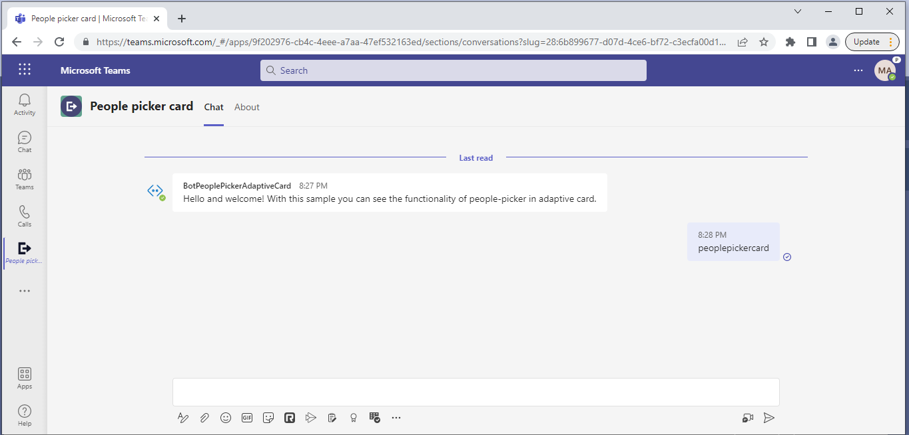
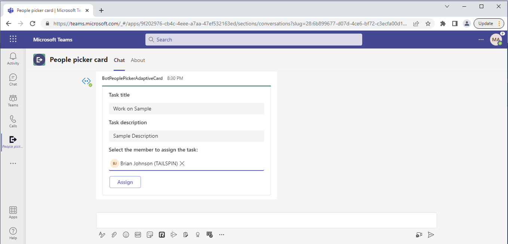
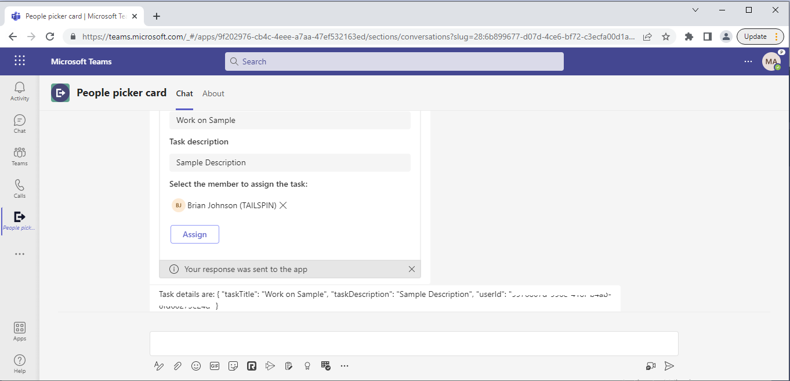

# People picker control in Adaptive Cards

This sample shows the feature of people picker on Adaptive Cards.


 Use the bot command `peoplepickercard` to get the card with people picker control 



 Adaptive card.



 Adaptive card with details( On `Assign` button click, the bot will return the member id that we have selected.)  



- Personal scope (get all the users of organisation)


## Prerequisites

- [.NET Core SDK](https://dotnet.microsoft.com/download) version 3.1

  determine dotnet version
  ```bash
  dotnet --version
  ```
- [Ngrok](https://ngrok.com/download) (For local environment testing) Latest (any other tunneling software can also be used)
  
  run ngrok locally
  ```bash
  ngrok http -host-header=localhost 3978
  ```
- [Teams](https://teams.microsoft.com) Microsoft Teams is installed and you have an account

## To try this sample

### 1. Setup for Bot
In Azure portal, create a [Azure Bot resource](https://docs.microsoft.com/en-us/azure/bot-service/bot-builder-authentication?view=azure-bot-service-4.0&tabs=csharp%2Caadv2).

- Ensure that you've [enabled the Teams Channel](https://docs.microsoft.com/en-us/azure/bot-service/channel-connect-teams?view=azure-bot-service-4.0)

### 2. Run your bot sample

1. Clone the repository
   ```bash
   git clone https://github.com/OfficeDev/Microsoft-Teams-Samples.git
   ```

2. Open the code in Visual Studio
   - File -> Open -> Project/Solution
   - Navigate to folder where repository is cloned then `samples/bot-people-picker-adaptive-card/csharp/PeoplePicker.sln`
    
3. Run ngrok - point to port 3978

    ```bash
    # ngrok http -host-header=rewrite 3978
    ```
 
4. Setup and run the bot from Visual Studio: 
   Modify the `appsettings.json` and fill in the following details:
   - `MicrosoftAppId` - Generated from Step 1 (Application (client) ID)is the application app id
   - `MicrosoftAppPassword` - Generated from Step 1, also referred to as Client secret
   - Press `F5` to run the project
	 
5. Modify the `manifest.json` in the `/AppPackage` folder and replace the following details:
   - `{{Microsoft-App-Id}}` with Application id generated from Step 3

6. Zip the contents of `AppPackage` folder into a `manifest.zip`, and use the `manifest.zip` to deploy in app store or add to Teams using step 

7. Upload the manifest.zip to Teams (in the Apps view click "Upload a custom app")
   - Go to Microsoft Teams and then go to side panel, select Apps
   - Choose Upload a custom App
   - Go to your project directory, the ./AppPackage folder, select the zip folder, and choose Open.
   - Select Add in the pop-up dialog box. Your app is uploaded to Teams.    

## Further reading

- [Bot Framework Documentation](https://docs.botframework.com)
- [Bot Basics](https://docs.microsoft.com/azure/bot-service/bot-builder-basics?view=azure-bot-service-4.0)
- [Send Notification to User in Chat](https://docs.microsoft.com/en-us/graph/api/chat-sendactivitynotification?view=graph-rest-beta)
- [Send Notification to User in Team](https://docs.microsoft.com/en-us/graph/api/team-sendactivitynotification?view=graph-rest-beta&tabs=http)
- [Send Notification to User](https://docs.microsoft.com/en-us/graph/api/userteamwork-sendactivitynotification?view=graph-rest-beta&tabs=http)
