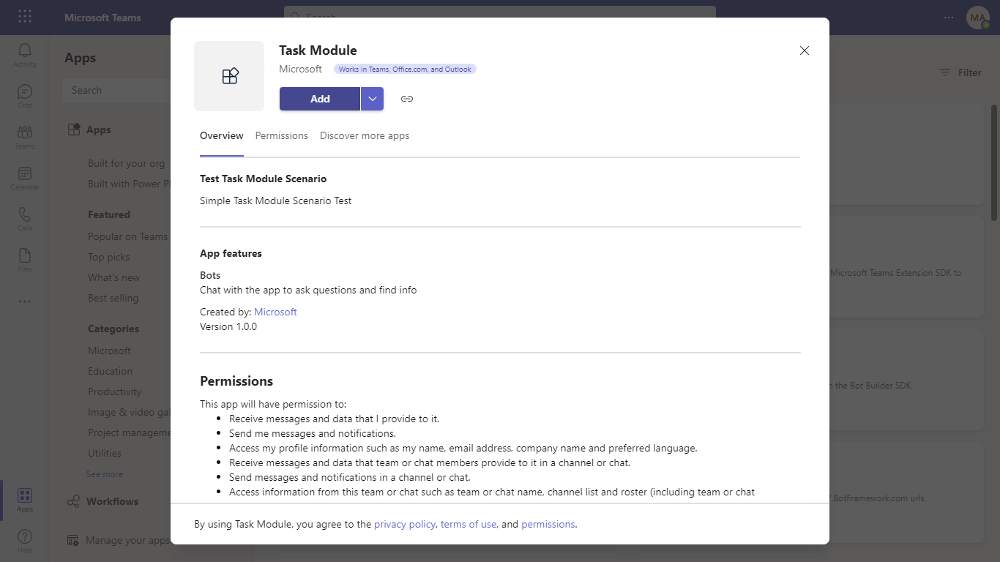
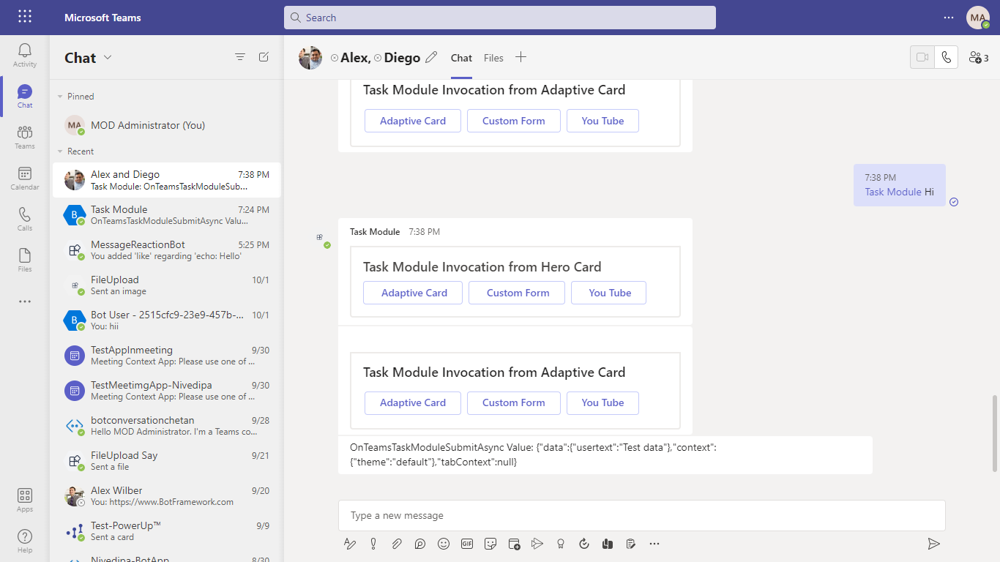

# Teams Task Module

Bot Framework Teams Task Module sample.

This bot has been created using [Bot Framework](https://dev.botframework.com). It shows how to fetch a Task Module from Hero Card or Adaptive Card buttons and receive input from the Task Module in the bot.

- **Interaction with bot**


## Prerequisites

- Microsoft Teams is installed and you have an account
- [.NET SDK](https://dotnet.microsoft.com/download) version 6.0
- [ngrok](https://ngrok.com/) or equivalent tunnelling solution

## To try this sample

> Note these instructions are for running the sample on your local machine, the tunnelling solution is required because
the Teams service needs to call into the bot.

1) Run ngrok - point to port 3978

    ```bash
    ngrok http --host-header=rewrite 3978
    ```

1) Setup for Bot

   In Azure portal, create a [Azure Bot resource](https://docs.microsoft.com/en-us/azure/bot-service/bot-service-quickstart-registration).
    - For bot handle, make up a name.
    - Select "Use existing app registration" (Create the app registration in Azure Active Directory beforehand.)
    - __*If you don't have an Azure account*__ create an [Azure free account here](https://azure.microsoft.com/en-us/free/)
    
   In the new Azure Bot resource in the Portal, 
    - Ensure that you've [enabled the Teams Channel](https://learn.microsoft.com/en-us/azure/bot-service/channel-connect-teams?view=azure-bot-service-4.0)
    - In Settings/Configuration/Messaging endpoint, enter the current `https` URL you were given by running ngrok. Append with the path `/api/messages`

1) Clone the repository

    ```bash
    git clone https://github.com/OfficeDev/Microsoft-Teams-Samples.git
    ```

1) If you are using Visual Studio
   - Launch Visual Studio
   - File -> Open -> Project/Solution
   - Navigate to `samples/bot-task-module/csharp` folder
   - Select `TeamsTaskModule.csproj` or `TeamsTaskModule.sln`file

1) Update the `appsettings.json` configuration for the bot to use the MicrosoftAppId, MicrosoftAppPassword, MicrosoftAppTenantId generated in Step 2 (App Registration creation). (Note the App Password is referred to as the "client secret" in the azure portal and you can always create a new client secret anytime.)
    - Set "MicrosoftAppType" in the `appsettings.json`. (**Allowed values are: MultiTenant(default), SingleTenant, UserAssignedMSI**)

    - Set "BaseUrl" in the `appsettings.json` as per your application like the ngrok forwarding url (ie `https://xxxx.ngrok.io`) after starting ngrok

1) Run your bot, either from Visual Studio with `F5` or using `dotnet run` in the appropriate folder.

1) __*This step is specific to Teams.*__
    - **Edit** the `manifest.json` contained in the `TeamsAppManifest` folder to replace your Microsoft App Id (that was created when you registered your bot earlier) *everywhere* you see the place holder string `<<YOUR-MICROSOFT-APP-ID>>` (depending on the scenario the Microsoft App Id may occur multiple times in the `manifest.json`)
    - **Edit** the `manifest.json` for `validDomains` with base Url domain. E.g. if you are using ngrok it would be `https://1234.ngrok.io` then your domain-name will be `1234.ngrok.io`.
    - **Zip** up the contents of the `TeamsAppManifest` folder to create a `manifest.zip` (Make sure that zip file does not contains any subfolder otherwise you will get error while uploading your .zip package)
    - **Upload** the `manifest.zip` to Teams (In Teams Apps/Manage your apps click "Upload an app". Browse to and Open the .zip file. At the next dialog, click the Add button.)
    - Add the app in personal/groupchat/team scope (supported scopes)

## Interacting with the bot in Teams

> Note this `manifest.json` specified that the bot will be installed in "personal", "team" and "groupchat" scope which is why you immediately entered a one on one chat conversation with the bot. You can at mention the bot in a group chat or in a Channel in the Team you installed it in. Please refer to Teams documentation for more details.

You can interact with this bot by sending it a message. The bot will respond with a Hero Card and Adaptive Card with buttons which will display a Task Module when clicked. The Task Modules demonstrate retrieving input from a user, or displaying custom web page content.

- **Personal Scope Interactions:**




- **Group Chat Scope Interactions:**



- **Team Scope Interactions:**


## Deploy the bot to Azure

To learn more about deploying a bot to Azure, see [Deploy your bot to Azure](https://aka.ms/azuredeployment) for a complete list of deployment instructions.

## Further reading

- [How Microsoft Teams bots work](https://docs.microsoft.com/en-us/azure/bot-service/bot-builder-basics-teams?view=azure-bot-service-4.0&tabs=javascript)

