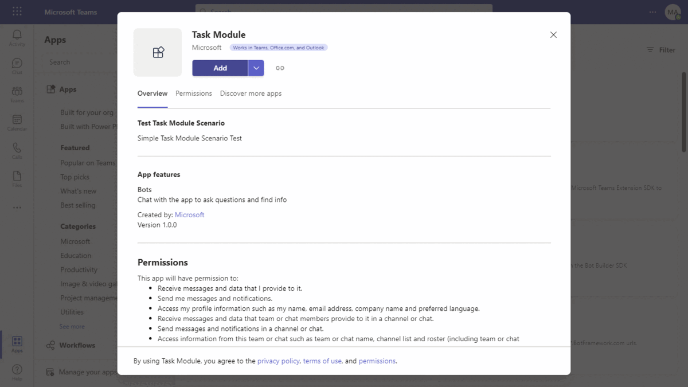
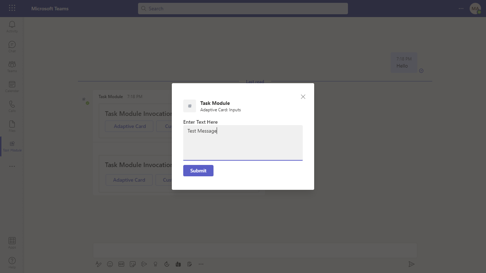
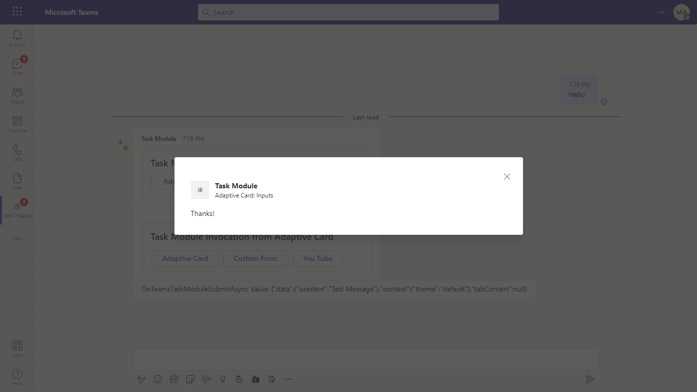
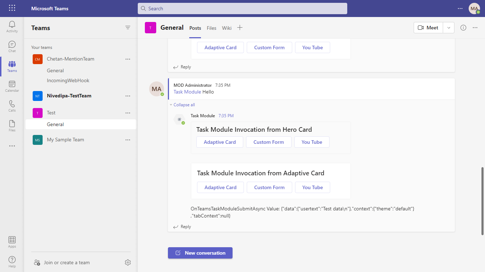
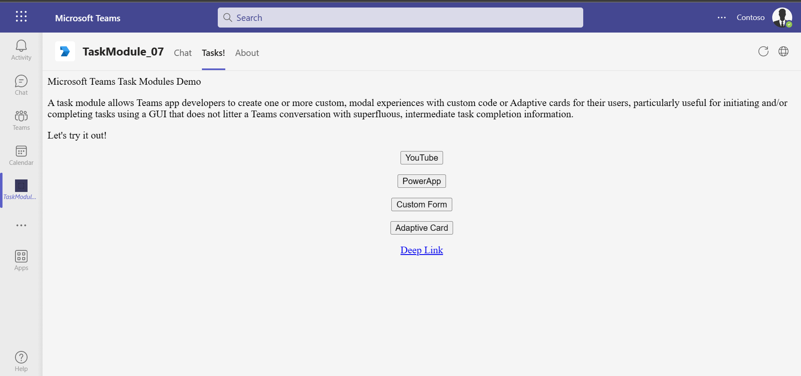
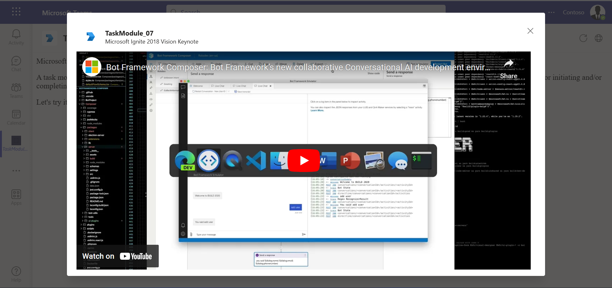
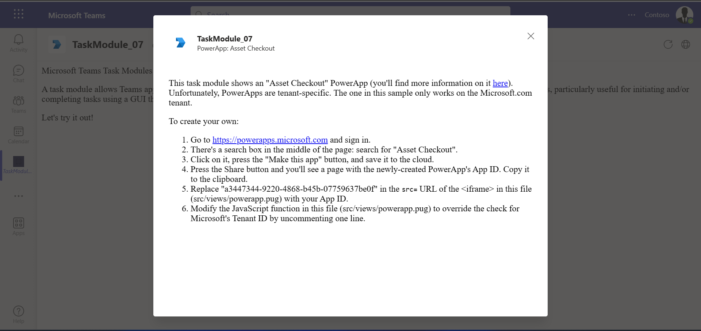
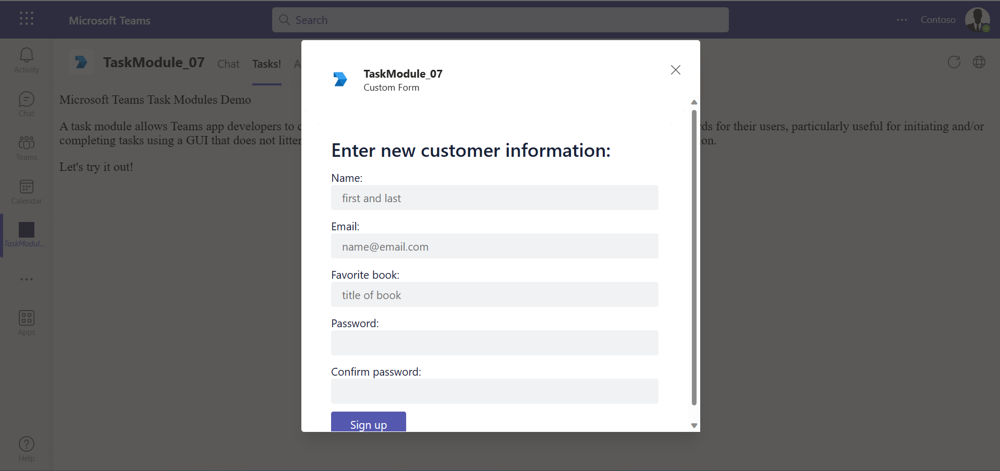
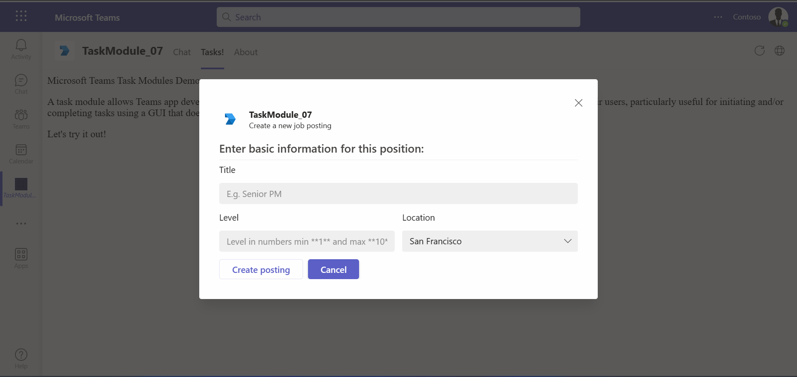

# Teams Task Module

Bot Framework Teams Task Module sample.

This bot has been created using [Bot Framework](https://dev.botframework.com). It shows how to fetch a Task Module from a Hero Card button and receive input from an Adaptive Card in the Task Module.

## Included Features
* Bots
* Tabs
* Task Modules

## Interaction with botss


## Try it yourself - experience the App in your Microsoft Teams client
Please find below demo manifest which is deployed on Microsoft Azure and you can try it yourself by uploading the app package (.zip file link below) to your teams and/or as a personal app. (Sideloading must be enabled for your tenant, [see steps here](https://docs.microsoft.com/microsoftteams/platform/concepts/build-and-test/prepare-your-o365-tenant#enable-custom-teams-apps-and-turn-on-custom-app-uploading)).

**Teams Task Module:** [Manifest](/samples/bot-task-module/csharp/demo-manifest/bot-task-module.zip)

## Prerequisites

- Microsoft Teams is installed and you have an account
- [NodeJS](https://nodejs.org/en/)
- [ngrok](https://ngrok.com/) or equivalent tunnelling solution
- [Teams Toolkit for VS Code](https://marketplace.visualstudio.com/items?itemName=TeamsDevApp.ms-teams-vscode-extension) or [TeamsFx CLI](https://learn.microsoft.com/microsoftteams/platform/toolkit/teamsfx-cli?pivots=version-one)

## Run the app (Using Teams Toolkit for Visual Studio Code)

The simplest way to run this sample in Teams is to use Teams Toolkit for Visual Studio Code.

1. Ensure you have downloaded and installed [Visual Studio Code](https://code.visualstudio.com/docs/setup/setup-overview)
1. Install the [Teams Toolkit extension](https://marketplace.visualstudio.com/items?itemName=TeamsDevApp.ms-teams-vscode-extension)
1. Select **File > Open Folder** in VS Code and choose this samples directory from the repo
1. Using the extension, sign in with your Microsoft 365 account where you have permissions to upload custom apps
1. Select **Debug > Start Debugging** or **F5** to run the app in a Teams web client.
1. In the browser that launches, select the **Add** button to install the app to Teams.

> If you do not have permission to upload custom apps (sideloading), Teams Toolkit will recommend creating and using a Microsoft 365 Developer Program account - a free program to get your own dev environment sandbox that includes Teams.

## Setup

> Note these instructions are for running the sample on your local machine, the tunnelling solution is required because
the Teams service needs to call into the bot.

1) Run ngrok - point to port 3978

    ```bash
    ngrok http 3978 --host-header="localhost:3978"
    ```

## Setup for bot
In Azure portal, create a [Azure Bot resource](https://docs.microsoft.com/azure/bot-service/bot-service-quickstart-registration).
    - For bot handle, make up a name.
    - Select "Use existing app registration" (Create the app registration in Azure Active Directory beforehand.)
    - __*If you don't have an Azure account*__ create an [Azure free account here](https://azure.microsoft.com/free/)
    
   In the new Azure Bot resource in the Portal, 
    - Ensure that you've [enabled the Teams Channel](https://learn.microsoft.com/azure/bot-service/channel-connect-teams?view=azure-bot-service-4.0)
    - In Settings/Configuration/Messaging endpoint, enter the current `https` URL you were given by running ngrok. Append with the path `/api/messages`

## Setup for code
1) Clone the repository

    ```bash
    git clone https://github.com/OfficeDev/Microsoft-Teams-Samples.git
    ```

1) In a terminal, navigate to `samples/bot-task-module/nodejs`

1) Install modules

    ```bash
    npm install
    ```

1) Update the `.env` configuration for the bot to use the `<<MicrosoftAppId>>`, `<<MicrosoftAppPassword>>` from the Bot Framework registration. (Note the App Password is referred to as the "client secret" in the azure portal and you can always create a new client secret anytime.) `<<MicrosoftAppTenantId>>` will be the id for the tenant where application is registered.
- Set "MicrosoftAppType" in the `.env`. (**Allowed values are: MultiTenant(default), SingleTenant, UserAssignedMSI**)

- Replace `<<BaseUrl>>` in the `.env` as per your application like the ngrok forwarding url (ie `https://xxxx.ngrok-free.app`) after starting ngrok.

- Replace `<<MicrosoftAppId>>` and <<BaseUrl>> with your MicrosoftAppId and BaseUrl in the `.TaskModuleTab.js` file.

1) Run your bot at the command line:

    ```bash
    npm start
    ```

1) __*This step is specific to Teams.*__
    - **Edit** the `manifest.json` contained in the `appPackage` folder to replace your Microsoft App Id (that was created when you registered your bot earlier) *everywhere* you see the place holder string `<<YOUR-MICROSOFT-APP-ID>>` (depending on the scenario the Microsoft App Id may occur multiple times in the `manifest.json`)
    - **Edit** the `manifest.json` for `<<Valid-Domain>>` with base Url domain. E.g. if you are using ngrok it would be `https://1234.ngrok-free.app` then your domain-name will be `1234.ngrok-free.app`.
    - **Zip** up the contents of the `appPackage` folder to create a `manifest.zip` (Make sure that zip file does not contains any subfolder otherwise you will get error while uploading your .zip package)
    - **Upload** the `manifest.zip` to Teams (In Teams Apps/Manage your apps click "Upload an app". Browse to and Open the .zip file. At the next dialog, click the Add button.)
    - Add the app in personal/groupchat/team scope (supported scopes)

**Note**: If you are facing any issue in your app, please uncomment [this](https://github.com/OfficeDev/Microsoft-Teams-Samples/blob/main/samples/bot-task-module/nodejs/index.js#L45) line and put your debugger for local debug.

## Running the sample

> Note this `manifest.json` specified that the bot will be installed in "personal", "team" and "groupchat" scope which is why you immediately entered a one on one chat conversation with the bot. You can at mention the bot in a group chat or in a Channel in the Team you installed it in. Please refer to Teams documentation for more details.

You can interact with this bot by sending it a message. The bot will respond with a Hero Card and Adaptive Card with buttons which will display a Task Module when clicked. The Task Modules demonstrate retrieving input from a user, or displaying custom web page content.

- **Personal Scope Interactions:**






- **Group Chat Scope Interactions:**


- **Team Scope Interactions:**



- **Task Module Tab:**











## Deploy the bot to Azure

To learn more about deploying a bot to Azure, see [Deploy your bot to Azure](https://aka.ms/azuredeployment) for a complete list of deployment instructions.

## Further reading

- [Bot Framework Documentation](https://docs.botframework.com)
- [Bot Basics](https://docs.microsoft.com/azure/bot-service/bot-builder-basics?view=azure-bot-service-4.0)
- [Azure Bot Service Introduction](https://docs.microsoft.com/azure/bot-service/bot-service-overview-introduction?view=azure-bot-service-4.0)
- [Azure Bot Service Documentation](https://docs.microsoft.com/azure/bot-service/?view=azure-bot-service-4.0)
- [Task modules](https://learn.microsoft.com/en-us/microsoftteams/platform/task-modules-and-cards/what-are-task-modules)


