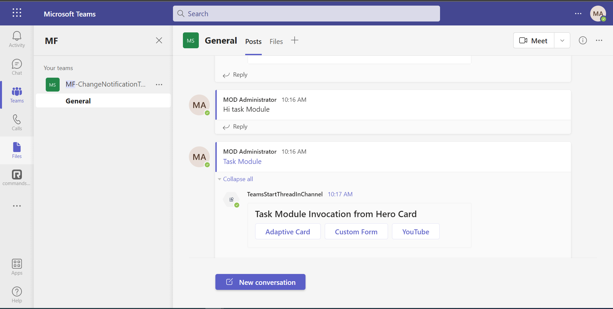
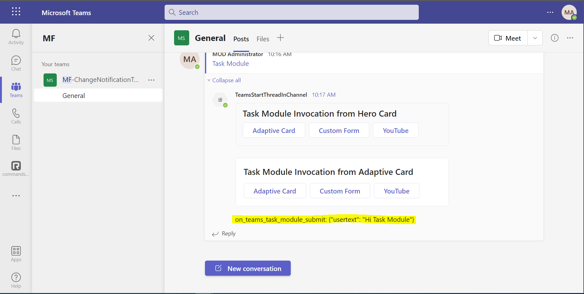

# Teams Task Module

[Task Modules](https://docs.microsoft.com/en-us/microsoftteams/platform/task-modules-and-cards/what-are-task-modules) allow you to create modal popup experiences in your Teams bot or application. This sample shows how to fetch a Task Module from a Hero Card button and receive input from an Adaptive Card in the Task Module.

## Prerequisites

- Microsoft Teams is installed and you have an account
- [Python SDK](https://www.python.org/downloads/) version 3.7
- [ngrok](https://ngrok.com/) or equivalent tunnelling solution

## Concepts introduced in this sample


Sends Adaptive Cards 


Adaptive Card Input


Response from the card


Adaptive card from input


Adaptive card youtube


## To try this sample

> Note these instructions are for running the sample on your local machine, the tunnelling solution is required because
the Teams service needs to call into the bot.

1) Clone the repository

    ```bash
    git clone https://github.com/Microsoft/botbuilder-samples.git
    ```

1) Run ngrok - point to port 3978

    ```bash
    ngrok http --host-header=rewrite 3978
    ```

1) Create [Bot Framework registration resource](https://docs.microsoft.com/en-us/azure/bot-service/bot-service-quickstart-registration) in Azure
    - Use the current `https` URL you were given by running ngrok. Append with the path `/api/messages` used by this sample
    - Ensure that you've [enabled the Teams Channel](https://docs.microsoft.com/en-us/azure/bot-service/channel-connect-teams?view=azure-bot-service-4.0)
    - __*If you don't have an Azure account*__ you can use this [Bot Framework registration](https://docs.microsoft.com/en-us/microsoftteams/platform/bots/how-to/create-a-bot-for-teams#register-your-web-service-with-the-bot-framework)

1) Bring up a terminal, navigate to `Microsoft-Teams-Samples\samples\python\bot-task-module` folder

1) Activate your desired virtual environment

1) Install dependencies by running ```pip install -r requirements.txt``` in the project folder.

1) Update the `config.py` configuration for the bot to use the Microsoft App Id and App Password from the Bot Framework registration. (Note the App Password is referred to as the "client secret" in the azure portal and you can always create a new client secret anytime.)

1) Update `CustomForm.html` to replace your Microsoft App Id *everywhere* you see the place holder string `<<YOUR-MICROSOFT-APP-ID>>`

1) __*This step is specific to Teams.*__
    - **Edit** the `manifest.json` contained in the `teamsAppManifest` folder to replace your Microsoft App Id (that was created when you registered your bot earlier) *everywhere* you see the place holder string `<<YOUR-MICROSOFT-APP-ID>>` (depending on the scenario the Microsoft App Id may occur multiple times in the `manifest.json`). **Note:** the Task Modules containing pages will require the deployed bot's domain in validDomains of the manifest.
    - **Zip** up the contents of the `teamsAppManifest` folder to create a `manifest.zip`
    - **Upload** the `manifest.zip` to Teams (in the Apps view click "Upload a custom app")

1) Run your bot with `python app.py`

## Interacting with the bot in Teams

> Note this `manifest.json` specified that the bot will be installed in "personal", "team" and "groupchat" scope which is why you immediately entered a one on one chat conversation with the bot. You can at mention the bot in a group chat or in a Channel in the Team you installed it in. Please refer to Teams documentation for more details.

You can interact with this bot by sending it a message. The bot will respond with a Hero Card with a button which will display a Task Module when clicked.  The Task Module demonstrates retrieving input from a user through a Text Block and a Submit button.

## Deploy the bot to Azure

To learn more about deploying a bot to Azure, see [Deploy your bot to Azure](https://aka.ms/azuredeployment) for a complete list of deployment instructions.

# Further reading

- [How Microsoft Teams bots work](https://docs.microsoft.com/en-us/azure/bot-service/bot-builder-basics-teams)

