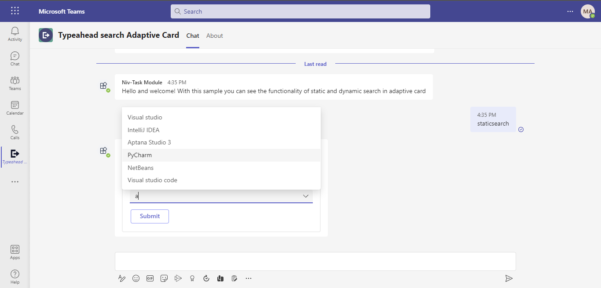
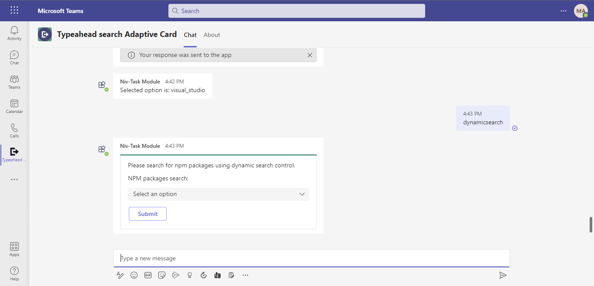
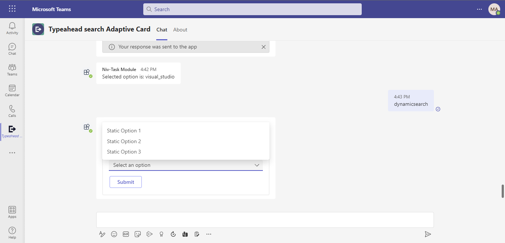
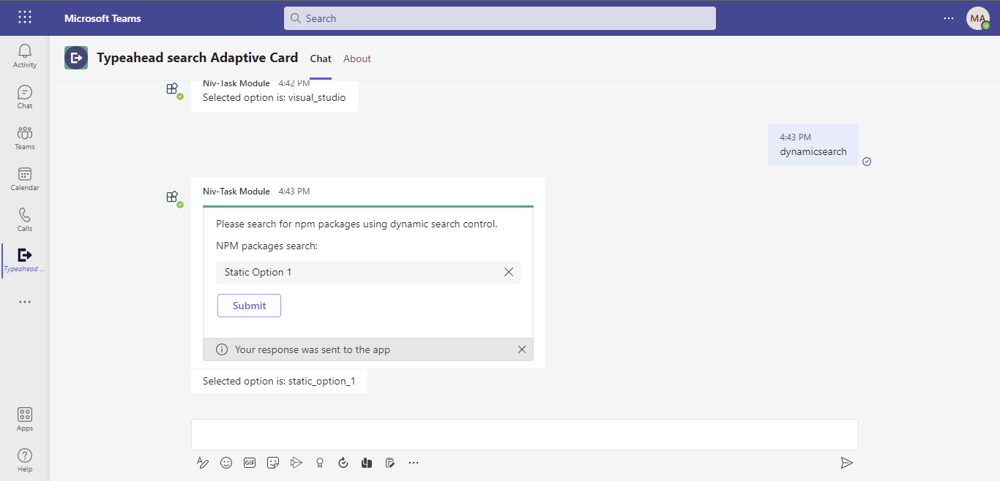

# Typeahead search control in Adaptive Cards Node.js

This sample shows the feature of typeahead search (static and dynamic) control in Adaptive Cards.

## Interaction with bot
 

## Prerequisites

- Microsoft Teams is installed and you have an account
- [NodeJS](https://nodejs.org/en/)
- [ngrok](https://ngrok.com/download) or equivalent tunnelling solution

## Setup

1. Register a new application in the [Azure Active Directory – App Registrations](https://go.microsoft.com/fwlink/?linkid=2083908) portal.

2. Setup for Bot
- In Azure portal, create a [Azure Bot resource](https://docs.microsoft.com/en-us/azure/bot-service/bot-builder-authentication?view=azure-bot-service-4.0&tabs=csharp%2Caadv2).
- Ensure that you've [enabled the Teams Channel](https://docs.microsoft.com/en-us/azure/bot-service/channel-connect-teams?view=azure-bot-service-4.0)
- While registering the bot, use `https://<your_ngrok_url>/api/messages` as the messaging endpoint.
**NOTE:** When you create app registration, you will create an App ID and App password - make sure you keep these for later.

3. Setup NGROK
 - Run ngrok - point to port 3978

    ```bash
    ngrok http -host-header=rewrite 3978
    ```
    
4. Setup for code
  - Clone the repository

    ```bash
    git clone https://github.com/OfficeDev/Microsoft-Teams-Samples.git
    ```

- Update the `.env` configuration for the bot to use the `MicrosoftAppId` and `MicrosoftAppPassword` (Note the MicrosoftAppId is the AppId created in step 1 (Setup for Bot), the MicrosoftAppPassword is referred to as the "client secret" in step 1 (Setup for Bot) and you can always create a new client secret anytime.)

-Also, set MicrosoftAppType in the `.env`. (**Allowed values are: MultiTenant(default), SingleTenant, UserAssignedMSI**)

- In a terminal, navigate to `samples/bot-type-ahead-search-adaptive-cards/nodejs`

- Install modules

    ```bash
    npm install
    ```
- Run your bot at the command line:

    ```bash
    npm start
    ```
- __*This step is specific to Teams.*__
    - **Edit** the `manifest.json` contained in the  `appPackage` folder to replace your Microsoft App Id (that was created when you registered your bot earlier) *everywhere* you see the place holder string `<<YOUR-MICROSOFT-APP-ID>>` (depending on the scenario the Microsoft App Id may occur multiple times in the `manifest.json`)
    - **Edit** the `manifest.json` for `validDomains` with base Url domain. E.g. if you are using ngrok it would be `https://1234.ngrok.io` then your domain-name will be `1234.ngrok.io`.
    - **Zip** up the contents of the `appPackage` folder to create a `manifest.zip` (Make sure that zip file does not contains any subfolder otherwise you will get error while uploading your .zip package)
    - **Upload** the `manifest.zip` to Teams (In Teams Apps/Manage your apps click "Upload an app". Browse to and Open the .zip file. At the next dialog, click the Add button.)
    - Add the app in personal/groupchat/team scope (supported scopes)

## Running the sample

Use the bot command `staticsearch` to get the card with static typeahead search control and use bot command `dynamicsearch` to get the card with dynamic typeahead search control.

 `Static search:` Static typeahead search allows users to search from values specified within `input.choiceset` in the Adaptive Card payload.





`Dynamic search:` Dynamic typeahead search is useful to search and select data from large data sets. The data sets are loaded dynamically from the dataset specified in the card payload.







On `Submit` button click, the bot will return the choice that we have selected.

## Deploy the bot to Azure

To learn more about deploying a bot to Azure, see [Deploy your bot to Azure](https://aka.ms/azuredeployment) for a complete list of deployment instructions.

## Further reading

- [Bot Framework Documentation](https://docs.botframework.com)
- [Bot Basics](https://docs.microsoft.com/azure/bot-service/bot-builder-basics?view=azure-bot-service-4.0)
- [Send Notification to User in Chat](https://docs.microsoft.com/en-us/graph/api/chat-sendactivitynotification?view=graph-rest-beta)
- [Send Notification to User in Team](https://docs.microsoft.com/en-us/graph/api/team-sendactivitynotification?view=graph-rest-beta&tabs=http)
- [Send Notification to User](https://docs.microsoft.com/en-us/graph/api/userteamwork-sendactivitynotification?view=graph-rest-beta&tabs=http)
