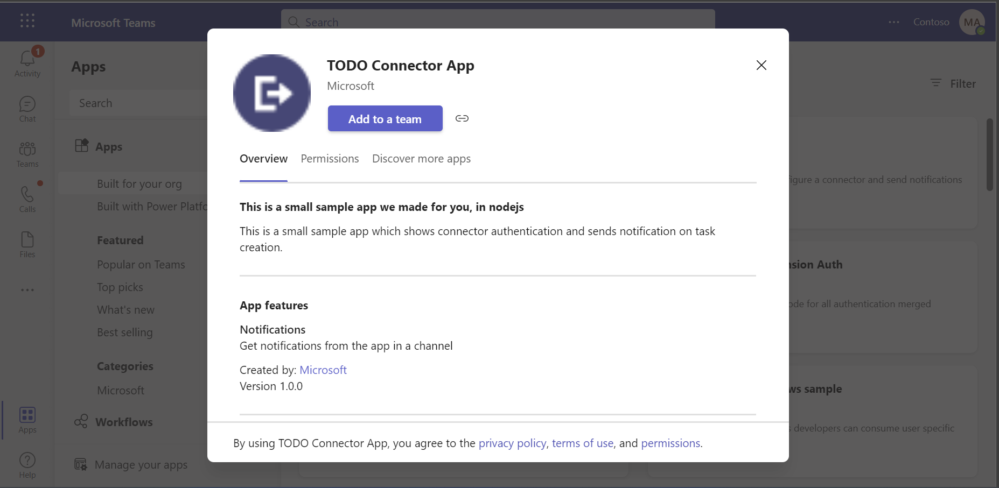
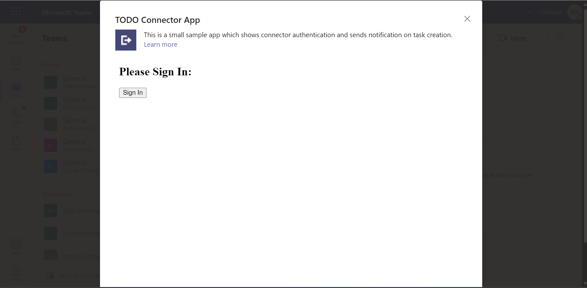
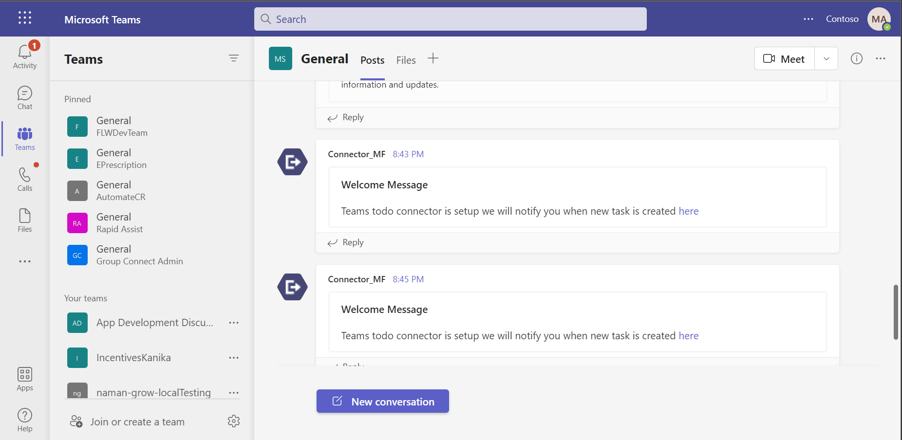
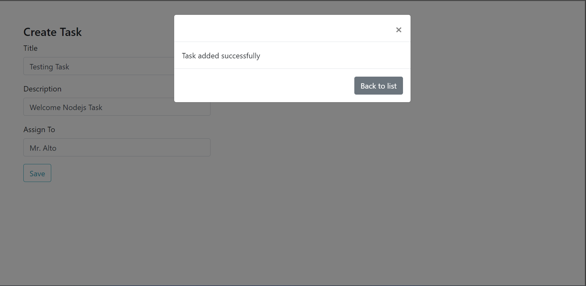
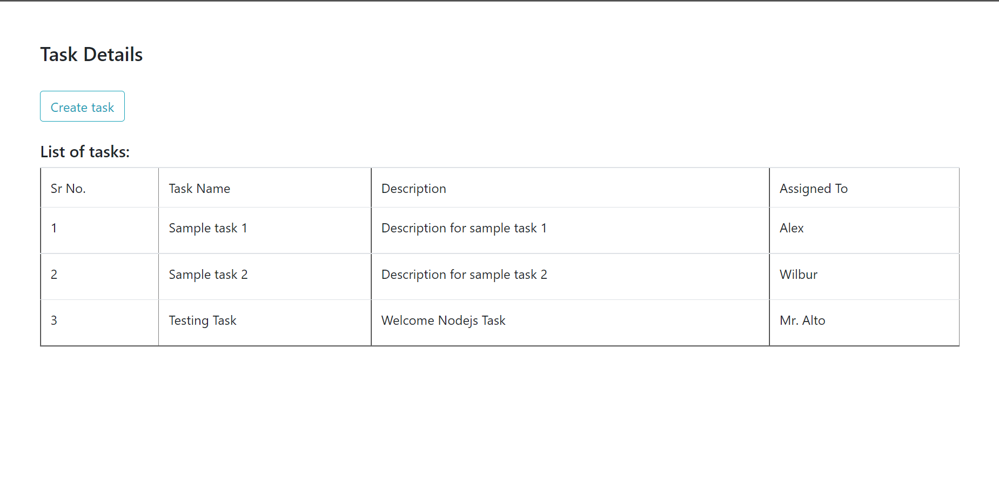

# Microsoft Teams Sample Connector Todo

This is a sample connector application which demonstarates how to add authentication to connector configuration page and send notification on task creation.

- **Interaction with bot**
 

## Prerequisites
- Microsoft Teams is installed and you have an account (not a guest account)
-  [NodeJS](https://nodejs.org/en/)
-  [ngrok](https://ngrok.com/) or equivalent tunneling solution
-  [M365 developer account](https://docs.microsoft.com/en-us/microsoftteams/platform/concepts/build-and-test/prepare-your-o365-tenant) or access to a Teams account with the 
   appropriate permissions to install an app.

### Setup 

### How to see the connector working in Microsoft Teams
1) [Upload your custom app in Microsoft Teams](https://docs.microsoft.com/microsoftteams/platform/concepts/apps/apps-upload) using [this manifest file](TeamsToDoAppConnector/TeamsAppPackages/manifest.json).
2) Configure the [Connector](https://docs.microsoft.com/microsoftteams/platform/concepts/connectors#accessing-office-365-connectors-from-microsoft-teams).


3) Select either Create or Update on the registration page and click Save. 
4) Once the connector is configured, you will get a notification in channel for the configured connector.

>**Note**: With the above instructions, you can use sample connector which is deployed on Azure. Please follow the instructions below to create your own connector.

### [Configure your own connector](https://docs.microsoft.com/microsoftteams/platform/webhooks-and-connectors/how-to/connectors-creating)
The sample shows a simple implementation of a connector registration implementation. It also sends a connector card to the registered connector via a process triggered "externally."

1. Clone the repository
   ```bash
   git clone https://github.com/OfficeDev/Microsoft-Teams-Samples.git
   ```
1. In a terminal, navigate to `samples/connector-todo-notification/nodejs`
1. Install node modules using command npm install.
1. Run your app using command npm start.
1. Begin your tunnelling service to get an https endpoint. 
   1. Open a new command prompt window. 
   1. Change to the directory that contains the ngrok.exe application. 
   1. Run ngrok - point to port 3978

      ```bash
      ngrok http -host-header=rewrite 3978
      ```
   1. Ngrok will fill the entire prompt window. Make note of the https:// Forwarding URL. This URL will be your [BASE_URI] referenced below. 
   1. Minimize the ngrok Command Prompt window. It is no longer referenced in these instructions, but it must remain running.
1. Register a new connector in the [Connector Developer Portal](https://aka.ms/connectorsdashboard)
   1. Fill in all the basic details such as name, logo, descriptions etc. for the new connector.
   1. For the configuration page, you'll use our sample code's setup endpoint: `https://[BASE_URI]/connector/SimpleAuth`
   1. For Valid domains, make entery of your domain's https URL, e.g. XXXXXXXX.ngrok.io.
   1. Click on Save. After the save completes, download the zip file for your connector which will contain the connector id.
1. Now you can sideload your app package and test your new connector.

### [Using Azure AD](#using-azure-ad)

1. Go to the [Application Registration Portal](https://aka.ms/appregistrations) and sign in with the your account to create an application.
1. Navigate to **Authentication** under **Manage** and add the following redirect URLs:

    - `https://<your_ngrok_url>/SimpleEnd`

1. Additionally, under the **Implicit grant** subsection select **Access tokens** and **ID tokens**

1. Click on **Expose an API** under **Manage**. Select the Set link to generate the Application ID URI in the form of api://{AppID}. Insert your fully qualified domain name (with a forward slash "/" appended to the end) between the double forward slashes and the GUID. The entire ID should have the form of: api://<your_ngrok_url>/{AppID}

1. Navigate to **API Permissions**, and make sure to add the following delegated permissions:
    - User.Read
    - email
    - offline_access
    - openid
    - profile
1. Scroll to the bottom of the page and click on "Add Permissions".

## Setting up .env configuration 
1. Update the `.env` configuration with the `ClientId` and `BaseUrl`

>Note: `ClientId` is your **Microsoft-App-ID** and `BaseUrl` is your **Ngrok**.

1. Run your app for server and client

    ```bash
    npm start
    ```

7) __*This step is specific to Teams.*__
1. Add your ngrok URL to validDomains. Teams will only show the sign-in popup if its from a whitelisted domain.
- **Edit** the `manifest.json` for `validDomains` with base Url domain. E.g. if you are using ngrok it would be `https://1234.ngrok.io` then your domain-name will be `1234.ngrok.io`.

   ```json
    "connectors": [
    {
      "connectorId": "<<connector-Id>>",
      "configurationUrl": "https://<<base-url>>/SetupAuth",
    }
  ]
    ```
- **Zip** up the contents of the `TeamsAppManifest` folder to create a `manifest.zip` (Make sure that zip file does not contains any subfolder otherwise you will get error while uploading your .zip package)
- **Upload** the `manifest.zip` to Teams (In Teams Apps/Manage your apps click "Upload an app". Browse to and Open the .zip file. At the next dialog, click the Add button.)
- Add the app to personal/team/groupChat scope (Supported scopes)

## Running the sample

- **Setup your App in Teams**


- **Click to `Setup a Connector` as given in the below image**. 


- **Sign In.**


- **Welcome message after successfull SignIn**


- **Now connector todo is configured.**


- **Task Details will displayed.**


- **Click Create button to create a new task.** 


- **Task add successfull message.**


- **Created task list will displayed as below image shows.** 


- **This is notify you in the channel group.**


## Further Information
- For more information on developing apps for Microsoft Teams, please review the Microsoft Teams [developer documentation](https://docs.microsoft.com/microsoftteams/platform/overview).**
- For more information about getting started with Teams, please review the following resources:
- Review [Getting Started with Authentications for Tabs](https://docs.microsoft.com/en-us/microsoftteams/platform/tabs/how-to/authentication/auth-tab-aad)
- Review [Getting Started with Teams](https://msdn.microsoft.com/en-us/microsoft-teams/setup)


