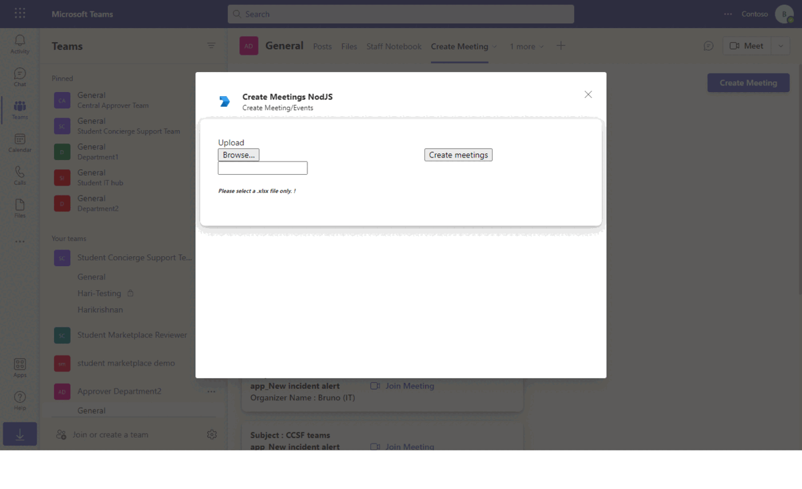
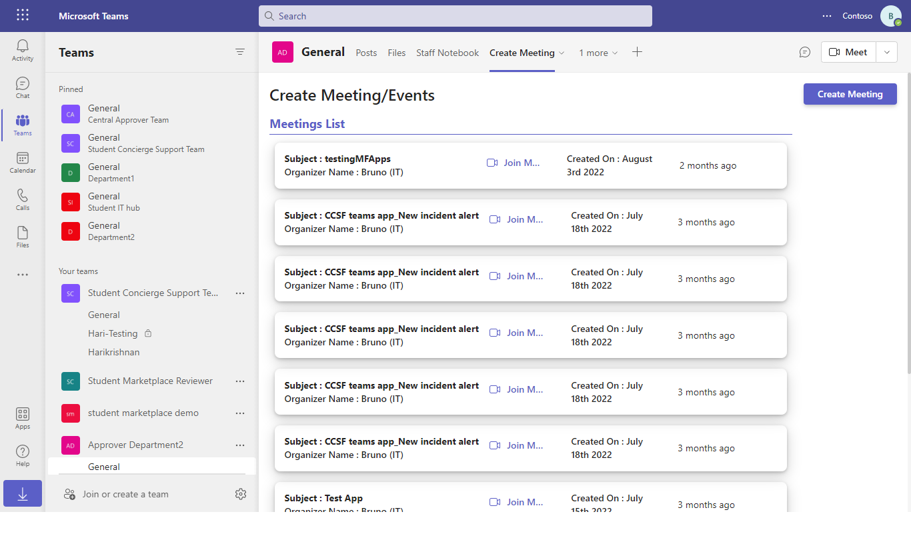

# This is an sample application which shows how to create teams meetings in bulk.

This is an sample application which shows how to create teams meetings in bulk using file upload method.

## Interact with app.



## Prerequisites

- Microsoft Teams is installed and you have an account (not a guest account)
-  [NodeJS](https://nodejs.org/en/)

## Setup.

### Register your application with Azure AD

1. Register a new application in the [Azure Active Directory – App Registrations](https://go.microsoft.com/fwlink/?linkid=2083908) portal.
2. On the overview page, copy and save the **Application (client) ID, Directory (tenant) ID**. You’ll need those later when updating your Teams application manifest and in the appsettings.json.
3. Navigate to **API Permissions**, and make sure to add the follow permissions:
-   Select Add a permission
-   Select Microsoft Graph -> Application permissions.
   - `Calendars.Read`,
   - `Calendars.ReadWrite.All`,
   - `OnlineMeetings.Read.All`,
   - `OnlineMeetings.ReadWrite.All`

-   Click on Add permissions. Please make sure to grant the admin consent for the required permissions.

4.  Navigate to the **Certificates & secrets**. In the Client secrets section, click on "+ New client secret". Add a description (Name of the secret) for the secret and select “Never” for Expires. Click "Add". Once the client secret is created, copy its value, it need to be placed in the .env file.

## To try this sample

> Note these instructions are for running the sample on your local machine, the tunnelling solution is required because
> the Teams service needs to call into the app.

### 1. Clone the repository
   ```bash
   git clone https://github.com/OfficeDev/Microsoft-Teams-Samples.git
   ```

### 2. Navigate to project
In the folder where repository is cloned navigate to `samples/graph-bulk-meetings-nodejs/nodejs`

### 3. Update the `.env`
Update configuration with the ```MicrosoftAppId```,  ```MicrosoftAppPassword``` and ```MicrosoftAppTenantId```.

### 4. Run ngrok - point to port 3978

```bash
ngrok http -host-header=rewrite 3978
```


### 3. Install node modules and run server 

 Inside node js folder, open your local terminal and run the below command to install node modules. You can do the same in Visual studio code terminal by opening the project in Visual studio code 

```bash
npm install
```

```bash
npm start
```

### 3. Install node modules and run client 

 Navigate to **client** folder, Open your local terminal and run the below command to install node modules. You can do the same in Visual studio code terminal by opening the project in Visual studio code 

```bash
cd client
npm install
```

```bash
npm start
```

```bash
npm install moment --save
```
    
### 4. Manually update the manifest.json
- **Edit** the `manifest.json` contained in the `Manifest` folder to replace your Base url wherever you see the place holder string `<<BASE-URL>>`. Also replace any random guid with the place holder `<<APP-ID>>`.
- **Zip** up the contents of the `Manifest` folder to create a `manifest.zip`
- **Upload** the `manifest.zip` to Teams (in the Apps view click "Upload a custom app")

## Running the sample.

## Features of samples Graph Bulk Meetings




## Further reading
- [Create Event](https://docs.microsoft.com/en-us/graph/api/user-post-events?view=graph-rest-1.0&tabs=javascript)
