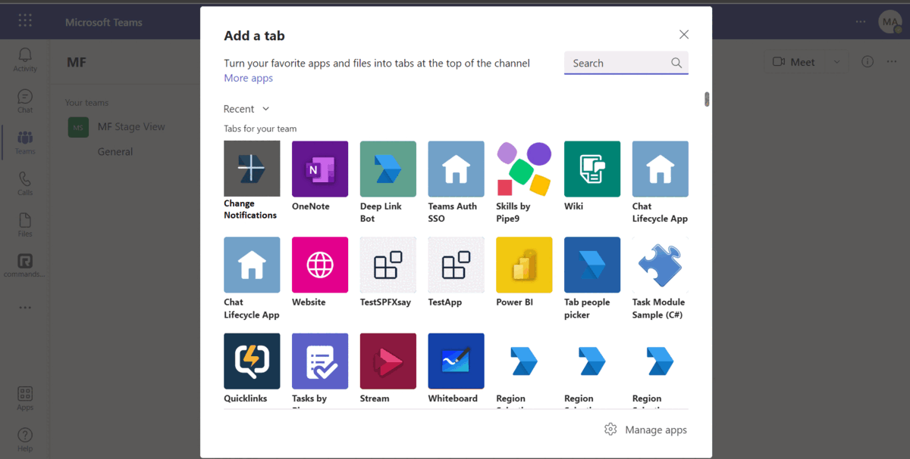
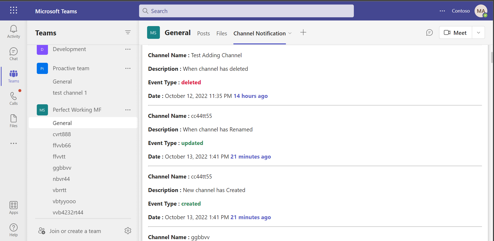
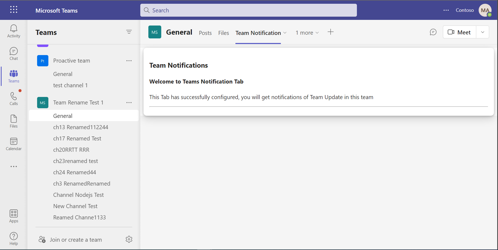

# Change Notifications For Team and Channel Using Microsoft Graph Node.js

This is a sample application which demonstrates use of Team/Channel subscription that will post notifications when user create/edit/delete team/channel.

## Included Features
* Tabs
* Graph API
* RSC Permissions
* Change Notifications

## Interaction with bot



## Prerequisites

- Microsoft Teams is installed and you have an account (not a guest account)
-  [NodeJS](https://nodejs.org/en/)
-  [dev tunnel](https://learn.microsoft.com/en-us/azure/developer/dev-tunnels/get-started?tabs=windows) or [ngrok](https://ngrok.com/download) latest version or equivalent tunneling solution
-  [M365 developer account](https://docs.microsoft.com/en-us/microsoftteams/platform/concepts/build-and-test/prepare-your-o365-tenant) or access to a Teams account with the appropriate permissions to install an app.
- [Teams Toolkit for VS Code](https://marketplace.visualstudio.com/items?itemName=TeamsDevApp.ms-teams-vscode-extension) or [TeamsFx CLI](https://learn.microsoft.com/microsoftteams/platform/toolkit/teamsfx-cli?pivots=version-one)

## Run the app (Using Teams Toolkit for Visual Studio Code)

The simplest way to run this sample in Teams is to use Teams Toolkit for Visual Studio Code.

1. Ensure you have downloaded and installed [Visual Studio Code](https://code.visualstudio.com/docs/setup/setup-overview)
1. Install the [Teams Toolkit extension](https://marketplace.visualstudio.com/items?itemName=TeamsDevApp.ms-teams-vscode-extension)
1. Select **File > Open Folder** in VS Code and choose this samples directory from the repo
1. Using the extension, sign in with your Microsoft 365 account where you have permissions to upload custom apps
1. Select **Debug > Start Debugging** or **F5** to run the app in a Teams web client.
1. In the browser that launches, select the **Add** button to install the app to Teams.

> If you do not have permission to upload custom apps (sideloading), Teams Toolkit will recommend creating and using a Microsoft 365 Developer Program account - a free program to get your own dev environment sandbox that includes Teams.

## Setup

> Note these instructions are for running the sample on your local machine.

1) Run ngrok - point to port 3978

   ```bash
   ngrok http 3978 --host-header="localhost:3978"
   ```  

   Alternatively, you can also use the `dev tunnels`. Please follow [Create and host a dev tunnel](https://learn.microsoft.com/en-us/azure/developer/dev-tunnels/get-started?tabs=windows) and host the tunnel with anonymous user access command as shown below:

   ```bash
   devtunnel host -p 3978 --allow-anonymous
   ```

2) Setup for Bot

### Register your application with Azure AD

1. Register a new application in the [Azure Active Directory - App Registrations](https://go.microsoft.com/fwlink/?linkid=2083908) portal.
2. On the overview page, copy and save the **Application (client) ID, Directory (tenant) ID**. You'll need those later when updating your Teams application manifest and in the .env file.
3. Navigate to **API Permissions**, and make sure to add the follow permissions:
-   Select Add a permission
-   Select Microsoft Graph -> Application permissions.
   - `Channel.ReadBasic.All`,`ChannelSettings.Read.All`,`Directory.ReadWrite.All`,`Group.ReadWrite.All`
    `Team.ReadBasic.All`,`TeamSettings.Read.All`,`TeamSettings.ReadWrite.All`

-   Click on Add permissions. Please make sure to grant the admin consent for the required permissions.

4.  Navigate to the **Certificates & secrets**. In the Client secrets section, click on "+ New client secret". Add a description (Name of the secret) for the secret and select "Never" for Expires. Click "Add". Once the client secret is created, copy its value, it need to be placed in the appsettings.json file.

### Create Azure bot resource

In Azure portal, create a [Azure Bot resource](https://docs.microsoft.com/en-us/azure/bot-service/bot-builder-authentication?view=azure-bot-service-4.0&tabs=csharp%2Caadv2).

- Ensure that you've [Enabled the Teams Channel](https://docs.microsoft.com/en-us/azure/bot-service/channel-connect-teams?view=azure-bot-service-4.0)

### Create and install Self-Signed certificate

To include resource data of graph notifications, this Graph API require self-signed certificate. Follow the below steps to create and manage certificate.

1. You can self-sign the certificate, since Microsoft Graph does not verify the certificate issuer, and uses the public key for only encryption.

2. Use [Azure Key Vault](https://docs.microsoft.com/en-us/azure/key-vault/key-vault-whatis) as the solution to create, rotate, and securely manage certificates. Make sure the keys satisfy the following criteria:

    - The key must be of type `RSA`
    - The key size must be between 2048 and 4096 bits

3. Follow this documentation for the steps - [**Create and install Self-Signed certificate**](CertificateDocumentation/README.md)


4. Clone the repository

    ```bash
    git clone https://github.com/OfficeDev/Microsoft-Teams-Samples.git
    ```

 A) If you are using Visual Studio Code

  - Launch Visual Studio code
  - File -> Open Folder
  - Navigate to `samples/graph-change-notification-team-channel` folder.
  - Select `nodejs` folder.

  **Instruction for .env**
    1. Provide Update configuration with the ```MicrosoftAppId```, ```MicrosoftAppPassword```, ```MicrosoftAppTenantId```,
       ```Base64EncodedCertificate```, ```EncryptionCertificateId```, ```PRIVATE_KEY_PATH``` in the .env that is created in Azure.
    2. Provide the tunnel url as  "BaseUrl" in appsetting on which application is running on.
    3. You should be having Base64EncodedCertificate from *Create and install Self-Signed certificate* step.
    4. Use Certificate "PEM" format and add the certificate name for `PRIVATE_KEY_PATH` For eg  `PRIVATE_KEY_PATH`=PrivateKeyFileName.pem" in .env file. Also make sure the private key file is stored inside helper folder of this project.
    **Note** : ```notificationUrl``` will be updated automatically from `teamsapp.local.yml` file when you run application by teams toolkit. And when you run locally through `npm start` then your notificationUrl will be like : `https://1234.ngrok-free.app/api/notifications` and if you are using dev tunnels, your notificationUrl will be like: `https://12345.devtunnels.ms/api/notifications`.   

  - Install node modules

    Inside node js folder, open your local terminal and run the below command to install node modules. You can do the same for client folder by opening the project in Visual Studio code.

    ```bash
    npm install
    ```

    Run your app

    ```bash
     npm start
    ``` 


 B) _**This step is specific to Teams.**_
 
   - **Edit** the `manifest.json` contained in the `appManifest` folder to replace your Microsoft App Id (that was created when you registered your bot earlier) *everywhere* you see the place holder string `<<YOUR-MICROSOFT-APP-ID>>` (depending on the scenario the Microsoft App Id may occur multiple times in the `manifest.json`).
    
   - **Edit** the `manifest.json` for `validDomains` with base Url domain. E.g. if you are using ngrok it would be `https://1234.ngrok-free.app` then your domain-name will be `1234.ngrok-free.app` and if you are using dev tunnels then your domain will be like: `12345.devtunnels.ms`.
    
   - **Zip** up the contents of the `appManifest` folder to create a `manifest.zip` (Make sure that zip file does not contains any subfolder otherwise you will get error while uploading your .zip package)
    
   - **Upload** the `manifest.zip` to Teams (In Teams Apps/Manage your apps click "Upload an app". Browse to and Open the .zip file. At the next dialog, click the Add button.)
    
   - Add the app to personal/team/groupChat scope (Supported scopes). 

## Running the sample

You can interact with Teams Tab by subscribing the teams/channel for notifications.

1. **Show Welcome - Channel**
Welcome Message when Channel selected for subscription.


2. **Channel Notifications**
Channel Created Update Delete Message


3. **Show Welcome - Team**
Welcome Message when Team selected for subscription.


4. **Team Notifications**
- Team Update Edit Message


 
## Further reading
- [Change notifications for Microsoft Teams channel](https://docs.microsoft.com/en-us/graph/teams-changenotifications-team-and-channel)
- [Create subscription permissions for supported resource](https://docs.microsoft.com/en-us/graph/api/subscription-post-subscriptions?view=graph-rest-1.0&tabs=http#team-channel-and-chat)


