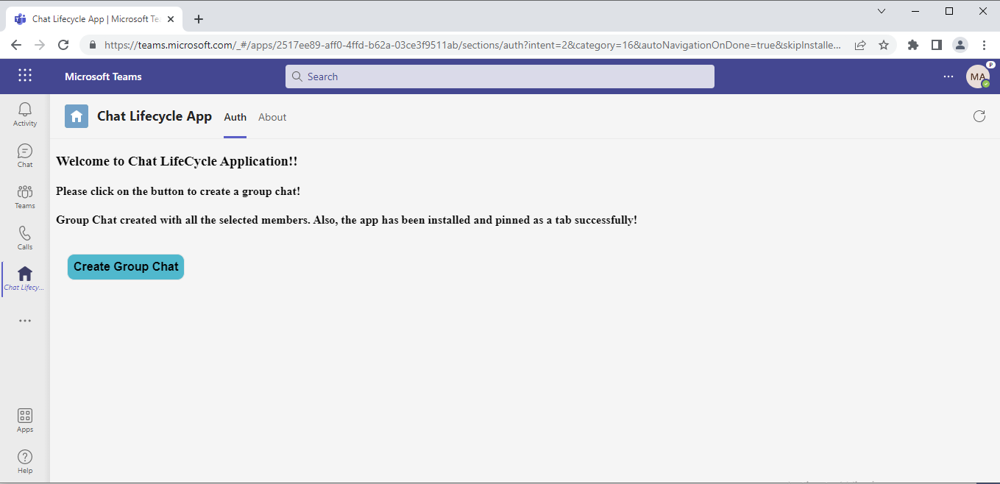

# Chat LifeCycle Application

This sample illustrates Lifecycle of chat in Teams (Creating chat, adding members with all scenarios, deleting member).

## Interaction with app


## Prerequisites

- Microsoft Teams is installed and you have an account
- [.NET Core SDK](https://dotnet.microsoft.com/download) version 3.1
- [ngrok](https://ngrok.com/) or equivalent tunnelling solution

## Setup

1) Clone the repository

    ```bash
    git clone https://github.com/OfficeDev/Microsoft-Teams-Samples.git
    ```

1) If you are using Visual Studio
  - Launch Visual Studio
  - File -> Open -> Project/Solution
  - Navigate to `samples/graph-chat-lifecycle/ChatLifecycle` folder
  - Select `ChatLifecycle.csproj` file

1) Run ngrok - point to port 3978

    ```bash
    ngrok http -host-header=rewrite 3978
    ```
### Register your Teams Auth SSO with Azure AD

1. Register a new application in the [Azure Active Directory – App Registrations](https://go.microsoft.com/fwlink/?linkid=2083908) portal.
2. Select **New Registration** and on the *register an application page*, set following values:
    * Set **name** to your app name.
    * Choose the **supported account types** (any account type will work)
    * Leave **Redirect URI** empty.
    * Choose **Register**.
3. On the overview page, copy and save the **Application (client) ID, Directory (tenant) ID**. You’ll need those later when updating your Teams application manifest and in the appsettings.json.
4. Under **Manage**, select **Expose an API**. 
5. Select the **Set** link to generate the Application ID URI in the form of `api://{AppID}`. Insert your fully qualified domain name (with a forward slash "/" appended to the end) between the double forward slashes and the GUID. The entire ID should have the form of: `api://fully-qualified-domain-name/{AppID}`
    * ex: `api://%ngrokDomain%.ngrok.io/00000000-0000-0000-0000-000000000000`.
6. Select the **Add a scope** button. In the panel that opens, enter `access_as_user` as the **Scope name**.
7. Set **Who can consent?** to `Admins and users`
8. Fill in the fields for configuring the admin and user consent prompts with values that are appropriate for the `access_as_user` scope:
    * **Admin consent title:** Teams can access the user’s profile.
    * **Admin consent description**: Allows Teams to call the app’s web APIs as the current user.
    * **User consent title**: Teams can access the user profile and make requests on the user's behalf.
    * **User consent description:** Enable Teams to call this app’s APIs with the same rights as the user.
9. Ensure that **State** is set to **Enabled**
10. Select **Add scope**
    * The domain part of the **Scope name** displayed just below the text field should automatically match the **Application ID** URI set in the previous step, with `/access_as_user` appended to the end:
        * `api://[ngrokDomain].ngrok.io/00000000-0000-0000-0000-000000000000/access_as_user.
11. In the **Authorized client applications** section, identify the applications that you want to authorize for your app’s web application. Each of the following IDs needs to be entered:
    * `1fec8e78-bce4-4aaf-ab1b-5451cc387264` (Teams mobile/desktop application)
    * `5e3ce6c0-2b1f-4285-8d4b-75ee78787346` (Teams web application)
12. Navigate to **API Permissions**, and make sure to add the follow permissions:
-   Select Add a permission
-   Select Microsoft Graph -\> Delegated permissions.
    * User.Read (enabled by default)
    * email
    * offline_access
    * OpenId
    * profile
    * Chat.Create
    * Chat.ReadWrite
    * ChatMember.ReadWrite
    * TeamsAppInstallation.ReadWriteForChat
    * TeamsAppInstallation.ReadWriteSelfForChat
    * TeamsTab.Create
    * TeamsTab.ReadWriteForChat
    * TeamsTab.ReadWrite.All
    * User.Read.All
-   Click on Add permissions. Please make sure to grant the admin consent for the required permissions.
13. Navigate to **Authentication**
    If an app hasn't been granted IT admin consent, users will have to provide consent the first time they use an app.
    Set a redirect URI:
    * Select **Add a platform**.
    * Select **web**.
    * Enter the **redirect URI** for the app in the following format: https://%ngrokDomain%.ngrok.io/End. This will be the page where a successful implicit grant flow will redirect the user.
    
    Enable implicit grant by checking the following boxes:  
    ✔ ID Token  
    ✔ Access Token  
14.  Navigate to the **Certificates & secrets**. In the Client secrets section, click on "+ New client secret". Add a description      (Name of the secret) for the secret and select “Never” for Expires. Click "Add". Once the client secret is created, copy its value, it need to be placed in the appsettings.json.

1) __*This step is specific to Teams.*__
    - **Edit** the `manifest.json` contained in the `Manifest` folder to replace your Microsoft App Id (that was created when you registered your bot earlier) *everywhere* you see the place holder string `<<YOUR-MICROSOFT-APP-ID>>` (depending on the scenario the Microsoft App Id may occur multiple times in the `manifest.json`). Also, replace your Base url wherever you see the place holder string `<<YOUR-BASE-URL>>`.
    - **Zip** up the contents of the `teamsAppManifest` folder to create a `manifest.zip`
    - **Upload** the `manifest.zip` to Teams (in the Apps view click "Upload a custom app")

1) Update appsettings.json file with Microsoft App Id, App Secret, Tenant Id (from app created earlier).
2) Run your app, either from Visual Studio with `F5` or using `dotnet run` in the appropriate folder.

## Running the sample

1. In Teams, Once the app is successfully installed, it can be opened in the tab and has option to create group chat if user is authenticated.


2. Once create group chat is clicked, user will be able to add Title of the groupchat and select users from drop down to create a group chat and add members (using different scenarios) and delete member accordingly to depict the lifecycle of chat.

   

3. created group chat Details.

    

4. Successfully Group chat created.

   
   
## Further Reading.
[Graph-Chat-Lifecycle](https://learn.microsoft.com/en-us/microsoftteams/plan-teams-lifecycle)


