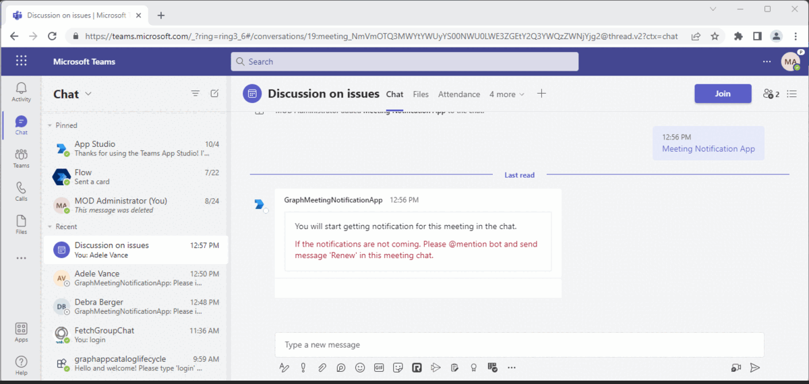
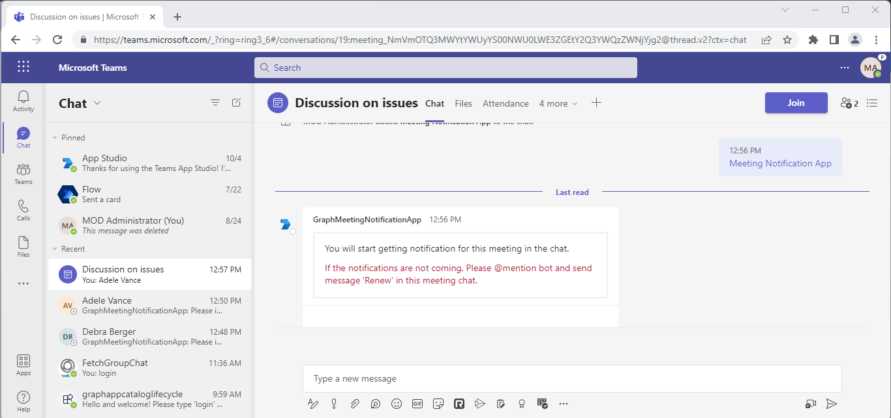
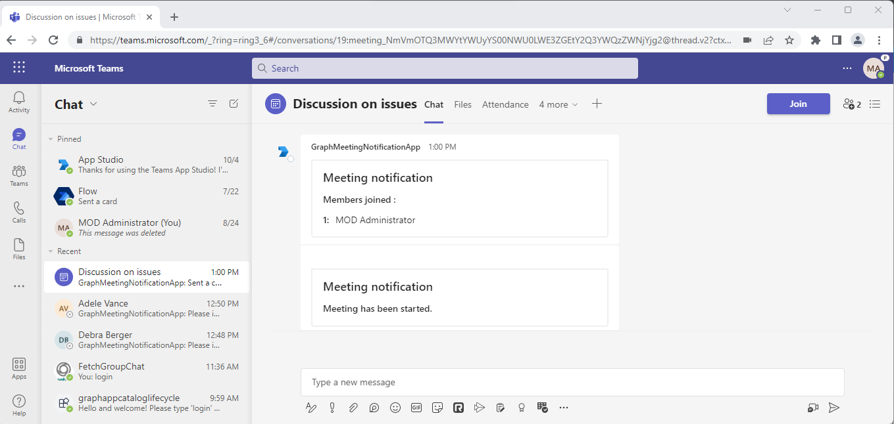
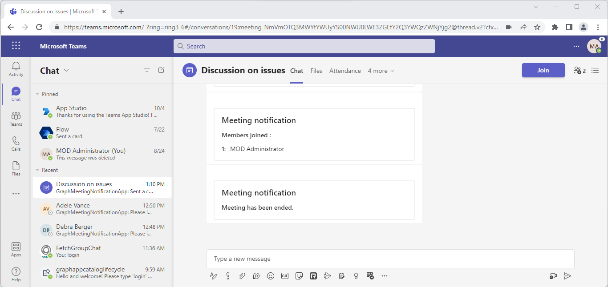

# Online meeting subscription

This is a sample application which demonstrates use of online meeting subscription that will post notifications when user joined/left and when meeting start/end.

## Concepts introduced in this sample
- After sucessfully installation of bot in meeting you will get a welcome card and the subscription will be created for meeting it is installed in.

## Interaction with app



## Prerequisites

- Microsoft Teams is installed and you have an account (not a guest account)
-  .[NET 6.0](https://dotnet.microsoft.com/en-us/download) SDK.
    ```bash
        # determine dotnet version
        dotnet --version
    ```
-  [ngrok](https://ngrok.com/download) or equivalent tunneling solution
-  [M365 developer account](https://docs.microsoft.com/en-us/microsoftteams/platform/concepts/build-and-test/prepare-your-o365-tenant) or access to a Teams account with the appropriate permissions to install an app.

## Setup

### Register your application with Azure AD

1. Register a new application in the [Azure Active Directory – App Registrations](https://go.microsoft.com/fwlink/?linkid=2083908) portal.

   - Navigate to **API Permissions**, and make sure to add the follow permissions:
   - Select Add a permission
   - Select Microsoft Graph -> Application permissions.
   - `OnlineMeetings.Read.All`
   - Click on Add permissions. Please make sure to grant the admin consent for the required permissions.
   - Navigate to the **Certificates & secrets**. In the Client secrets section, click on "+ New client secret". Add a description (Name of the secret) for the secret and select “Never” for Expires. Click "Add". Once the client secret is created, copy its value, it need to be placed in the appsettings.json file.

2. Setup for Bot
	
	- Also, register a bot with Azure Bot Service, following the instructions [here](https://docs.microsoft.com/en-us/azure/bot-service/bot-service-quickstart-registration?view=azure-bot-service-3.0).
	- Ensure that you've [enabled the Teams Channel](https://docs.microsoft.com/en-us/azure/bot-service/channel-connect-teams?view=azure-bot-service-4.0)
	- While registering the bot, use `https://<your_ngrok_url>/api/messages` as the messaging endpoint.

### Create and install Self-Signed certificate

 To include resource data of online meeting, this Graph API require self-signed certificate. Follow the below steps to create and manage certificate.

 - You can self-sign the certificate, since Microsoft Graph does not verify the certificate issuer, and uses the public key for only encryption.

 - Use [Azure Key Vault](https://docs.microsoft.com/en-us/azure/key-vault/key-vault-whatis) as the solution to create, rotate, and securely manage certificates. Make sure the keys satisfy the following criteria:

    - The key must be of type `RSA`
    - The key size must be between 2048 and 4096 bits

 - Follow this documentation for the steps - [**Create and install Self-Signed certificate**](MeetingNotification/CertificateDocumentation/README.md)
 
 3. Run ngrok - point to port 3978

   ```bash
     ngrok http -host-header=rewrite 3978
   ```  

4.  Setup for code.

- Clone the repository

    ```bash
    git clone https://github.com/OfficeDev/Microsoft-Teams-Samples.git
    ```
    
- Modify the `/appsettings.json` and fill in the following details:
  - `{{MicrosoftAppId}}` - Generated from Step 1 while doing AAd app registration in Azure portal.
  - `{{ MicrosoftAppPassword}}` - Generated from Step 1, also referred to as Client secret
  - `{{ MicrosoftAppTenantId }}`- Generated from Step 1 while doing AAd app registration in Azure portal Directory (tenant) ID.
  - `{{BaseUrl}}` -  Your application's base url. E.g. https://12345.ngrok.io if you are using ngrok.
  - `{{ Base64EncodedCertificate}}` - value from *Create and install Self-Signed certificate* step 2
  - `{{ CertificateThumbprint }}` - value from *Create and install Self-Signed certificate* step 2
    
 - Run from Visual Studio code

  - Launch Visual Studio code
  - File -> Open Folder
  - Navigate to `samples/graph-meeting-notification/csharp` folder
  - Select `MeetingNotification` folder
  - Press `F5` to run the project

5. Setup Manifest for Teams
- __*This step is specific to Teams.*__
    - **Edit** the `manifest.json` contained in the ./AppPackage folder to replace your Microsoft App Id (that was created when you registered your app registration earlier) *everywhere* you see the place holder string `{{Microsoft-App-Id}}` (depending on the scenario the Microsoft App Id may occur multiple times in the `manifest.json`)
    - **Edit** the `manifest.json` for `validDomains` and replace `{{domain-name}}` with base Url of your domain. E.g. if you are using ngrok it would be `https://1234.ngrok.io` then your domain-name will be `1234.ngrok.io`.
    
    - **Zip** up the contents of the `AppPackage` folder to create a `manifest.zip` (Make sure that zip file does not contains any subfolder otherwise you will get error while uploading your .zip package)

- Upload the manifest.zip to Teams (in the Apps view click "Upload a custom app")
   - Go to Microsoft Teams. From the lower left corner, select Apps
   - From the lower left corner, choose Upload a custom App
   - Go to your project directory, the ./AppPackage folder, select the zip folder, and choose Open.
   - Select Add in the pop-up dialog box. Your app is uploaded to Teams.
   
Follow this documentation to get more information on custom apps and uploading them into Teams - [Manage custom apps](https://docs.microsoft.com/en-us/microsoftteams/custom-app-overview) and [Upload an app package](https://docs.microsoft.com/en-us/microsoftteams/upload-custom-apps)

## Running the sample


- After that when the metting gets started or user joins the meeting, notifications will be sent in chat:



- Notifications will also be triggered when someone leaves that meeting or when meeting gets end:


 
## Further reading
- [Change notifications for Microsoft Teams meeting](https://docs.microsoft.com/en-us/graph/changenotifications-for-onlinemeeting)
- [Set up change notifications that include resource data](https://docs.microsoft.com/en-us/graph/webhooks-with-resource-data)

