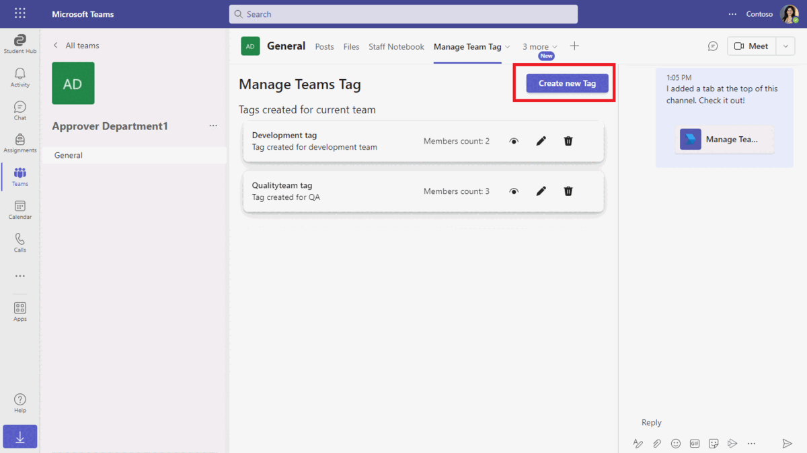
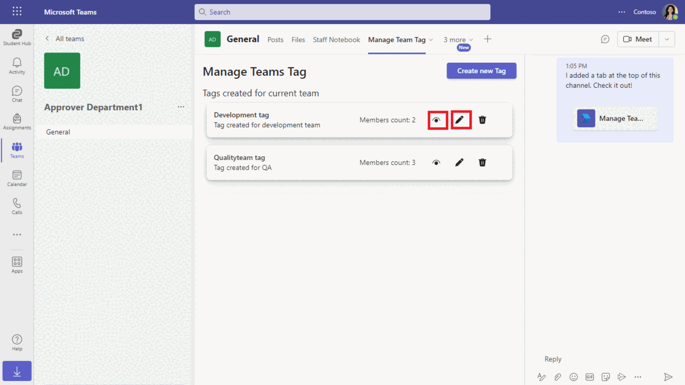
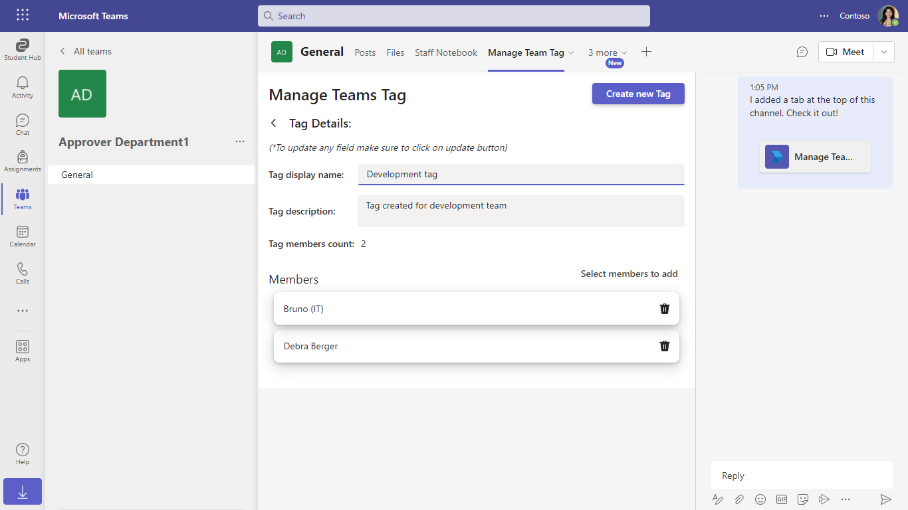

# This is a sample application shows the usage of Graph CRUD operations related to team tags.

This is a sample application where user can create, update, add or remove members of a tag. All of Graph CRUD operations related to tags can be performed within this sample.

## Key features

1. Create new tags.



2. View/Edit existing tags.




## Prerequisites

- Microsoft Teams is installed and you have an account (not a guest account)
-  .[NET 6.0](https://dotnet.microsoft.com/en-us/download) SDK.
    ```bash
        # determine dotnet version
        dotnet --version
    ```
-  [ngrok](https://ngrok.com/) or equivalent tunneling solution
-  [M365 developer account](https://docs.microsoft.com/en-us/microsoftteams/platform/concepts/build-and-test/prepare-your-o365-tenant) or access to a Teams account with the appropriate permissions to install an app.

## To try this sample

> Note these instructions are for running the sample on your local machine, the tunnelling solution is required because
> the Teams service needs to call into the app.

### 1. Clone the repository
   ```bash
   git clone https://github.com/OfficeDev/Microsoft-Teams-Samples.git
   ```

### 2. Launch Visual Studio
   - File -> Open -> Project/Solution
   - Navigate to folder where repository is cloned then `samples/graph-teams-tag/csharp/GraphTeamsTag.sln`
    
### 3. Start ngrok on localhost:3978
- Open ngrok and run command `ngrok http -host-header=rewrite 3978` 
- Once started you should see link  `https://41ed-abcd-e125.ngrok.io`. Copy it, this is your baseUrl that will used as endpoint for Azure bot.


4. Modify the `manifest.json` in the `/AppPackage` folder and replace the following details:
   - `{{APP-ID}}` with any guid id value.
   - `{{BASE-URL}}` with base Url domain. E.g. if you are using ngrok it would be `https://1234.ngrok.io` then your domain-name will be `1234.ngrok.io`.

5. Zip the contents of `AppPackage` folder into a `manifest.zip`, and use the `manifest.zip` to deploy in app store or add to Teams using step 6.

6. Upload the manifest.zip to Teams (in the Apps view click "Upload a custom app")
   - Go to Microsoft Teams and then go to side panel, select Apps
   - Choose Manage your apps -> Upload an app -> Upload a custom App
   - Go to your project directory, the ./AppPackage folder, select the zip folder, and choose Open.
   - Select Add in the pop-up dialog box. Your app is uploaded to Teams.

**NOTE: If you are not able to send caption, try configuring tab again.**

## Features of this sample

1. User can see list of tags created for the current team.

2. User can view/edit the existing team tags.

3. User can create new team tags.

4. User can delete existing team tags.
