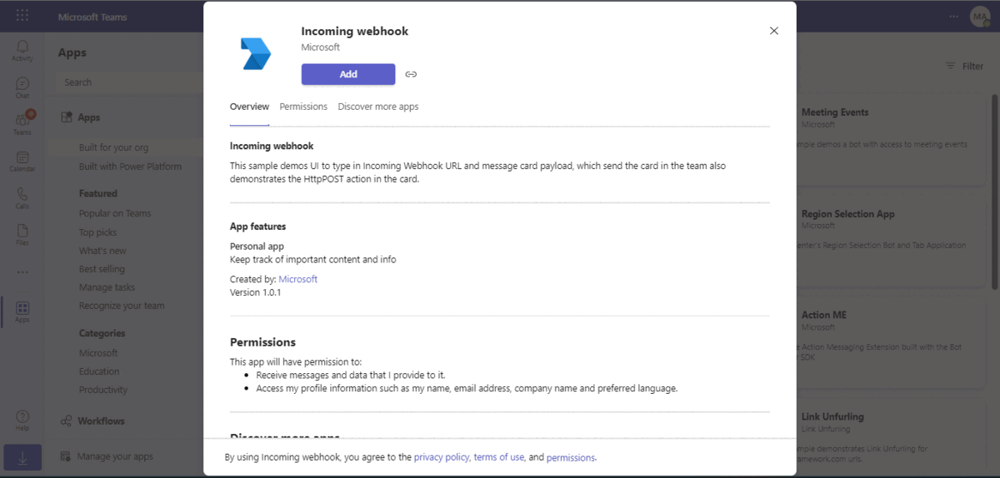
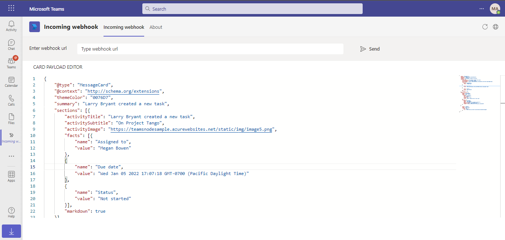
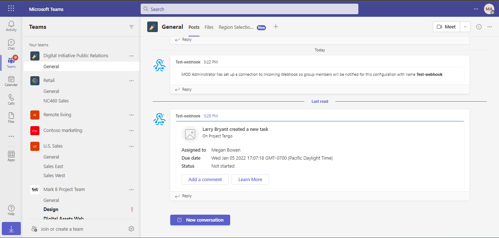
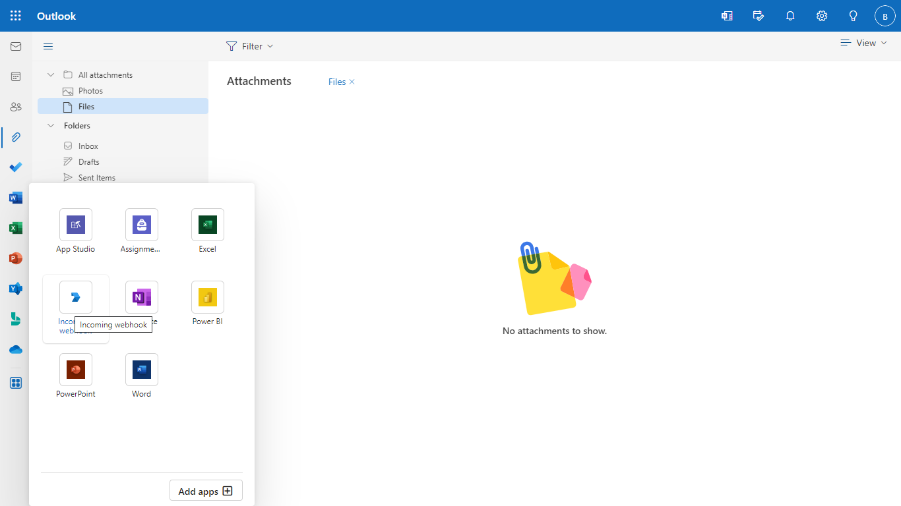
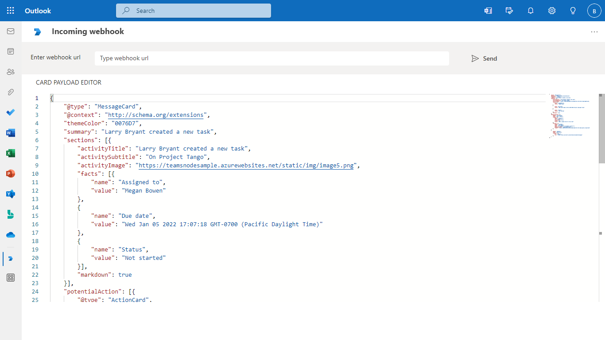
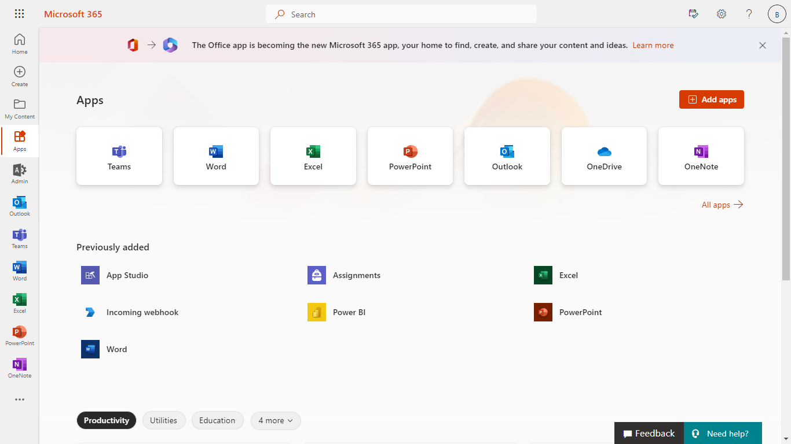
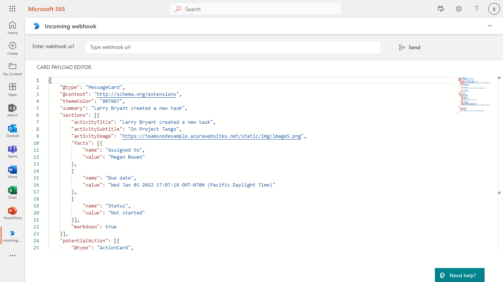
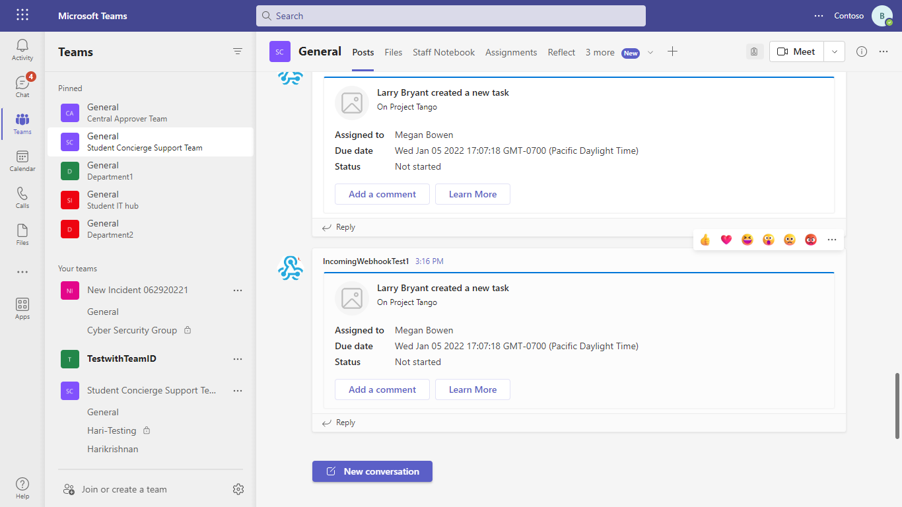

# Incoming webhook

This sample demos UI to type in Incoming Webhook URL and message card payload, which send the card in the team also demonstrates the HttpPOST action in the card.

## Included Features
* Tabs
* Incoming Webhooks

## Interaction with tab



## Prerequisites

- [.NET Core SDK](https://dotnet.microsoft.com/download) version 6.0

  ```bash
  # determine dotnet version
  dotnet --version
  ```
- Publicly addressable https url or tunnel such as [ngrok](https://ngrok.com/) or [Tunnel Relay](https://github.com/OfficeDev/microsoft-teams-tunnelrelay) 

- [Teams](https://teams.microsoft.com) Microsoft Teams is installed and you have an account

## Setup

### 1. Setup for incoming webhook

1) Create a incoming webhook. [Create incoming webhooks](https://docs.microsoft.com/en-us/microsoftteams/platform/webhooks-and-connectors/how-to/add-incoming-webhook). Keep this webhook URL handy while running the sample.

### 2. Setup NGROK
1) Run ngrok - point to port 3978

```bash
# ngrok http 3978 --host-header="localhost:3978"
```

### 3. Setup for code

1) Clone the repository
   ```bash
   git clone https://github.com/OfficeDev/Microsoft-Teams-Samples.git
   ```

1) In a terminal, navigate to `samples/incoming-webhook/csharp/ClientApp`

    ```bash
    npm install
    ```

    If you face any dependency error while installing node modules, try using below command

    ```bash
    npm install --legacy-peer-deps
    ```

1) In a terminal, navigate to `samples/incoming-webhook/csharp`

    ```bash
    # change into project folder
    cd # IncomingWebhook
    ```

1) Run the app from a terminal or from Visual Studio, choose option A or B.

  A) From a terminal

  ```bash
  # run the app
  dotnet run
  ```

  B) Or from Visual Studio

  - Launch Visual Studio
  - File -> Open -> Project/Solution
  - Navigate to `IncomingWebhook` folder
  - Select `IncomingWebhook.csproj` file
  - Press `F5` to run the project

### 4. Setup Manifest for Teams
1) __*This step is specific to Teams.*__
    - **Edit** the `manifest.json` contained in the  `AppPackage` folder to replace `{{Manifest-id}}` with any `GUID` ID.
    - **Edit** the `manifest.json` for `contentUrl`, `websiteUrl` inside `staticTabs` section. Replace `<<Domain-name>>` with app's base Url domain. E.g. if you are using ngrok it would be `https://1234.ngrok-free.app` then your domain-name will be `1234.ngrok-free.app`.
    - **Edit** the `manifest.json` for `validDomains` with base Url domain. E.g. if you are using ngrok it would be `https://1234.ngrok-free.app` then your domain-name will be `1234.ngrok-free.app`.
    - **Note:** If you want to test your app across multi hub like: Outlook/Office.com, please update the `manifest.json` in the `incoming-webhook\csharp\IncomingWebhook\Manifest_Hub` folder with the required values.
    - **Zip** up the contents of the `AppPackage` folder to create a `Manifest.zip` or `Manifest_Hub` folder to create a `Manifest_Hub.zip`(Make sure that zip file does not contains any subfolder otherwise you will get error while uploading your .zip package)
    - **Upload** the `manifest.zip` to Teams (In Teams Apps/Manage your apps click "Upload an app". Browse to and Open the .zip file. At the next dialog, click the Add button.)
    - Add the app to personal scope.


## Running the sample
- Open Incoming webhook tab.


- Click on send button. You will get a card from webhook in the team where incoming webhook is added.


## Outlook on the web

- To view your app in Outlook on the web.

- Go to [Outlook on the web](https://outlook.office.com/mail/)and sign in using your dev tenant account.

**On the side bar, select More Apps. Your sideloaded app title appears among your installed apps**



**Select your app icon to launch and preview your app running in Outlook on the web**




**Note:** Similarly, you can test your application in the Outlook desktop app as well.

## Office on the web

- To preview your app running in Office on the web.

- Log into office.com with test tenant credentials

**Select the Apps icon on the side bar. Your sideloaded app title appears among your installed apps**



**Select your app icon to launch your app in Office on the web**

  



**Note:** Similarly, you can test your application in the Office 365 desktop app as well.

## Further reading

- [Build webhooks and connectors ](https://docs.microsoft.com/en-us/microsoftteams/platform/webhooks-and-connectors/what-are-webhooks-and-connectors)
- [Extend Teams apps across Microsoft 365](https://learn.microsoft.com/en-us/microsoftteams/platform/m365-apps/overview)