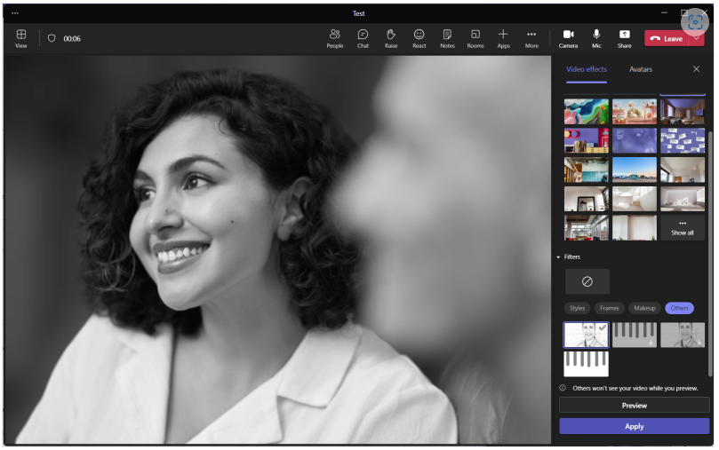

# Meeting AV Filters

This sample demos the use of AV filters for Teams meetings. 





## Prerequisites

- [.NET Core SDK](https://dotnet.microsoft.com/download) version 3.1

  ```bash
  # determine dotnet version
  dotnet --version
  ```

- [Ngrok](https://ngrok.com/download) (For local environment testing) Latest (any other tunneling software can also be used)
  ```bash
  # run ngrok locally
  ngrok http -host-header=localhost 3978
  ```

- [Teams](https://teams.microsoft.com) Microsoft Teams is installed and you have an account

## To try this sample

1) Clone the repository
   ```bash
   git clone https://github.com/OfficeDev/Microsoft-Teams-Samples.git
   ```

3) In a terminal, navigate to `samples/meeting-av-filters/csharp`

    ```bash
    # change into project folder
    cd # MeetingAVFilter
    ```
4) Run ngrok - point to port 3978

    ```bash
    # ngrok http -host-header=rewrite 3978
    ```
5) Modify the `manifest.json` in the `/AppPackage` folder and replace the following details
   - `<<GUID ID>>` id any guid id.
   - `<<VALID DOMAIN>>` with your app domain e.g. *.ngrok.io
   - in case of `videoAppContentUrl` the valid domain refers to the page where video frames are captured and processed.

6) Zip the contents of `AppPackage` folder into a `manifest.zip`, and use the `manifest.zip` to deploy in app store or add to Teams. Make sure the files `half.png` and `gray.png` are also included inside the zip file.

7) Run the app from a terminal or from Visual Studio, choose option A or B.

  A) From a terminal

  ```bash
  # run the app
  dotnet run
  ```

  B) Or from Visual Studio

  - Launch Visual Studio
  - File -> Open -> Project/Solution
  - Navigate to `MeetingAVFilter` folder
  - Select `MeetingAVFilter.csproj` file
  - Press `F5` to run the project

8) Upload the manifest.zip to Teams (in the Apps view click "Upload a custom app")
   - Go to Microsoft Teams. From the lower left corner, select Apps
   - From the lower left corner, choose Upload a custom App

9) Open any Microsoft Teams meeting and navigate to effects page
 -  

10) From the effects page, select others and select the custom filters we have uploaded.
  

## Features of the sample

- Open Teams meeting.
- Navigate to effects and background page and select other filters`.
- Click on our custom effects to see them applied to the video stream.

## Further reading

- [.NET Core CLI tools](https://docs.microsoft.com/en-us/dotnet/core/tools/?tabs=netcore2x)
- [Azure CLI](https://docs.microsoft.com/cli/azure/?view=azure-cli-latest)
- [Azure Portal](https://portal.azure.com)
