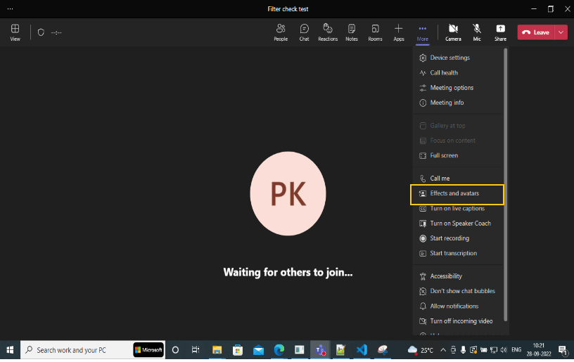

# Meeting AV Filters

This sample demos the use of AV filters for Teams meetings.



## Prerequisites

- [NodeJS](https://nodejs.org/en/)
- [ngrok](https://ngrok.com/) or equivalent tunnelling solution
- [Teams](https://teams.microsoft.com) Microsoft Teams is installed and you have an account

## To try this sample

1) Clone the repository
   ```bash
   git clone https://github.com/OfficeDev/Microsoft-Teams-Samples.git
   ```
2) Install node modules

   Inside node js folder,  navigate to `samples/meeting-av-filters/nodejs/ClientApp` open your local terminal and run the below command to install node modules. You can do the same in Visual Studio code terminal by opening the project in Visual Studio code.

    ```bash
    npm install
    ```
3) We have the run the solution so follow below steps:
 
   A) In a terminal, navigate to `samples/meeting-av-filters/nodejs/ClientApp`

4) Run ngrok - point to port 3978 (pointing to ClientApp)

    ```bash
    # ngrok http -host-header=rewrite 3978
    ```
5) Modify the `manifest.json` in the `/AppPackage` folder and replace the following details
   - `{{Manifest-id}}` with some unique GUID.
   - `{{Domain Name}}` with your application's base url, e.g. https://1234.ngrok.io
   - Inside the filters section `id` will be random GUID and `name` will be filter name that is displayed inside meeting. We have predefined 2 filters.
   - In case of `videoAppContentUrl` the valid domain refers to the page where video frames are captured and processed.

6) Zip the contents of `AppPackage` folder into a `manifest.zip`, and use the `manifest.zip` to deploy in app store or add to Teams. Make sure the files `half.png` and `gray.png` are also included inside the zip file.

7) Run the solution i.e. `samples/meeting-av-filters/nodejs/ClientApp`
    ```
    npm start
    ```
8) Upload the manifest.zip to Teams (in the Apps view click "Upload a custom app")
   - Go to Microsoft Teams. From the lower left corner, select Apps
   - From the lower left corner, choose Upload a custom App
   - Go to your project directory, the ./AppPackage folder, select the zip folder, and choose Open.
   - Select Add in meeting in the pop-up dialog box. Select the meeting where you want to add the filters. Select Done.

## Testing the bot using Bot Framework Emulator

[Bot Framework Emulator](https://github.com/microsoft/botframework-emulator) is a desktop application that allows bot developers to test and debug their bots on localhost or running remotely through a tunnel.

- Install the Bot Framework Emulator version 4.5.0 or greater from [here](https://github.com/Microsoft/BotFramework-Emulator/releases)

## Further reading

- [Enable-and-configure-your-app-for-teams-meetings](https://docs.microsoft.com/en-us/microsoftteams/platform/apps-in-teams-meetings/enable-and-configure-your-app-for-teams-meetings)