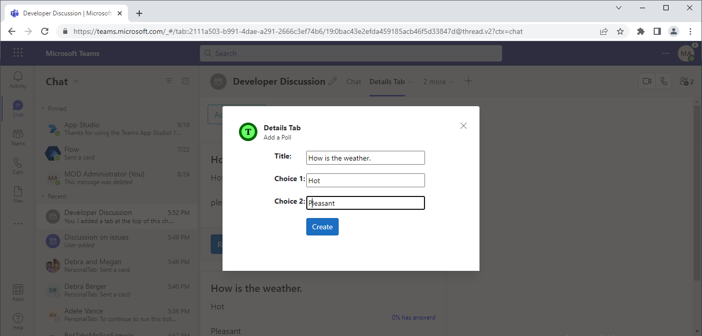
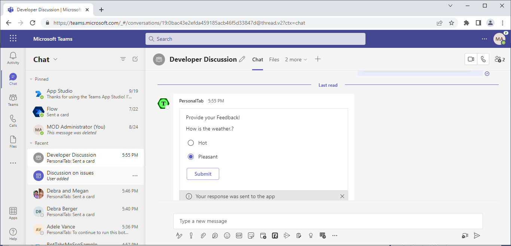

# Meetings Details Tab

This sample shows creating poll in meeting , where memebers of the meeting can answer poll question and can see the results.

## Interaction with app


## Prerequisites

- [.NET Core SDK](https://dotnet.microsoft.com/download) version 3.1

  ```bash
  # determine dotnet version
  dotnet --version
  ```
- [ngrok](https://ngrok.com/) or equivalent tunnelling solution

## Setup

- Register your app with Microsoft identity platform via the Azure AD portal
  - Your app must be registered in the Azure AD portal to integrate with the Microsoft identity platform and call Microsoft Graph APIs. See [Register an application with the Microsoft identity platform](https://docs.microsoft.com/en-us/graph/auth-register-app-v2).

  - Register a bot with Azure Bot Service, following the instructions [here](https://docs.microsoft.com/en-us/azure/bot-service/bot-service-quickstart-registration?view=azure-bot-service-3.0).
- Ensure that you've [enabled the Teams Channel](https://docs.microsoft.com/en-us/azure/bot-service/channel-connect-teams?view=azure-bot-service-4.0)
- While registering the bot, use `https://<your_ngrok_url>/api/messages` as the messaging endpoint.
    > NOTE: When you create your bot you will create an App ID and App password - make sure you keep these for later.
  
- Clone the repository 
   ```bash
   git clone https://github.com/OfficeDev/Microsoft-Teams-Samples.git
   ```

- Build your solution

  - Launch Visual Studio
  - File -> Open -> Project/Solution
  - Navigate to `samples/meetings-details-tab/csharp` folder
  - Select `DetailsTab.csproj` file
  - Press `F5` to run the project

- Setup ngrok
  ```bash
  ngrok http -host-header=rewrite 3978
  ```
- Go to appsettings.json and add ```MicrosoftAppId```, ```MicrosoftAppPassword``` and ```BaseUrl``` information.
- Update the manifest.json file with ```Microsoft-App-ID``` and ```BaseUrl``` value.
- Run your app, either from Visual Studio with ```F5``` or using ```dotnet run``` in the appropriate folder.
- [Install the App in Teams Meeting](https://docs.microsoft.com/en-us/microsoftteams/platform/apps-in-teams-meetings/teams-apps-in-meetings?view=msteams-client-js-latest#meeting-lifecycle-scenarios)

## Running the sample

Interact with Details Tab in Meeting.
1. Install the Details Tab manifest in meeting chat.
2. Add the Details Tab in Meeting
3. Click on `Add Agenda`
4. Newly added agenda will be added to Tab.


5. Participants in meeting can submit their response in adaptive card


6.Response will be recorded and Bot will send an new adaptive card with response..


## Further Reading

[Meetings-details-tab](https://learn.microsoft.com/en-us/microsoftteams/platform/apps-in-teams-meetings/build-tabs-for-meeting?tabs=desktop)
 
  
  
 
