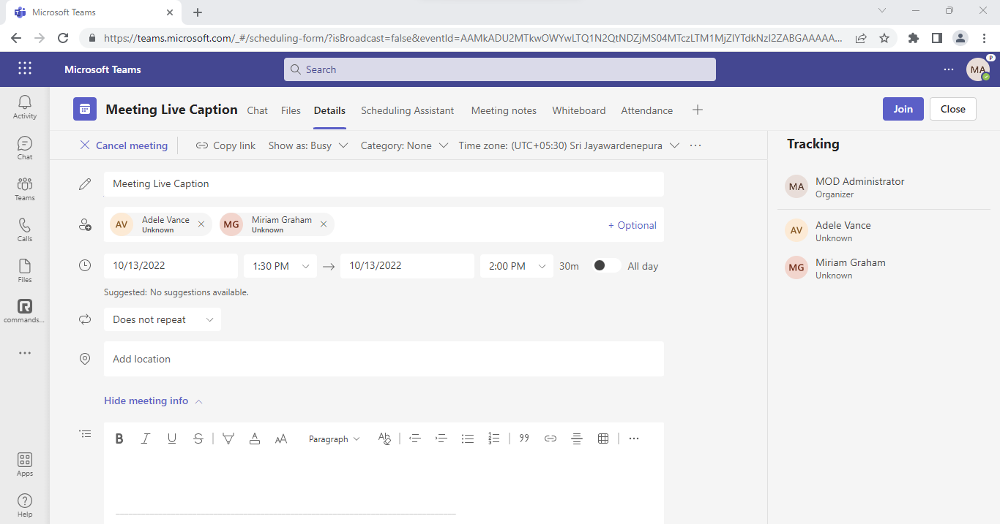
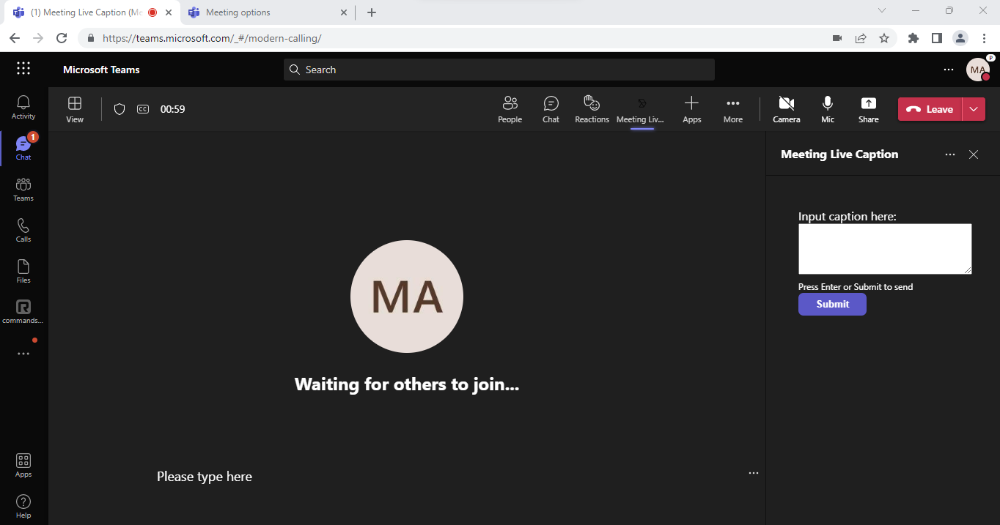

# Meeting side panel application uses CART link to send caption in live meeting.

This is a sample meeting side panel application which demonstrates how to enable live caption in the meeting and using the CART link how to send caption in live meeting. Meeting side panel application uses CART link to send caption in live meeting.

## Enable CART Captions
Once the meeting is scheduled. Follow this doc to enable [Provide Cart Catptions]("https://support.microsoft.com/office/use-cart-captions-in-a-microsoft-teams-meeting-human-generated-captions-2dd889e8-32a8-4582-98b8-6c96cf14eb47").
Copy the CART link it will used while configuring tab for meeting.

## Key features

1. Schedule the meeting and add Meeting Caption Tab in that particular scheduled meeting.

2. Once meeting started, turn on live caption.

3. Once the live caption has started, you can use the app to send live caption.

4. After clicking on `Submit` button, you will see the caption in the meeting.



## Prerequisites

- Microsoft Teams is installed and you have an account (not a guest account)
-  .[NET 6.0](https://dotnet.microsoft.com/en-us/download) SDK.
    ```bash
        # determine dotnet version
        dotnet --version
    ```
-  [ngrok](https://ngrok.com/) or equivalent tunneling solution
-  [M365 developer account](https://docs.microsoft.com/en-us/microsoftteams/platform/concepts/build-and-test/prepare-your-o365-tenant) or access to a Teams account with the appropriate permissions to install an app.

## To try this sample

> Note these instructions are for running the sample on your local machine, the tunnelling solution is required because
> the Teams service needs to call into the bot.

### 1. Start ngrok on localhost:3978
- Open ngrok and run command `ngrok http -host-header=rewrite 3978` 
- Once started you should see link  `https://41ed-abcd-e125.ngrok.io`. Copy it, this is your baseUrl that will used as endpoint for Azure bot and webhook.


### 2. Manually update the manifest.json
- Edit the `manifest.json` contained in the  `/AppManifest` folder to and fill in `<<App-Domain>>"` with ngrok link we get in step 1.
- Zip up the contents of the `/AppManifest` folder to create a `manifest.zip`
- Upload the manifest.zip to Teams (in the Apps view click "Upload a custom app")

### 3. To try this sample

- In a terminal, navigate to `MeetingLiveCaption`

    ```bash
    # change into project folder
    cd # MeetingLiveCaption
    ```

- Run the bot from a terminal or from Visual Studio, choose option A or B.

  A) From a terminal

  ```bash
  # run the bot
  dotnet run
  ```

  B) Or from Visual Studio

  - Launch Visual Studio
  - File -> Open -> Project/Solution
  - Navigate to `samples/meetings-live-caption/csharp` folder
  - Select `MeetingLiveCaption.csproj` file
  - Press `F5` to run the project

**NOTE: If you are not able to send caption, try configuring tab again.**
