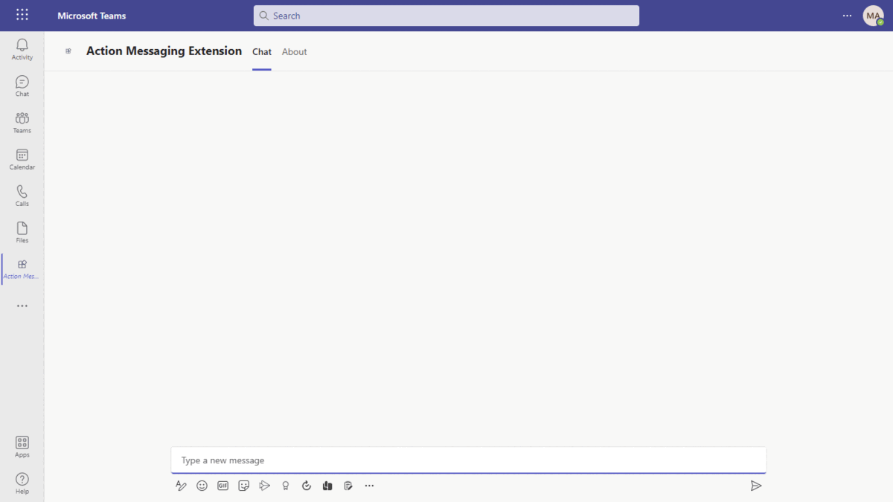
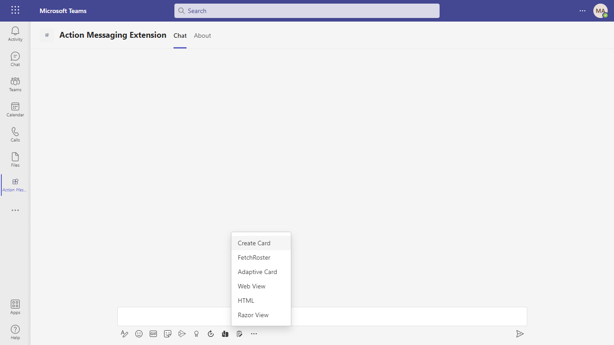
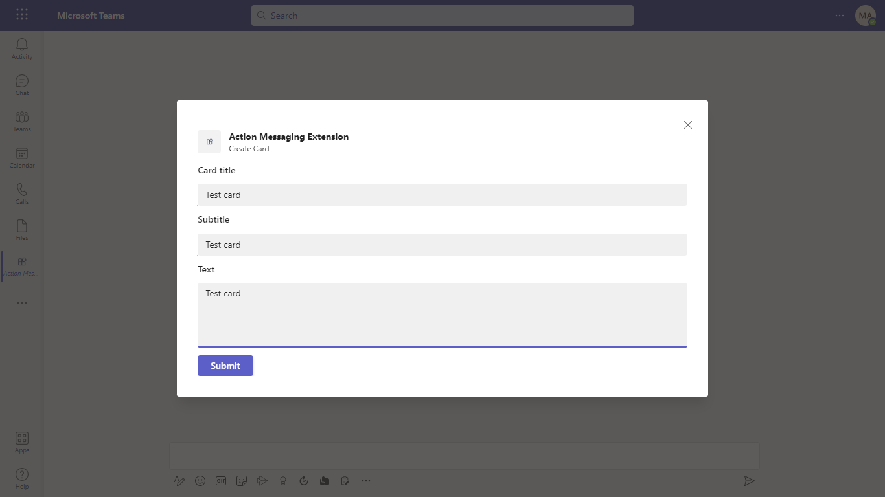
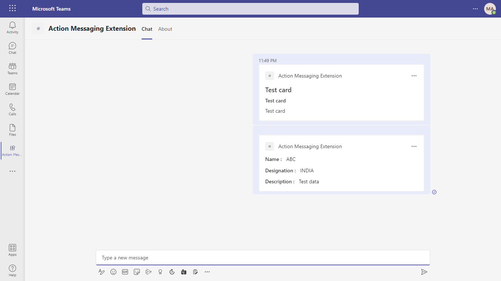
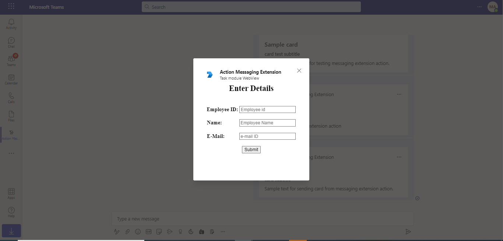
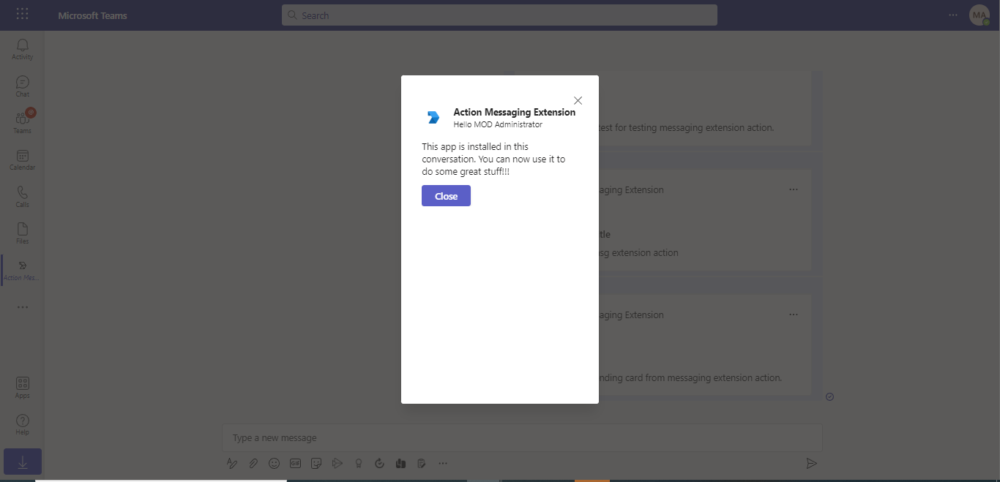

# Teams Message Extension Action Bot

Bot Framework v4 Conversation Bot sample for Teams.

There are two basic types of Messaging Extension in Teams: [Search-based](https://docs.microsoft.com/microsoftteams/platform/messaging-extensions/how-to/search-commands/define-search-command) and [Action-based](https://docs.microsoft.com/microsoftteams/platform/messaging-extensions/how-to/action-commands/define-action-command). This sample illustrates how to
build an Action-based Messaging Extension.

This sample is a Spring Boot app and uses the Azure CLI and azure-webapp Maven plugin to deploy to Azure.

## Included Features
* Bots
* Message Extensions
* Action Commands

- **Interaction with Messaging Extension action**


## Try it yourself - experience the App in your Microsoft Teams client
Please find below demo manifest which is deployed on Microsoft Azure and you can try it yourself by uploading the app package (.zip file link below) to your teams and/or as a personal app. (Sideloading must be enabled for your tenant, [see steps here](https://docs.microsoft.com/microsoftteams/platform/concepts/build-and-test/prepare-your-o365-tenant#enable-custom-teams-apps-and-turn-on-custom-app-uploading)).

**Teams Messaging Extensions Action:** [Manifest](/samples/msgext-action/csharp/demo-manifest/msgext-action.zip)

## Prerequisites

- Intall Java 1.8+ [Java](https://www.oracle.com/java/technologies/downloads/#java8-windows)
- Install [Maven](https://maven.apache.org/)
- Setup for Java and Maven [Setup](Setup.md)
- An account on [Azure](https://azure.microsoft.com) if you want to deploy to Azure.
- Microsoft Teams is installed and you have an account
- [dev tunnel](https://learn.microsoft.com/en-us/azure/developer/dev-tunnels/get-started?tabs=windows) or [ngrok](https://ngrok.com/) latest version or equivalent tunnelling solution

## Setup

> Note these instructions are for running the sample on your local machine, the tunnelling solution is required because
the Teams service needs to call into the bot.

1) Run ngrok - point to port 3978

   ```bash
   ngrok http 3978 --host-header="localhost:3978"
   ```  

   Alternatively, you can also use the `dev tunnels`. Please follow [Create and host a dev tunnel](https://learn.microsoft.com/en-us/azure/developer/dev-tunnels/get-started?tabs=windows) and host the tunnel with anonymous user access command as shown below:

   ```bash
   devtunnel host -p 3978 --allow-anonymous
   ```

1) Setup for Bot

   In Azure portal, create a [Azure Bot resource](https://docs.microsoft.com/azure/bot-service/bot-service-quickstart-registration).
    - For bot handle, make up a name.
    - Select "Use existing app registration" (Create the app registration in Azure Active Directory beforehand.)
    - Choose "Accounts in any organizational directory (Any Azure AD directory - Multitenant)" in Authentication section in your App Registration to run this sample smoothly.
    - __*If you don't have an Azure account*__ create an [Azure free account here](https://azure.microsoft.com/free/)

   In the new Azure Bot resource in the Portal, 
    - Ensure that you've [enabled the Teams Channel](https://learn.microsoft.com/azure/bot-service/channel-connect-teams?view=azure-bot-service-4.0)
    - In Settings/Configuration/Messaging endpoint, enter the current `https` URL you were given by running the tunnelling application. Append with the path `/api/messages`

1) Clone the repository

    ```bash
    git clone https://github.com/OfficeDev/Microsoft-Teams-Samples.git
    ```

1) Update the `resources/application.properties` file configuration in your project, for the bot to use the Microsoft App Id and App Password from the Bot Framework registration. (Note the App Password is referred to as the "client secret" in the azure portal and you can always create a new client secret anytime.)

1) From the root of this project folder: (`samples/msgext-action/java`)
    - Open a terminal and build the sample using `mvn package` command
    - Install the packages in the local cache by using `mvn install` command in a terminal
    - Run it by using `java -jar .\target\bot-teams-messaging-extensions-action-sample.jar` command in a terminal

1) __*This step is specific to Teams.*__
    - **Edit** the `manifest.json` contained in the `appManifest` folder to replace your Microsoft App Id (that was created when you registered your bot earlier) *everywhere* you see the place holder string `<<YOUR-MICROSOFT-APP-ID>>` (depending on the scenario the Microsoft App Id may occur multiple times in the `manifest.json`)
    - **Edit** the `manifest.json` for `validDomains` with base Url domain. E.g. if you are using ngrok it would be `https://1234.ngrok-free.app` then your domain-name will be `1234.ngrok-free.app` and if you are using dev tunnels then your domain will be like: `12345.devtunnels.ms`.
    - **Zip** up the contents of the `appManifest` folder to create a `manifest.zip` (Make sure that zip file does not contains any subfolder otherwise you will get error while uploading your .zip package)
    - **Upload** the `manifest.zip` to Teams (In Teams Apps/Manage your apps click "Upload an app". Browse to and Open the .zip file. At the next dialog, click the Add button.)

## Running the sample

> Note this `manifest.json` specified that the bot will be called from both the `compose` and `message` areas of Teams. Please refer to Teams documentation for more details.

1. Selecting the **Create Card** command from the Compose Box command list. The parameters dialog will be displayed and can be submitted to initiate the card creation within the Messaging Extension code.







2. Selecting the **Web View** command from the Message command list.


3. Selecting the **FetchRoster** command from the Message command list. *Even though this action is being shown on the contextual menu, it's not implemented and is expected to fail.*


**Note:** Likewise you can try with all other configured commands in your app manifest.

## Deploy the bot to Azure

To learn more about deploying a bot to Azure, see [Deploy your bot to Azure](https://aka.ms/azuredeployment) for a complete list of deployment instructions.

## Further reading

- [Messaging extension action](https://learn.microsoft.com/microsoftteams/platform/messaging-extensions/how-to/action-commands/define-action-command)
- [Spring Boot](https://spring.io/projects/spring-boot)
- [Maven Plugin for Azure App Service](https://github.com/microsoft/azure-maven-plugins/tree/develop/azure-webapp-maven-plugin)
- [Bot Framework Documentation](https://docs.botframework.com)
- [Bot Basics](https://docs.microsoft.com/azure/bot-service/bot-builder-basics?view=azure-bot-service-4.0)
- [Azure Bot Service Introduction](https://docs.microsoft.com/azure/bot-service/bot-service-overview-introduction?view=azure-bot-service-4.0)
- [Azure Bot Service Documentation](https://docs.microsoft.com/azure/bot-service/?view=azure-bot-service-4.0)
- [Azure for Java cloud developers](https://docs.microsoft.com/en-us/azure/java/?view=azure-java-stable)

