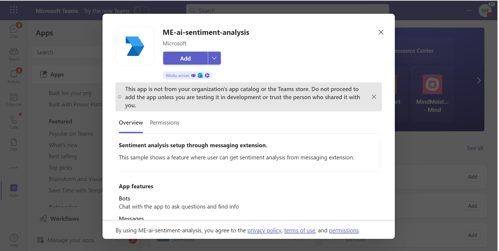
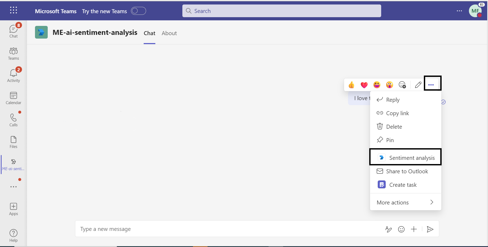
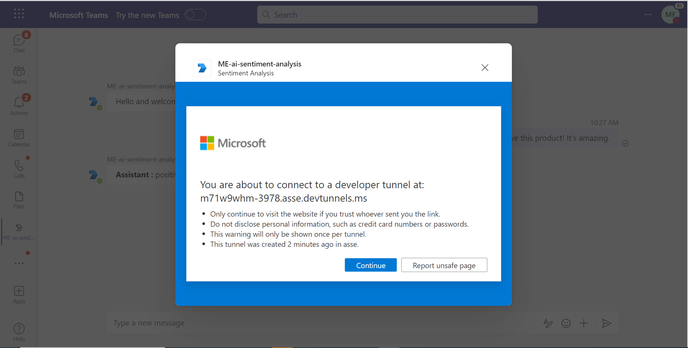
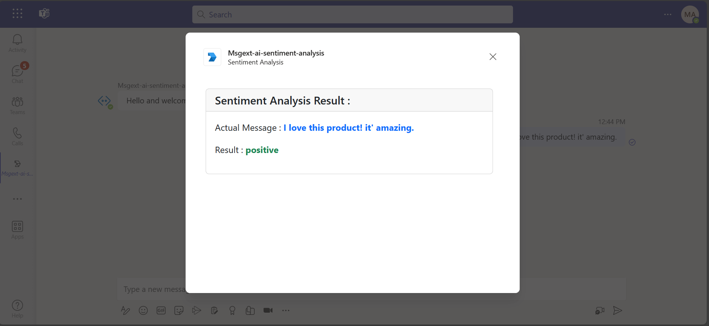
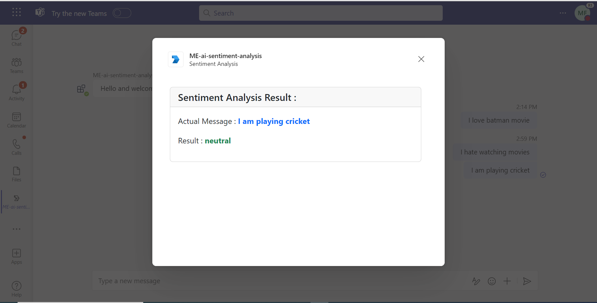

# Sentiment Analysis for Teams chat messages using Azure Open AI and messaging extension.

This sample shows a feature where user can analyze sentiments for messages posted in Teams chat using messaging extension and Azure Open AI.

## Included Features
* ME
* Azure Open AI For Sentiment Analysis

## Interaction with app


## Try it yourself - experience the App in your Microsoft Teams client
Please find below demo manifest which is deployed on Microsoft Azure and you can try it yourself by uploading the app package (.zip file link below) to your teams and/or as a personal app. (Sideloading must be enabled for your tenant, [see steps here](https://docs.microsoft.com/microsoftteams/platform/concepts/build-and-test/prepare-your-o365-tenant#enable-custom-teams-apps-and-turn-on-custom-app-uploading)).

**Message Extension AI Sentiment Analysis:** [Manifest](demo-manifest/msgext-ai-sentiment-analysis.zip)

## Prerequisites

- Microsoft Teams is installed and you have an account (not a guest account)
-  [NodeJS](https://nodejs.org/en/)
-  [devtunnel](https://aka.ms/TunnelsCliDownload/win-x64) or [ngrok](https://ngrok.com/) latest version or equivalent tunneling solution
-  [M365 developer account](https://docs.microsoft.com/microsoftteams/platform/concepts/build-and-test/prepare-your-o365-tenant) or access to a Teams account with the 
   appropriate permissions to install an app.
- [Teams Toolkit for VS Code](https://marketplace.visualstudio.com/items?itemName=TeamsDevApp.ms-teams-vscode-extension) or [TeamsFx CLI](https://learn.microsoft.com/microsoftteams/platform/toolkit/teamsfx-cli?pivots=version-one)

## Run the app (Using Teams Toolkit for Visual Studio Code)

The simplest way to run this sample in Teams is to use Teams Toolkit for Visual Studio Code.
1. Ensure you have downloaded and installed [Visual Studio Code](https://code.visualstudio.com/docs/setup/setup-overview)
1. Install the [Teams Toolkit extension](https://marketplace.visualstudio.com/items?itemName=TeamsDevApp.ms-teams-vscode-extension)
1. Select **File > Open Folder** in VS Code and choose this samples directory from the repo
1. Using the extension, sign in with your Microsoft 365 account where you have permissions to upload custom apps
1. In the `env/.env.local` file, fill all the required values for below and other values will be generated automatically once you debug/start the app.

`SECRET_OPENAI_API_KEY=<<SECRET_OPENAI_API_KEY>>` 

> Note: `Open Api key` is optional, if you dont have access to Azure Open Api Key. 

`SECRET_AZURE_OPENAPI_KEY=<Azure OpenAI Service Key>`

`CHAT_COMPLETION_MODEL_NAME=gpt-3.5-turbo`

> Note: If you are deploying the code, make sure that above mentioned values are properly updated at `env/.env.dev` or `env/.env.dev.user` wherever required.

1. Select **Debug > Start Debugging** or **F5** to run the app in a Teams web client.
1. In the browser that launches, select the **Add** button to install the app to Teams.
> If you do not have permission to upload custom apps (sideloading), Teams Toolkit will recommend creating and using a Microsoft 365 Developer Program account - a free program to get your own dev environment sandbox that includes Teams.

## Setup

> Note these instructions are for running the sample on your local machine, the tunnelling solution is required because
the Teams service needs to call into the bot.

1) Run ngrok - point to port 3978

   ```bash
   ngrok http 3978 --host-header="localhost:3978"
   ```  

   Alternatively, you can also use the `dev tunnels`. Please follow [Create and host a dev tunnel](https://learn.microsoft.com/en-us/azure/developer/dev-tunnels/get-started?tabs=windows) and host the tunnel with anonymous user access command as shown below:

   ```bash
   devtunnel host -p 3978 --allow-anonymous
   ```

1) Setup for Bot

   In Azure portal, create a [Azure Bot resource](https://docs.microsoft.com/azure/bot-service/bot-service-quickstart-registration).
    - For bot handle, make up a name.
    - Select "Use existing app registration" (Create the app registration in Azure Active Directory beforehand.)
    - Choose "Accounts in any organizational directory (Any Azure AD directory - Multitenant)" in Authentication section in your App Registration to run this sample smoothly.
    - __*If you don't have an Azure account*__ create an [Azure free account here](https://azure.microsoft.com/free/)

   In the new Azure Bot resource in the Portal, 
    - Ensure that you've [enabled the Teams Channel](https://learn.microsoft.com/azure/bot-service/channel-connect-teams?view=azure-bot-service-4.0)
    - In Settings/Configuration/Messaging endpoint, enter the current `https` URL you were given by running the tunnelling application. Append with the path `/api/messages`

1) Clone the repository

    ```bash
    git clone https://github.com/OfficeDev/Microsoft-Teams-Samples.git
    ```

1) In a terminal, navigate to `samples/msgext-ai-sentiment-analysis/nodejs`

1) Install modules

    ```bash
    npm install
    ```
1) Update the `.env` configuration for the bot to use the `MicrosoftAppId`, `MicrosoftAppPassword`,`AzureOpenAPIKey` and `BaseUrl`  with application base url. For e.g., your ngrok or dev tunnels url. (Note the MicrosoftAppId is the AppId created in step 1 (Setup for Bot), the MicrosoftAppPassword is referred to as the "client secret" in step 1 (Setup for Bot) and you can always create a new client secret anytime.)

1) Run your app

    ```bash
    npm start
    ```

1) __*This step is specific to Teams.*__
    - **Edit** the `manifest.json` contained in the `AppManifest` folder to replace your Microsoft App Id (that was created when you registered your bot earlier) *everywhere* you see the place holder string `<BOT_ID>` (depending on the scenario the Microsoft App Id may occur multiple times in the `manifest.json`)
    - Also, update the <TEAMS_APP_ID> with unique Guid in `manifest.json` stored in (`AppManifest`).

    - **Edit** the `manifest.json` for `validDomains` with base Url domain. E.g. if you are using ngrok it would be `https://1234.ngrok-free.app` then your domain-name will be `1234.ngrok-free.app`and if you are using dev tunnels then your domain will be `12345.devtunnels.ms`.
    - **Zip** up the contents of the `AppManifest` folder (AppManifest.admin and AppManifest.user folders separately) to create a `manifest.zip` (Make sure that zip file does not contains any subfolder otherwise you will get error while uploading your .zip package)
    - **Upload** the `manifest.zip` to Teams (In Teams Apps/Manage your apps click "Upload an app". Browse to and Open the .zip file. At the next dialog, click the Add button.)

**Note**: If you are facing any issue in your app, please uncomment [this](https://github.com/OfficeDev/Microsoft-Teams-Samples/blob/main/samples/msgext-ai-sentiment-analysis/nodejs/index.js#L44) line and put your debugger for local debug.

## Running the sample

Install Sample to Teams


Welcome Message then click on 3 dots navigate to ME sentiment analysis


 Click Continue 


Its shows Sentiment like(positive/negative/neutral) for messages posted in Teams chat.


Showing Sentiment Analysis `Negative` depending on Teams chat message


Showing Sentiment Analysis `Neutral` depending on Teams chat message


## Deploy to Azure

Deploy your project to Azure by following these steps:

| From Visual Studio Code                                                                                                                                                                                                                                                                                                                                                  | From TeamsFx CLI                                                                                                                                                                                                                    |
| :----------------------------------------------------------------------------------------------------------------------------------------------------------------------------------------------------------------------------------------------------------------------------------------------------------------------------------------------------------------------- | :---------------------------------------------------------------------------------------------------------------------------------------------------------------------------------------------------------------------------------- |
| <ul><li>Open Teams Toolkit, and sign into Azure by clicking the `Sign in to Azure` under the `ACCOUNTS` section from sidebar.</li> <li>After you signed in, select a subscription under your account.</li><li>Open the Teams Toolkit and click `Provision` from DEPLOYMENT section or open the command palette and select: `Teams: Provision`.</li><li>Open the Teams Toolkit and click `Deploy` or open the command palette and select: `Teams: Deploy`.</li></ul> | <ul> <li>Run command `teamsfx account login azure`.</li> <li>Run command `teamsfx provision --env dev`.</li> <li>Run command: `teamsfx deploy --env dev`. </li></ul> |

> Note: Provisioning and deployment may incur charges to your Azure Subscription.

**Note:** Once the provisioning and deployment steps are finished please update the `manifest.json` contained in the `AppManifest` folders (`AppManifest.admin` and `AppManifest.user` folders) for `validDomains` with base Url domain. E.g. if your deployed web app service URL is: `https://botaxxxxx.azurewebsites.net/` then your domain-name will be `botaxxxxx.azurewebsites.net`.


Also, make sure that below key/values are properly added to the configuration section of web app after code deployement.

`"name": "AZURE_STORAGE_CONNECTION_STRING", "value": 'DefaultEndpointsProtocol=https;AccountName=<Storage Account Name>;AccountKey=<Your Account Key>;EndpointSuffix=core.windows.net'`

`"name": "MicrosoftAppId", "value": "<BOT_ID>"`

`"name": "MicrosoftAppPassword", "value": "<BOT_PASSWORD>"`

`"name": "CHAT_COMPLETION_MODEL_NAME", "value": "gpt-3.5-turbo"`

`"name": "SECRET_AZURE_OPENAPI_KEY", "value": "<Your Azure Open API Key>"`

`"name": "WEBSITE_NODE_DEFAULT_VERSION", "value": "~18"`

`"name": "WEBSITE_RUN_FROM_PACKAGE", "value": "1"`

## Preview

Once the provisioning and deployment steps are finished, you can sideload your app.

**Note:** Please refer above `Setup` section for manifest configurations and sideload your packages in Teams.

## Further reading
- [Azure OpenAI Service](https://learn.microsoft.com/azure/ai-services/openai/overview)
- [Messaging Extension](https://learn.microsoft.com/microsoftteams/platform/messaging-extensions/how-to/action-commands/define-action-command)


