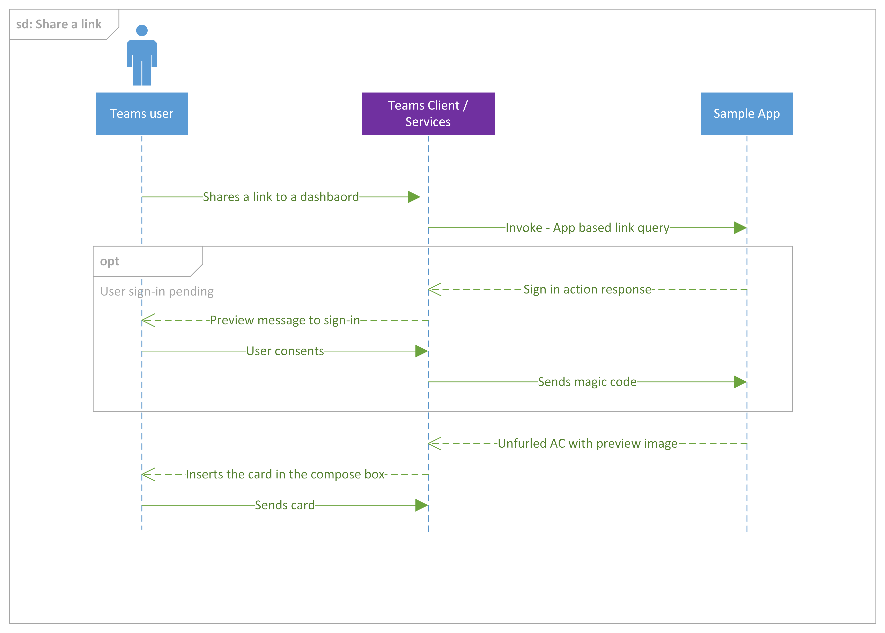
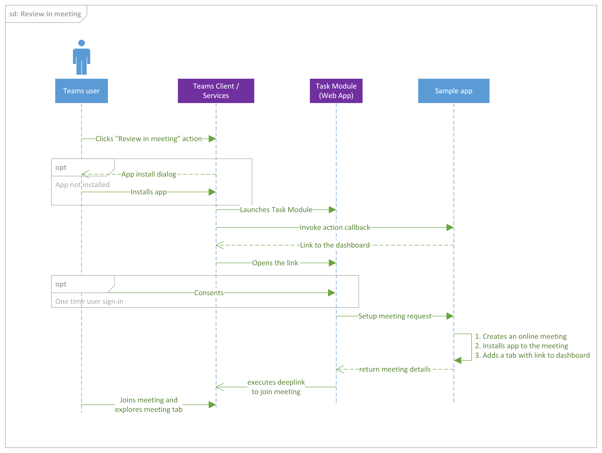
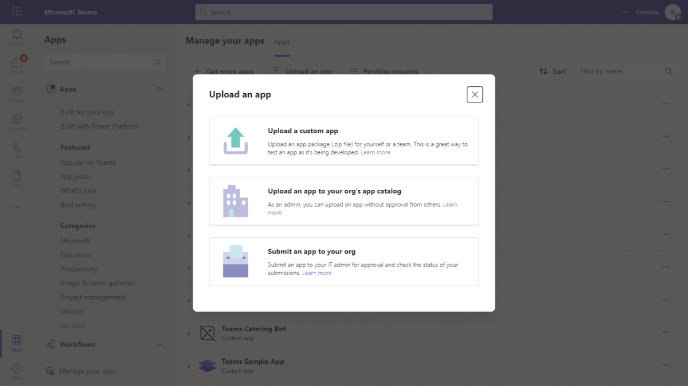

# Link unfurling meeting sample

This sample illustrates a common scenario where a user shares a link to a resource (dashboard in this sample) with a group of users, and they collaborate to review it in a meeting.

### 1. Workflow:
* User shares a link to a dashboard with a group of users.
* Teams app unfurls the link to an adaptive card with actions to view it in a stage tab or review it in a meeting.



### 2. Workflow:
* Other user in the group chooses to review the dashboard in a meeting.
* Teams app creates a new meeting, adds a tab (that points to the dashboard originally shared) to a meeting.
* User automatically joins the meeting and reviews the tab.
* User shares the tab to meeting stage view with other users.



## Interaction with app



## Prerequisites

- [.NET Core SDK](https://dotnet.microsoft.com/download) version 3.1

  ```bash
  # determine dotnet version
  dotnet --version
  ```
- Publicly addressable https url or tunnel such as [ngrok](https://ngrok.com/) or [Tunnel Relay](https://github.com/OfficeDev/microsoft-teams-tunnelrelay) 

## Setup

### 1. Setup for Bot

- Register a bot with Azure Bot Service, following the instructions [here](https://docs.microsoft.com/en-us/azure/bot-service/bot-service-quickstart-registration?view=azure-bot-service-3.0).
- Ensure that you've [enabled the Teams Channel](https://docs.microsoft.com/en-us/azure/bot-service/channel-connect-teams?view=azure-bot-service-4.0)
- While registering the bot, use `https://<your_ngrok_url>/api/messages` as the messaging endpoint.
    > NOTE: When you create your bot you will create an App ID and App password - make sure you keep these for later.
### 2. Setup NGROK
1) Run ngrok - point to port 3978

```bash
# ngrok http -host-header=rewrite 3978
```

### 3. Setup for code

- Clone the repository

    ```bash
    git clone https://github.com/OfficeDev/Microsoft-Teams-Samples.git
    ```

- Run the bot from a terminal or from Visual Studio:

  A) From a terminal, navigate to `samples\msgext-link-unfurling-meeting\csharp\Source`

  ```bash
  # run the bot
  dotnet run
  ```

  B) Or from Visual Studio

  - Launch Visual Studio
  - File -> Open -> Project/Solution
  - Navigate to `samples\msgext-link-unfurling-meeting\csharp\Source` folder
  - Select `LinkUnfurling.csproj` file
  - Press `F5` to run the project

### 4. Update the appsettings.json files.
* Clone the repo or download the sample code to your machine.
* Update the following settings in `appsettings.json`
  * `MicrosoftAppId` - App ID saved earlier.
  * `ClientId` - App ID saved earlier.
  * `TeamsBot:AppId` - App ID saved earlier.
  * `MicrosoftAppPassword` - App secret saved earlier.
  * `ClientSecret` - App secret saved earlier.
  * `AzureAd.domain` - Replace with ngrok domain. (ex. `<randomsubdomain>.ngrok.io`)
  * `ConnectionName` - Connection name 
  * `BaseUrl` - ngrok url saved earlier.
  * `TenantId` - Tenant ID where you wll run the Teams application.
  * `CatalogAppId` - App ID in organization's app store saved earlier.
  * `GraphApiBeta.Scopes` add the following graph permission(`TeamsAppInstallation.ReadWriteSelfForChat TeamsTab.ReadWriteForChat Chat.ReadBasic OnlineMeetings.ReadWrite`)
* Update the following in `.env` under ClientApp.
  * `REACT_APP_BASE_URL` - ngrok url saved earlier.
  * `REACT_APP_AZURE_APP_REGISTRATION_ID` - App ID saved earlier.
* Build and run the sample code in Visual studio / Visual studio code.

### 5. Troubleshooting
* If the web application fails to load, run `npm install` and `npm run build` under ClientApp folder.
* If the meeting setup fails with 403 (Not authorized), make sure you grant admin consent on behalf of all the users.
  * Grant admin conset - `https://login.microsoftonline.com/{tenant-id}/adminconsent?client_id={client-id}` where
  * `{client-id}` is the app ID saved earlier.
  * `{tenant-id}` is your organization's tenant ID.

### 6. Register a bot with Azure

1. Register a new application in the [Azure Active Directory – App Registrations](https://go.microsoft.com/fwlink/?linkid=2083908) portal.
2. Select **New Registration** and on the *register an application page*, set following values:
    * Set **name** to your app name.
    * Choose the **supported account types** (any account type will work)
    * Leave **Redirect URI** empty.
    * Choose **Register**.
3. On the overview page, copy and save the **Application (client) ID, Directory (tenant) ID**. You’ll need those later when updating your Teams application manifest and in the appsettings.json.
4. Under **Manage**, select **Expose an API**. 
5. Select the **Set** link to generate the Application ID URI in the form of `api://{AppID}`. Insert your fully qualified domain name (with a forward slash "/" appended to the end) between the double forward slashes and the GUID. The entire ID should have the form of: `api://fully-qualified-domain-name/botid-{AppID}`
    * ex: `api://%ngrokDomain%.ngrok.io/botid-00000000-0000-0000-0000-000000000000`.
6. Select the **Add a scope** button. In the panel that opens, enter `access_as_user` as the **Scope name**.
7. Set **Who can consent?** to `Admins and users`
8. Fill in the fields for configuring the admin and user consent prompts with values that are appropriate for the `access_as_user` scope:
    * **Admin consent display name:** Teams can access the user’s profile.
    * **Admin consent description**: Allows Teams to call the app’s web APIs as the current user.
    * **User consent display name**: Teams can access the user profile and make requests on the user's behalf.
    * **User consent description:** Enable Teams to call this app’s APIs with the same rights as the user.
9. Ensure that **State** is set to **Enabled**
10. Select **Add scope**
    * The domain part of the **Scope name** displayed just below the text field should automatically match the **Application ID** URI set in the previous step, with `/access_as_user` appended to the end:
        * `api://[ngrokDomain].ngrok.io/00000000-0000-0000-0000-000000000000/access_as_user.

11. In the **Authorized client applications** section, identify the applications that you want to authorize for your app’s web application. Each of the following IDs needs to be entered:
    * `1fec8e78-bce4-4aaf-ab1b-5451cc387264` (Teams mobile/desktop application)
    * `5e3ce6c0-2b1f-4285-8d4b-75ee78787346` (Teams web application)

12. Navigate to **API Permissions**, and make sure to add the follow permissions:
-   Select Add a permission
-   Select Microsoft Graph -\> Delegated permissions.
    * User.Read (enabled by default)
    * TeamsAppInstallation.ReadWriteSelfForChat
    * TeamsTab.ReadWriteForChat
    * Chat.ReadBasic
    * OnlineMeetings.ReadWrite
-   Click on Add permissions. Please make sure to grant the admin consent for the required permissions.
13. Navigate to **Authentication**
    If an app hasn't been granted IT admin consent, users will have to provide consent the first time they use an app.
    Set a redirect URI:
    * Select **Add a platform**.
    * Select **web**.
    * Enter the **redirect URI** for the app in the following format: 
    1) https://token.botframework.com/.auth/web/redirect, 
    2) https://%ngrokDomain%.ngrok.io/AuthEnd
    3) https://%ngrokDomain%.ngrok.io/AuthStart This will be the page where a successful implicit grant flow will redirect the user.
    
    Enable implicit grant by checking the following boxes:  
    ✔ ID Token  
    ✔ Access Token  
14.  Navigate to the **Certificates & secrets**. In the Client secrets section, click on "+ New client secret". Add a description      (Name of the secret) for the secret and select “Never” for Expires. Click "Add". Once the client secret is created, copy its value, it need to be placed in the appsettings.json.

### 7. Add authentication to your Teams bot
* Follow steps to add OAuth connection setting on [this page](https://docs.microsoft.com/en-us/microsoftteams/platform/bots/how-to/authentication/add-authentication?tabs=dotnet%2Cdotnet-sample#azure-ad-v2)

  * Make sure to copy and save OAuth connection name.
  * For `Scopes`, enter all the delegated graph permissions configured in the app(`TeamsAppInstallation.ReadWriteSelfForChat TeamsTab.ReadWriteForChat Chat.ReadBasic OnlineMeetings.ReadWrite`).
* Update Bot messaging endpoint to ngrok url with messaging endpoint. (ex. `https://<randomsubdomain>.ngrok.io/api/messages`

**Add OAuth connection:**


### 8. Setup Manifest for Teams

- **This step is specific to Teams.**
    - **Edit** the `manifest.json` contained in the  `samples\msgext-link-unfurling-meeting\csharp\Manifest` folder to replace your Microsoft App Id (that was created when you registered your bot earlier) *everywhere* you see the place holder string `<<Your Microsoft App Id>>` (depending on the scenario the Microsoft App Id may occur multiple times in the `manifest.json`)

    - **Edit** the `manifest.json` for `websiteUrl`,`privacyUrl`,`termsOfUseUrl` inside `DeveloperTabs` . Replace `<yourNgrok.ngrok.io>` with base Url domain. E.g. if you are using ngrok it would be `https://1234.ngrok.io` then your domain-name will be `1234.ngrok.io`.
    - **Edit** the `manifest.json` for `validDomains` with base Url domain. E.g. if you are using ngrok it would be `https://1234.ngrok.io` then your domain-name will be `1234.ngrok.io`.

    - **Edit** the `manifest.json` for  `showLoadingIndicator` Replace `false`.
    - **Zip** up the contents of the `samples\msgext-link-unfurling-meeting\csharp\Manifest` folder to create a `manifest.zip` (Make sure that zip file does not contains any subfolder otherwise you will get error while uploading your .zip package)
    - **Upload** the `manifest.zip` to Teams (In Teams Apps/Manage your apps click "Upload an app". Browse to and Open the .zip file. At the next dialog, click the Add button.)
    - Add the app to personal/team/groupChat scope (Supported scopes)

 ## Running the sample

**Publish the app package to organization's app store:**


**Build for your org:**


**Install App(personal):**


**SignIn UI :**


**Create link - https://<your_ngrok_url>/api/messages/dashboard1:**


**Send Card UI:**


**View:**


**Install App(groupChat):**


**Add link unfurling to group chat:**


**Configuration groupChat UI:**


**Shared Dashboard:**


**Join Meeting:**


**Share dashboard screen UI:**


**Screen sharing:**


**Install App(team):**


**Add link unfurling to team:**


**Configuration team UI:**


**Shared dashboard team:**


### 9. Project Structure
* The sample contains 3 projects
  * `Web` - Exposes REST APIs (including Bot messaging endpoint) for clients to consume and contains ClientApp logic.
  * `Domain` - Contains the business logic to setup online meetings based on where the resource is shared.
  * `Infrastructure` - Fulfills `Domain`'s dependencies. Example - resource service, card factory to prepare card etc. If you want to change AC, or connect to a resource service, this is where you would make the changes.

### 10. Basic Tests
* You should be able to install the application to personal scope, group chats and Teams.
* Share a link say `https://<randomdomain>.ngrok.io/dashboard1` and application should prompt the user to sign-in and unfurl it to an adaptive card post sign-in.
* You should be able to open stage tab view from adaptive card.
* You should be able to setup a meeting with everything configured.

## Deploy the bot to Azure

To learn more about deploying a bot to Azure, see [Deploy your bot to Azure](https://aka.ms/azuredeployment) for a complete list of deployment instructions.

## Further reading
- [Conversational bots in teams](https://docs.microsoft.com/en-us/microsoftteams/platform/bots/what-are-bots)
- [Conversation Basics](https://docs.microsoft.com/en-us/microsoftteams/platform/bots/how-to/conversations/conversation-basics?tabs=dotnet)
- [Universal Bots in Teams](https://docs.microsoft.com/en-us/microsoftteams/platform/task-modules-and-cards/cards/universal-actions-for-adaptive-cards/overview)
- [List Meeting Attendance Reports](https://docs.microsoft.com/en-us/graph/api/meetingattendancereport-list?view=graph-rest-1.0&tabs=http)
- [List Attendance Records](https://docs.microsoft.com/en-us/graph/api/attendancerecord-list?view=graph-rest-1.0&tabs=http)
- [Configure application access policy](https://docs.microsoft.com/en-us/graph/cloud-communication-online-meeting-application-access-policy)
- [Bot Framework Documentation](https://docs.botframework.com)
- [Bot Basics](https://docs.microsoft.com/azure/bot-service/bot-builder-basics?view=azure-bot-service-4.0)
- [Azure Portal](https://portal.azure.com)
- [Add Authentication to Your Bot Via Azure Bot Service](https://docs.microsoft.com/en-us/azure/bot-service/bot-builder-authentication?view=azure-bot-service-4.0&tabs=csharp)
- [Activity processing](https://docs.microsoft.com/en-us/azure/bot-service/bot-builder-concept-activity-processing?view=azure-bot-service-4.0)
- [Azure Bot Service Introduction](https://docs.microsoft.com/azure/bot-service/bot-service-overview-introduction?view=azure-bot-service-4.0)
- [Azure Bot Service Documentation](https://docs.microsoft.com/azure/bot-service/?view=azure-bot-service-4.0)
- [.NET Core CLI tools](https://docs.microsoft.com/en-us/dotnet/core/tools/?tabs=netcore2x)
- [Azure CLI](https://docs.microsoft.com/cli/azure/?view=azure-cli-latest)
- [Azure Portal](https://portal.azure.com)
- [Language Understanding using LUIS](https://docs.microsoft.com/en-us/azure/cognitive-services/luis/)
- [Channels and Bot Connector Service](https://docs.microsoft.com/en-us/azure/bot-service/bot-concepts?view=azure-bot-service-4.0)
- [Microsoft Teams Developer Platform](https://docs.microsoft.com/en-us/microsoftteams/platform/)
