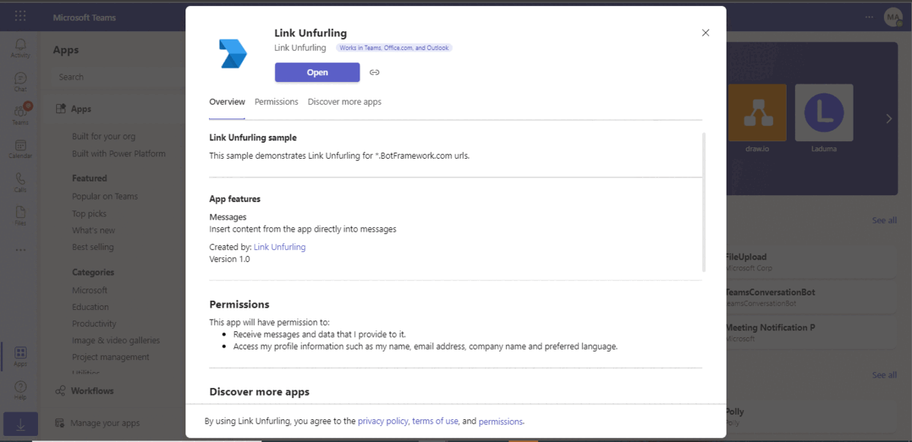

# Teams Link Unfurl Bot Python

Bot Framework v4 Teams [link unfurling](https://docs.microsoft.com/microsoftteams/platform/messaging-extensions/how-to/link-unfurling?tabs=json) bot sample for Teams.

This bot has been created using [Bot Framework](https://dev.botframework.com), it shows how to create a simple bot that performs link unfurling in Teams.

## Included Features
* Bots
* Message Extensions
* Search Commands
* Link Unfurling

## Interaction with Messaging Extension Link Unfurling


## Try it yourself - experience the App in your Microsoft Teams client
Please find below demo manifest which is deployed on Microsoft Azure and you can try it yourself by uploading the app package (.zip file link below) to your teams and/or as a personal app. (Sideloading must be enabled for your tenant, [see steps here](https://docs.microsoft.com/microsoftteams/platform/concepts/build-and-test/prepare-your-o365-tenant#enable-custom-teams-apps-and-turn-on-custom-app-uploading)).

**Teams Link Unfurl Bot:** [Manifest](/samples/msgext-link-unfurling/csharp/demo-manifest/msgext-link-unfurling.zip)

## Prerequisites

- Microsoft Teams is installed and you have an account
- [devtunnel](https://learn.microsoft.com/en-us/azure/developer/dev-tunnels/get-started?tabs=windows) or [ngrok](https://ngrok.com/) latest version or equivalent tunnelling solution


## To try this sample

> Note these instructions are for running the sample on your local machine, the tunnelling solution is required because
the Teams service needs to call into the bot.

1) Clone the repository

    ```bash
    git clone https://github.com/OfficeDev/Microsoft-Teams-Samples.git
    ```

1) Run ngrok - point to port 3978

   ```bash
   ngrok http 3978 --host-header="localhost:3978"
   ```  

   Alternatively, you can also use the `dev tunnels`. Please follow [Create and host a dev tunnel](https://learn.microsoft.com/en-us/azure/developer/dev-tunnels/get-started?tabs=windows) and host the tunnel with anonymous user access command as shown below:

   ```bash
   devtunnel host -p 3978 --allow-anonymous
   ```

1) Create [Bot Framework registration resource](https://docs.microsoft.com/azure/bot-service/bot-service-quickstart-registration) in Azure
    - Use the current `https` URL you were given by running the tunnelling application. Append with the path `/api/messages` used by this sample
    - Ensure that you've [enabled the Teams Channel](https://docs.microsoft.com/azure/bot-service/channel-connect-teams?view=azure-bot-service-4.0)
    - __*If you don't have an Azure account*__ you can use this [Bot Framework registration](https://docs.microsoft.com/microsoftteams/platform/bots/how-to/create-a-bot-for-teams#register-your-web-service-with-the-bot-framework)

1) Bring up a terminal, navigate to `Microsoft-Teams-Samples\samples\msgext-link-unfurling\python` folder

1) Activate your desired virtual environment

1) Install dependencies by running ```pip install -r requirements.txt``` in the project folder.

1) Update the `config.py` configuration for the bot to use the Microsoft App Id and App Password from the Bot Framework registration. (Note the App Password is referred to as the "client secret" in the azure portal and you can always create a new client secret anytime.)

1) __*This step is specific to Teams.*__
    - **Edit** the `manifest.json` contained in the `teamsAppManifest` folder to replace your Microsoft App Id (that was created when you registered your bot earlier) *everywhere* you see the place holder string `<<YOUR-MICROSOFT-APP-ID>>` (depending on the scenario the Microsoft App Id may occur multiple times in the `manifest.json`)
    - **Zip** up the contents of the `teamsAppManifest` folder to create a `manifest.zip`
    - **Upload** the `manifest.zip` to Teams (in the Apps view click "Upload a custom app")

1) Run your bot with `python app.py`

## Interacting with the bot in Teams

> Note the Teams `manifest.json` for this sample also includes a Search Query. This Messaging Extension is only introduced in order to enable installation, because there is no mechanism for installing a link unfurling feature in isolation.

If you copy and paste a link from https://www.BotFramework.com into the compose message area the link will unfurl. 

## Deploy the bot to Azure

To learn more about deploying a bot to Azure, see [Deploy your bot to Azure](https://aka.ms/azuredeployment) for a complete list of deployment instructions.

## Further reading

- [Link unfurling](https://learn.microsoft.com/microsoftteams/platform/messaging-extensions/how-to/link-unfurling?tabs=dotnet%2Cadvantages)
- [Bot Framework Documentation](https://docs.botframework.com)
- [Bot Basics](https://docs.microsoft.com/azure/bot-service/bot-builder-basics?view=azure-bot-service-4.0)
- [Azure Bot Service Introduction](https://docs.microsoft.com/azure/bot-service/bot-service-overview-introduction?view=azure-bot-service-4.0)
- [Azure Bot Service Documentation](https://docs.microsoft.com/azure/bot-service/?view=azure-bot-service-4.0)

