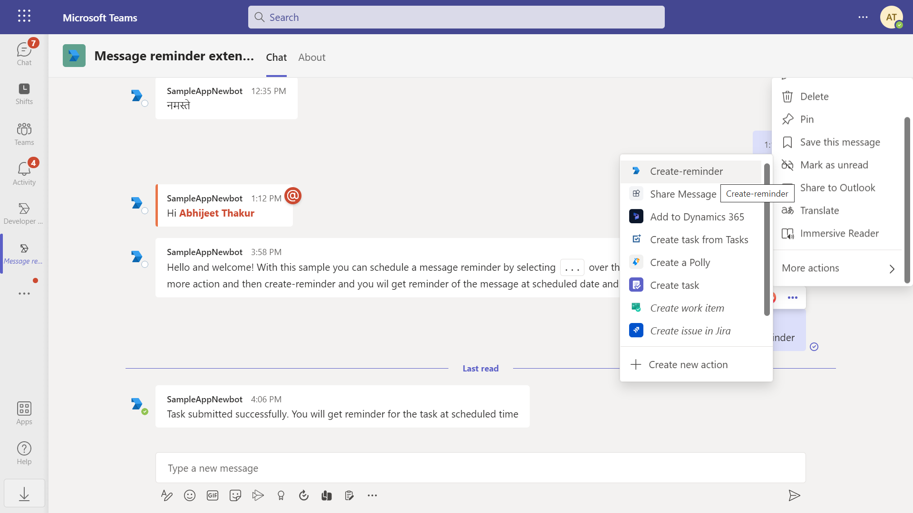
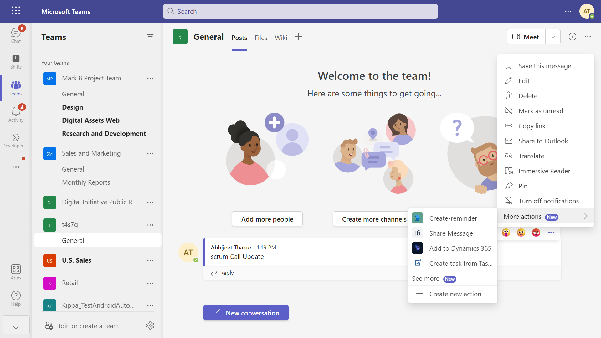
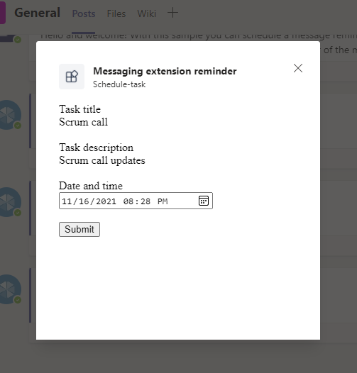
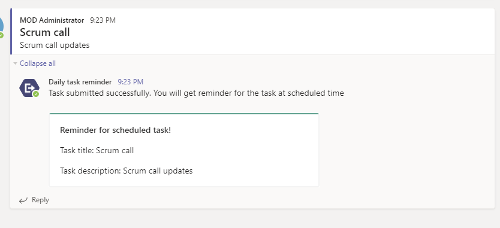

# Message reminder with messaging extension action

This sample shows a feature where user can schedule a task from messaging extension action and get a reminder card at a scheduled time.

## Interaction with app.


## Prerequisites

- Microsoft Teams is installed and you have an account (not a guest account)
-  [NodeJS](https://nodejs.org/en/)
-  [ngrok](https://ngrok.com/) or equivalent tunneling solution
-  [M365 developer account](https://docs.microsoft.com/en-us/microsoftteams/platform/concepts/build-and-test/prepare-your-o365-tenant) or access to a Teams account with the 
   appropriate permissions to install an app.

## Setup.

> Note these instructions are for running the sample on your local machine, the tunnelling solution is required because
> the Teams service needs to call into the bot.

### 1. Azure app Registration.

    Register a new application in the [Azure Active Directory – App Registrations](https://go.microsoft.com/fwlink/?linkid=2083908) portal.

### 2. Setup for Bot
In Azure portal, create a [Azure Bot resource](https://docs.microsoft.com/en-us/azure/bot-service/bot-builder-authentication?view=azure-bot-service-4.0&tabs=csharp%2Caadv2).

### 3. Run your bot sample
1) Clone the repository

    ```bash
    git clone https://github.com/OfficeDev/Microsoft-Teams-Samples.git
    ```

   - Ensure that you've [enabled the Teams Channel](https://docs.microsoft.com/en-us/azure/bot-service/channel-connect-teams?view=azure-bot-service-4.0)

2) In the folder where repository is cloned navigate to `samples/bot-task-reminder/nodejs`

3) Install node modules

   Inside node js folder, open your local terminal and run the below command to install node modules. You can do the same in Visual studio code terminal by opening the project in Visual studio code 

    ```bash
    npm install
    ```
4) Run ngrok - point to port 3978

    ```bash
    ngrok http -host-header=rewrite 3978
    ```
5) Update the `.env` configuration file in your project folder for the bot to use the `MicrosoftAppId` and `MicrosoftAppPassword`, `BaseUrl` with application base url. For e.g., your ngrok url. (Note the MicrosoftAppId is the AppId created in step 1 (Setup for Bot), the MicrosoftAppPassword is referred to as the "client secret" in step 1 (Setup for Bot) and you can always create a new client secret anytime.)

6) Run your app

    ```bash
    npm start
    ```
7) Manually update the manifest.json
    - Edit the `manifest.json` contained in the  `appPackage/` folder to replace with your MicrosoftAppId (that was created in step1.1 and is the same value of MicrosoftAppId in `.env` file) *everywhere* you see the place holder string `{MicrosoftAppId}` (depending on the scenario the Microsoft App Id may occur multiple times in the `manifest.json`)
    - Zip up the contents of the `appPackage/` folder to create a `manifest.zip`
    - Upload the `manifest.zip` to Teams (in the left-bottom *Apps* view, click "Upload a custom app")

## Running the sample.

- Personal scope scenario
 Select `...` over message to get action `create-reminder` for scheduling task.



 Task module to schedule a task.


 Reminder card of task at scheduled date and time.


- Team scope scenario
 Navigate to team where the app is installed

 Select `...` over message to get action `create-reminder` for scheduling task.



 Task module to schedule a task.



 Reminder card of task at scheduled date and time.



## Further reading

- [Bot Framework Documentation](https://docs.botframework.com)
- [Bot Basics](https://docs.microsoft.com/azure/bot-service/bot-builder-basics?view=azure-bot-service-4.0)
- [Activity processing](https://docs.microsoft.com/en-us/azure/bot-service/bot-builder-concept-activity-processing?view=azure-bot-service-4.0)
- [Azure Bot Service Introduction](https://docs.microsoft.com/azure/bot-service/bot-service-overview-introduction?view=azure-bot-service-4.0)
- [Azure Bot Service Documentation](https://docs.microsoft.com/azure/bot-service/?view=azure-bot-service-4.0)
- [.NET Core CLI tools](https://docs.microsoft.com/en-us/dotnet/core/tools/?tabs=netcore2x)
- [Azure CLI](https://docs.microsoft.com/cli/azure/?view=azure-cli-latest)
- [Azure Portal](https://portal.azure.com)
- [Language Understanding using LUIS](https://docs.microsoft.com/en-us/azure/cognitive-services/luis/)
- [Channels and Bot Connector Service](https://docs.microsoft.com/en-us/azure/bot-service/bot-concepts?view=azure-bot-service-4.0)
