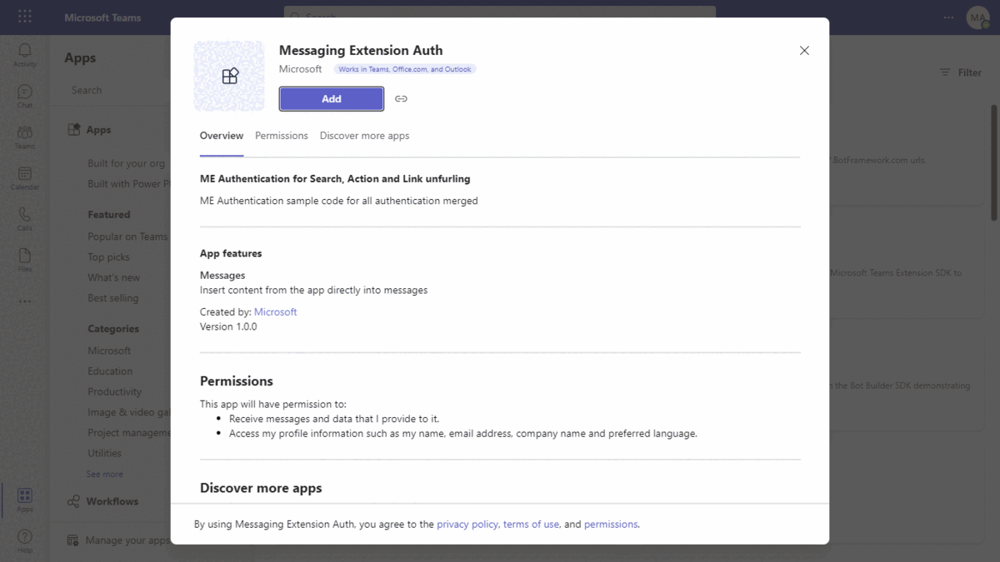
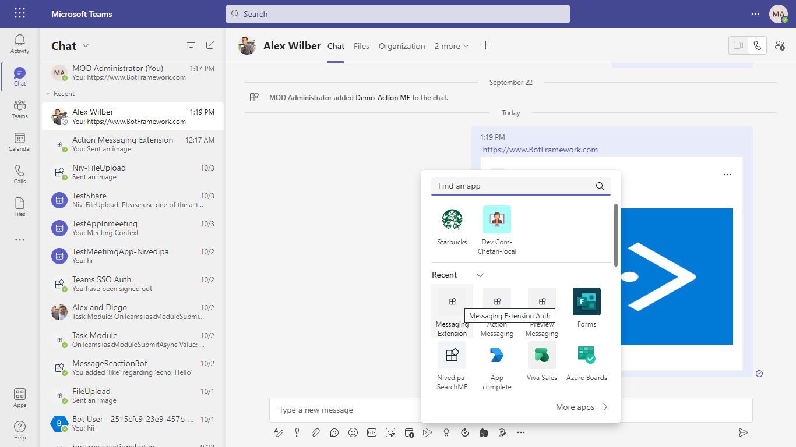
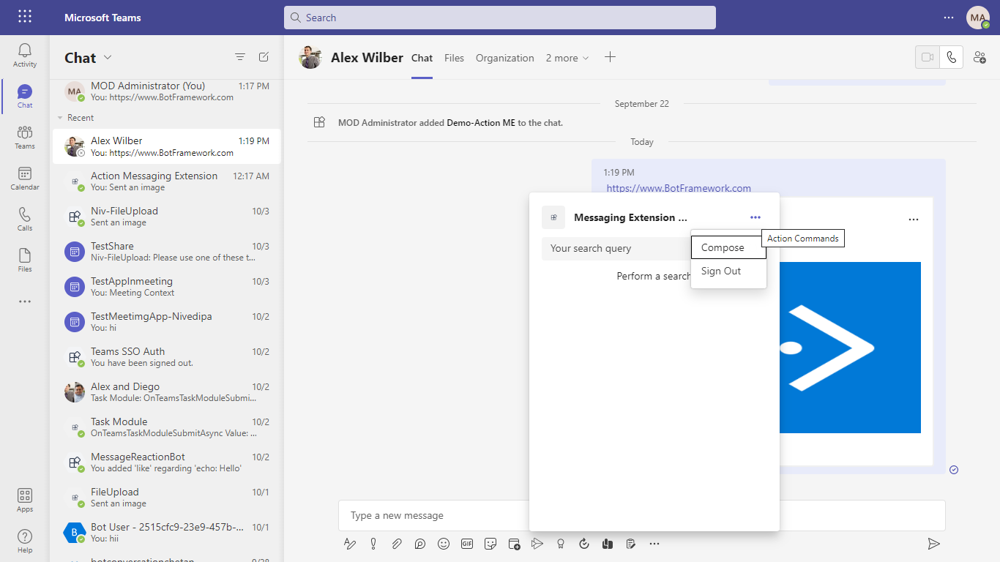
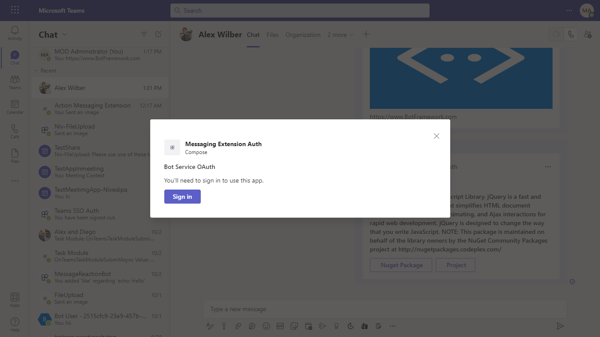
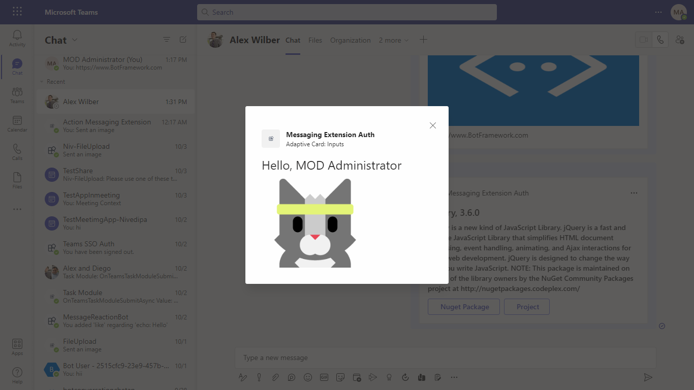

# Teams Search Auth Config 

Bot Framework v4 sample for Teams expands the [msgext-search-auth-config](https://github.com/OfficeDev/Microsoft-Teams-Samples/tree/main/samples/msgext-search-auth-config/csharp) sample to include a configuration page and Bot Service authentication.

This bot has been created using [Bot Framework](https://dev.botframework.com), it shows how to use a Messaging Extension configuration page, as well as how to sign in from a search Messaging Extension. In this sample we are assuming the OAuth 2 provider is Azure Active Directory v2 (AADv2) and are utilizing the Microsoft Graph API to retrieve data about the user. Check [here](https://docs.microsoft.com/azure/bot-service/bot-builder-authentication) for information about getting an AADv2 application setup for use in Azure Bot Service. The scopes used in this sample are the following:

- `email`
- `openid`
- `profile`
- `Mail.Read`
- `User.Read`
- `User.ReadBasic.All`
- `Mail.Send.Shared`

## Included Features
* Bots
* Message Extensions (with teams sso)
* Search Commands

## Interaction With Messaging Extension Auth


## Try it yourself - experience the App in your Microsoft Teams client
Please find below demo manifest which is deployed on Microsoft Azure and you can try it yourself by uploading the app package (.zip file link below) to your teams and/or as a personal app. (Sideloading must be enabled for your tenant, [see steps here](https://docs.microsoft.com/microsoftteams/platform/concepts/build-and-test/prepare-your-o365-tenant#enable-custom-teams-apps-and-turn-on-custom-app-uploading)).

**Messaging Extension Auth:** [Manifest](/samples/msgext-search-auth-config/csharp/demo-manifest/msgext-search-auth-config.zip)

## Prerequisites

- Microsoft Teams is installed and you have an account
- [.NET SDK](https://dotnet.microsoft.com/download) version 6.0
- [ngrok](https://ngrok.com/) or equivalent tunnelling solution

## Description

- Teams Messaging Extension Auth Configuration [AAD Authentication] for search, action and link unfurling combined in the sample. 
- [Add Authentication to your Bot](https://docs.microsoft.com/en-us/microsoftteams/platform/bots/how-to/authentication/add-authentication?tabs=dotnet%2Cdotnet-sample#create-the-bot-channels-registration)


## Setup

> Note these instructions are for running the sample on your local machine, the tunnelling solution is required because
the Teams service needs to call into the bot.

### 1. Setup for Messaging Extension Auth
Refer to [Bot SSO Setup document](https://github.com/OfficeDev/Microsoft-Teams-Samples/blob/main/samples/bot-conversation-sso-quickstart/BotSSOSetup.md).

1) Clone the repository

    ```bash
    git clone https://github.com/OfficeDev/Microsoft-Teams-Samples.git
    ```

1) If you are using Visual Studio
   - Launch Visual Studio
   - File -> Open -> Project/Solution
   - Navigate to `samples/msgext-search-auth-config/csharp` folder
   - Select `TeamsMessagingExtensionsSearchAuthConfig.csproj` or `TeamsMessagingExtensionsSearchAuthConfig.sln`file

1) Run ngrok - point to port 3978 (You can skip this step, if you have already run ngrok while doing SSO setup)

    ```bash
    ngrok http --host-header=rewrite 3978
    ```

1) Update the `appsettings.json` configuration for the bot to use the MicrosoftAppId, MicrosoftAppPassword, MicrosoftAppTenantId generated in Step 1 (App Registration creation). (Note the App Password is referred to as the "client secret" in the azure portal and you can always create a new client secret anytime.)
    - Set "MicrosoftAppType" in the `appsettings.json`. (**Allowed values are: MultiTenant(default), SingleTenant, UserAssignedMSI**)
    - Set "ConnectionName" in the `appsettings.json`. The AAD ConnectionName from the OAuth Connection Settings on Azure Bot registration
    - Set "SiteUrl" in the `appsettings.json`. The ngrok forwarding url (ie `https://xxxx.ngrok.io`) from starting ngrok

1) Run your bot, either from Visual Studio with `F5` or using `dotnet run` in the appropriate folder.

1) __*This step is specific to Teams.*__
    - **Edit** the `manifest.json` contained in the  `TeamsAppManifest` folder to replace your Microsoft App Id (that was created when you registered your bot earlier) *everywhere* you see the place holder string `<<YOUR-MICROSOFT-APP-ID>>` (depending on the scenario the MicrosoftAppId may occur multiple times in the `manifest.json`)
    - **Edit** the `manifest.json` for `validDomains` with base Url domain. E.g. if you are using ngrok it would be `https://1234.ngrok.io` then your domain-name will be `1234.ngrok.io`.
    - **Zip** up the contents of the `TeamsAppManifest` folder to create a `manifest.zip` (Make sure that zip file does not contains any subfolder otherwise you will get error while uploading your .zip package)
    - **Upload** the `manifest.zip` to Teams (In Teams Apps/Manage your apps click "Upload an app". Browse to and Open the .zip file. At the next dialog, click the Add button.)

**Note**: If you are facing any issue in your app, please uncomment [this](https://github.com/OfficeDev/Microsoft-Teams-Samples/blob/main/samples/meetings-sidepanel/nodejs/server/index.js#L48) line and put your debugger for local debug.

## Running the sample

Once the Messaging Extension is installed, click the icon for **Config Auth Search** in the Compose Box's Messaging Extension menu to display the search window. Left click to choose **Settings** and view the Sign-In page.

**Adding bot UI:**

**Zero install link unfurling card**










## Deploy the bot to Azure

To learn more about deploying a bot to Azure, see [Deploy your bot to Azure](https://aka.ms/azuredeployment) for a complete list of deployment instructions.

## Further reading

- [Search based messaging extension](https://learn.microsoft.com/microsoftteams/platform/messaging-extensions/how-to/search-commands/define-search-command)
- [Zero Install Link Unfurling](https://learn.microsoft.com/microsoftteams/platform/messaging-extensions/how-to/link-unfurling?tabs=dotnet%2Cadvantages#zero-install-for-link-unfurling)
- [Bot Framework Documentation](https://docs.botframework.com)
- [Bot Basics](https://docs.microsoft.com/azure/bot-service/bot-builder-basics?view=azure-bot-service-4.0)
- [Azure Bot Service Introduction](https://docs.microsoft.com/azure/bot-service/bot-service-overview-introduction?view=azure-bot-service-4.0)
- [Azure Bot Service Documentation](https://docs.microsoft.com/azure/bot-service/?view=azure-bot-service-4.0)
