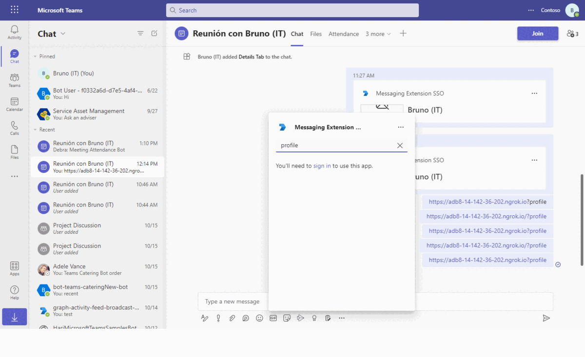

# Messaging Extension SSO Config Bot

Bot Framework v4 sample for Teams expands the [52.teams-messaging-extensions-search-auth-config](https://github.com/microsoft/BotBuilder-Samples/tree/main/samples/javascript_nodejs/52.teams-messaging-extensions-search-auth-config) sample to include a configuration page and Bot Service SSO authentication.

## Interact with app.

## Prerequisites

- Microsoft Teams is installed and you have an account
- [NodeJS](https://nodejs.org/en/) version v16.14.2 or Higher Version
- [ngrok](https://ngrok.com/) or equivalent tunnelling solution

This bot has been created using [Bot Framework](https://dev.botframework.com), it shows how to use a Messaging Extension configuration page, as well as how to sign in from a search Messaging Extension.

## Setup

> Note these instructions are for running the sample on your local machine, the tunnelling solution is required because
the Teams service needs to call into the bot.

### 1. Setup for Bot SSO
Refer to [Bot SSO Setup document](../../../samples/bot-conversation-sso-quickstart/BotSSOSetup.md).

### 2. Configure this sample

   Update the `.env` configuration for the bot to use the Microsoft App Id and App Password from the Bot Framework registration. The `SiteUrl` is the URL that generated by ngrok and start with "https". (Note the MicrosoftAppId is the AppId created in step 1.1, the MicrosoftAppPassword is referred to as the "client secret" in step1.2 and you can always create a new client secret anytime.)

### 3. Run your bot sample
Under the root of this sample folder, build and run by commands:
- `npm install`
- `npm start`

- **Manually update the manifest.json**
    - Edit the `manifest.json` contained in the  `appPackage/` folder to replace with your MicrosoftAppId (that was created in step1.1 and is the same value of MicrosoftAppId in `.env` file) *everywhere* you see the place holder string `{TODO: MicrosoftAppId}` (depending on the scenario the Microsoft App Id may occur multiple times in the `manifest.json`)
    - Zip up the contents of the `appPackage/` folder to create a `manifest.zip`
    - Upload the `manifest.zip` to Teams (in the left-bottom *Apps* view, click "Upload a custom app")

- **Interacting with the Message Extension in Teams
    Once the Messaging Extension is installed, find the icon for **Config Auth Search** in the Compose Box's Messaging Extension menu. Right click to choose **Settings** and view the Config page. Click the icon to display the search window, type anything it will show your profile picture.
    
## Deploy the bot to Azure

To learn more about deploying a bot to Azure, see [Deploy your bot to Azure](https://aka.ms/azuredeployment) for a complete list of deployment instructions.

## Running the sample

**Sign in on search:**

**Configuration page:**

**Display profile on search:**

**Profile card:**

**Signout:**

## Further reading

- [How Microsoft Teams bots work](https://docs.microsoft.com/en-us/azure/bot-service/bot-builder-basics-teams?view=azure-bot-service-4.0&tabs=javascript)

