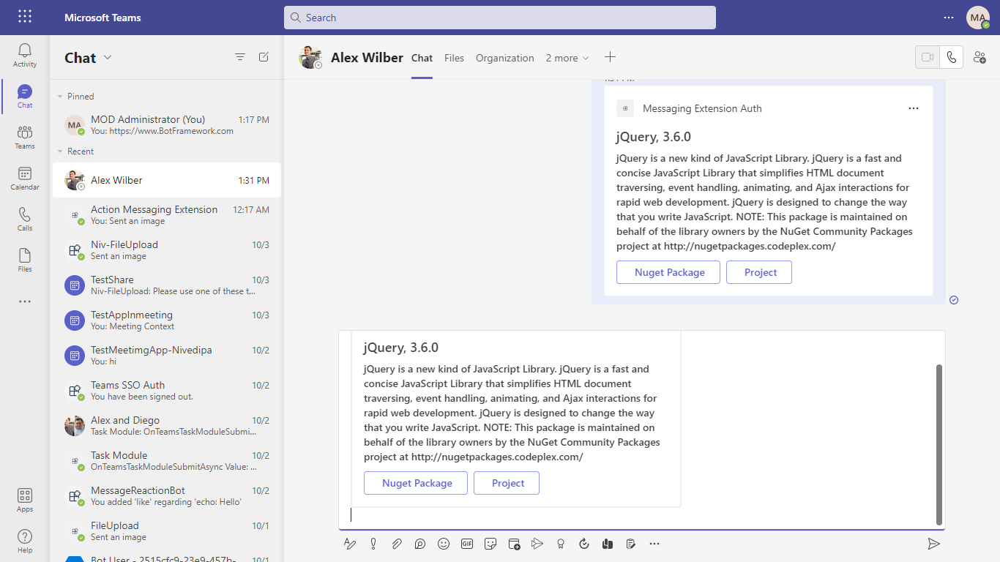

# Teams Messaging Extensions Search

[Messaging Extensions](https://docs.microsoft.com/microsoftteams/platform/messaging-extensions/what-are-messaging-extensions) are a special kind of Microsoft Teams application that is support by the [Bot Framework](https://dev.botframework.com) v4.

There are two basic types of Messaging Extension in Teams: [Search-based](https://docs.microsoft.com/microsoftteams/platform/messaging-extensions/how-to/search-commands/define-search-command) and [Action-based](https://docs.microsoft.com/microsoftteams/platform/messaging-extensions/how-to/action-commands/define-action-command). This sample illustrates how to
build a Search-based Messaging Extension.

## Included Features
* Bots
* Message Extensions
* Search Commands

## Interaction with Messaging Extension


## Try it yourself - experience the App in your Microsoft Teams client
Please find below demo manifest which is deployed on Microsoft Azure and you can try it yourself by uploading the app package (.zip file link below) to your teams and/or as a personal app. (Sideloading must be enabled for your tenant, [see steps here](https://docs.microsoft.com/microsoftteams/platform/concepts/build-and-test/prepare-your-o365-tenant#enable-custom-teams-apps-and-turn-on-custom-app-uploading)).

**Teams Messaging Extensions Search:** [Manifest](/samples/msgext-search/csharp/demo-manifest/msgext-search.zip)


## Prerequisites

- Microsoft Teams is installed and you have an account
- [NodeJS](https://nodejs.org/en/)
- [ngrok](https://ngrok.com/) or equivalent tunnelling solution

## Setup

> Note these instructions are for running the sample on your local machine, the tunnelling solution is required because
the Teams service needs to call into the bot.

1) Run ngrok - point to port 3978

    ```bash
    ngrok http --host-header=rewrite 3978
    ```

## Setup for bot
In Azure portal, create a [Azure Bot resource](https://docs.microsoft.com/azure/bot-service/bot-service-quickstart-registration).
    - For bot handle, make up a name.
    - Select "Use existing app registration" (Create the app registration in Azure Active Directory beforehand.)
    - __*If you don't have an Azure account*__ create an [Azure free account here](https://azure.microsoft.com/free/)
    
   In the new Azure Bot resource in the Portal, 
    - Ensure that you've [enabled the Teams Channel](https://learn.microsoft.com/azure/bot-service/channel-connect-teams?view=azure-bot-service-4.0)
    - In Settings/Configuration/Messaging endpoint, enter the current `https` URL you were given by running ngrok. Append with the path `/api/messages`

## Setup for code
1) Clone the repository

    ```bash
    git clone https://github.com/OfficeDev/Microsoft-Teams-Samples.git
    ```

1) In a terminal, navigate to `samples/msgext-search/nodejs`

1) Install modules

    ```bash
    npm install
    ```

1) Update the `.env` configuration for the bot to use the Microsoft App Id and App Password from the Bot Framework registration. (Note the App Password is referred to as the "client secret" in the azure portal and you can always create a new client secret anytime.) `MicrosoftAppTenantId` will be the id for the tenant where application is registered.
   - Set "MicrosoftAppType" in the `env`. (**Allowed values are: MultiTenant(default), SingleTenant, UserAssignedMSI**)

   - Set "BaseUrl" in the `env` as per your application like the ngrok forwarding url (ie `https://xxxx.ngrok.io`) after starting ngrok

1) Run your bot at the command line:

    ```bash
    npm start
    ```

1) __*This step is specific to Teams.*__
    - **Edit** the `manifest.json` contained in the `appPackage` folder to replace your Microsoft App Id (that was created when you registered your bot earlier) *everywhere* you see the place holder string `<<YOUR-MICROSOFT-APP-ID>>` (depending on the scenario the Microsoft App Id may occur multiple times in the `manifest.json`)
    - **Edit** the `manifest.json` for `validDomains` with base Url domain. E.g. if you are using ngrok it would be `https://1234.ngrok.io` then your domain-name will be `1234.ngrok.io`.
    - **Zip** up the contents of the `appPackage` folder to create a `manifest.zip` (Make sure that zip file does not contains any subfolder otherwise you will get error while uploading your .zip package)
    - **Upload** the `manifest.zip` to Teams (In Teams Apps/Manage your apps click "Upload an app". Browse to and Open the .zip file. At the next dialog, click the Add button.)
    - Add the bot to personal/team/groupChat scope (Supported scopes)

**Note**: If you are facing any issue in your app, please uncomment [this](https://github.com/OfficeDev/Microsoft-Teams-Samples/blob/main/samples/msgext-search/nodejs/index.js#L46) line and put your debugger for local debug.

## Running the sample

> Note this `manifest.json` specified that the feature will be available from both the `compose` and `commandBox` areas of Teams. Please refer to Teams documentation for more details.

In Teams, the command bar is located at the top of the window. When you at mention the bot what you type is forwarded (as you type) to the bot for processing. By way of illustration, this sample uses the text it receives to query the NuGet package store.

**Mention In Search CommandBar:**
  

**Search Result:**
   

**Selected Item:**
  

There is a secondary, drill down, event illustrated in this sample: clicking on the results from the initial query will result in the bot receiving another event.




## Deploy the bot to Azure

To learn more about deploying a bot to Azure, see [Deploy your bot to Azure](https://aka.ms/azuredeployment) for a complete list of deployment instructions.

## Further reading

- [Search based messaging extension](https://learn.microsoft.com/microsoftteams/platform/messaging-extensions/how-to/search-commands/define-search-command)
- [Bot Framework Documentation](https://docs.botframework.com)
- [Bot Basics](https://docs.microsoft.com/azure/bot-service/bot-builder-basics?view=azure-bot-service-4.0)
- [Azure Bot Service Introduction](https://docs.microsoft.com/azure/bot-service/bot-service-overview-introduction?view=azure-bot-service-4.0)
- [Azure Bot Service Documentation](https://docs.microsoft.com/azure/bot-service/?view=azure-bot-service-4.0)