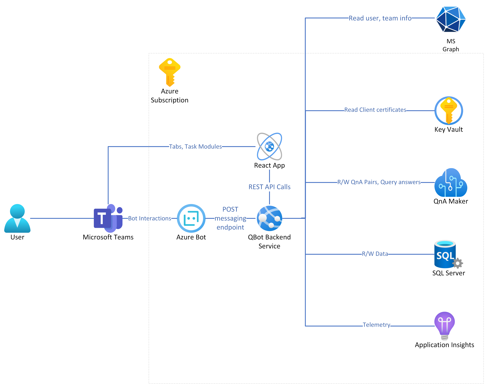

# Solution Overview

## Architecture
Refer to image below for high level architecture.

The following are the main components:

### QBot Backend Service
The Backend service is an ASP.NET Core 3.1 application for housing all the business logic for the QBot implementation. It acts as the message handler for the bot (under the /bot/message path) as well as the backend for the React application for the personal and shared app experiences (tabs, task modules).

### React App
Client application that powers personal, shared tab and task module experiences.

### Azure Bot
Bot channel registration. The messaging endpoint is set to QBot Backend service to handle bot interactions in Teams.

### QnA Maker
Azure Cognitive service to help intelligently answer questions. The backend service posts QnA Pairs in this service (KnowledgeBase) and queries it for answers when a new question is posted.

### SQL Server
Stores user, course, question and answer data.

### Key Vault
Application certificates are stored in Key Vault.

### Application Insights
Telemetry is sent to application insight service. This makes it easier to monitor application health and debug issues.

### Graph Service
The backend service consumes Graph services to read User (profile) and Teams data (messages in a channel).

## Project Structure
* The application contains 3 projects
  * `Web` - Exposes REST APIs (including Bot messaging endpoint) for clients to integrate. Also contains React application logic.
  * `Domain` - Contains the core business logic to setup a course, QnA workflow, user roles etc.
  * `Infrastructure` - Fulfills `Domain`'s dependencies. Example - Connects to QnA Maker service, Teams and Graph services, Key Vault and R/W data from/to SQL Server. Each dependency can be replaced without affecting Domain logic.