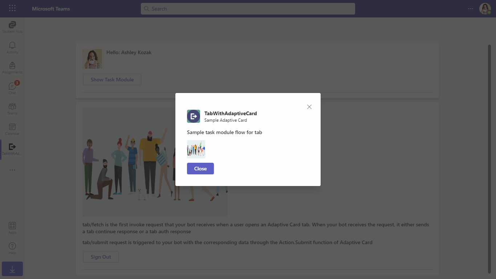
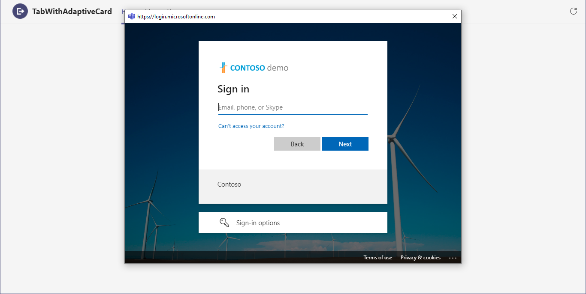

# Tab With AdpativeCard Flow

This App talks about the Teams tab which displays Adaptive card with Node JS

This bot has been created using [Bot Framework v4](https://dev.botframework.com), it shows how to create a simple bot that accepts Adaptive Cards V1.4 to render in Teams tab.

This feature shown in this sample is in Public Developer Preview and is supported in desktop and mobile.

## Key features

- Tab showing Adaptive card with action controls


- Task module



- Sign in card


- Sign in popup



- Sign out card


## Prerequisites

1. Office 365 tenant. You can get a free tenant for development use by signing up for the [Office 365 Developer Program](https://developer.microsoft.com/en-us/microsoft-365/dev-program).

2. To test locally, [NodeJS](https://nodejs.org/en/download/) must be installed on your development machine (version 10.14 or higher).

    ```bash
    # determine node version
    node --version
    ```

3. To test locally, you'll need [Ngrok](https://ngrok.com/) installed on your development machine.
Make sure you've downloaded and installed Ngrok on your local machine. ngrok will tunnel requests from the Internet to your local computer and terminate the SSL connection from Teams.

> NOTE: The free ngrok plan will generate a new URL every time you run it, which requires you to update your Azure AD registration, the Teams app manifest, and the project configuration. A paid account with a permanent ngrok URL is recommended.

## To try this sample

- Register Azure AD applications
    -   Register your bot using bot channel registration in Azure AD portal, following the instructions [here](Wiki/azure-bot-channels-registration.md).

- Clone the repository

    ```bash
    git clone https://github.com/OfficeDev/Microsoft-Teams-Samples.git
    ```

- In a console, navigate to `samples/tab-adaptive-cards/nodejs`

    ```bash
    cd samples/tab-adaptive-cards/nodejs
    ```

- Run ngrok - point to port `3978`

    ```bash
    ngrok http -host-header=localhost 3978
    ```


- Update the `.env` configuration for the bot to use the `MicrosoftAppId` (Microsoft App Id) and `MicrosoftAppPassword` (App Password) from the Bot Framework registration. 
Also update `BaseUrl` according to your code runtime environment and `ConnectionName` with Bot Channel Registration connection name.
> NOTE: the App Password is referred to as the `client secret` in the azure portal and you can always create a new client secret anytime.

- Install modules & Run the `NodeJS` Server 
    - Server will run on PORT:  `3978`
    - Open a terminal and navigate to project root directory
    
    ```bash
    npm run server
    ```
    
    > **This command is equivalent to:**
    _npm install  > npm start_

- __*This step is specific to Teams.*__
    - **Edit** the `manifest.json` contained in the  `appPackage` folder to replace your Microsoft App Id (that was created when you registered your bot earlier) *everywhere* you see the place holder string `<<YOUR-MICROSOFT-APP-ID>>` (depending on the scenario the Microsoft App Id may occur multiple times in the `manifest.json`) also update the `<<DOMAIN-NAME>>` with the ngrok URL
    - **Zip** up the contents of the `appPackage` folder to create a `manifest.zip`
    - **Upload** the `manifest.zip` to Teams (in the Apps view click "Upload a custom app")

## Interacting with the bot in Teams

You can interact with this bot by `@Sequential Workflows` (BotName). The bot will respond with adaptive card requesting you the details.

- Install App

Navigate to `Manage apps` > `Upload a custom app` (Bottom-Right of the screen) > Upload `manifest.zip` > `Add`


## Deploy the bot to Azure

To learn more about deploying a bot to Azure, see [Deploy your bot to Azure](https://aka.ms/azuredeployment) for a complete list of deployment instructions.

## Further reading

- [Bot Framework Documentation](https://docs.botframework.com)
- [Bot Basics](https://docs.microsoft.com/azure/bot-service/bot-builder-basics?view=azure-bot-service-4.0)
- [User Specific Views](https://docs.microsoft.com/en-us/microsoftteams/platform/task-modules-and-cards/cards/universal-actions-for-adaptive-cards/user-specific-views)
- [Sequential Workflows](https://docs.microsoft.com/en-us/microsoftteams/platform/task-modules-and-cards/cards/universal-actions-for-adaptive-cards/sequential-workflows)
- [Up to date cards](https://docs.microsoft.com/en-us/microsoftteams/platform/task-modules-and-cards/cards/universal-actions-for-adaptive-cards/up-to-date-views)
- [Universal Bot Action Model](https://docs.microsoft.com/en-us/adaptive-cards/authoring-cards/universal-action-model#actionexecute)
- [Azure Portal](https://portal.azure.com)
- [Activity processing](https://docs.microsoft.com/en-us/azure/bot-service/bot-builder-concept-activity-processing?view=azure-bot-service-4.0)
- [Azure Bot Service Introduction](https://docs.microsoft.com/azure/bot-service/bot-service-overview-introduction?view=azure-bot-service-4.0)
- [Azure Bot Service Documentation](https://docs.microsoft.com/azure/bot-service/?view=azure-bot-service-4.0)
- [Azure CLI](https://docs.microsoft.com/cli/azure/?view=azure-cli-latest)
- [Azure Portal](https://portal.azure.com)
- [Language Understanding using LUIS](https://docs.microsoft.com/en-us/azure/cognitive-services/luis/)
- [Channels and Bot Connector Service](https://docs.microsoft.com/en-us/azure/bot-service/bot-concepts?view=azure-bot-service-4.0)
- [dotenv](https://www.npmjs.com/package/dotenv)
- [Microsoft Teams Developer Platform](https://docs.microsoft.com/en-us/microsoftteams/platform/)