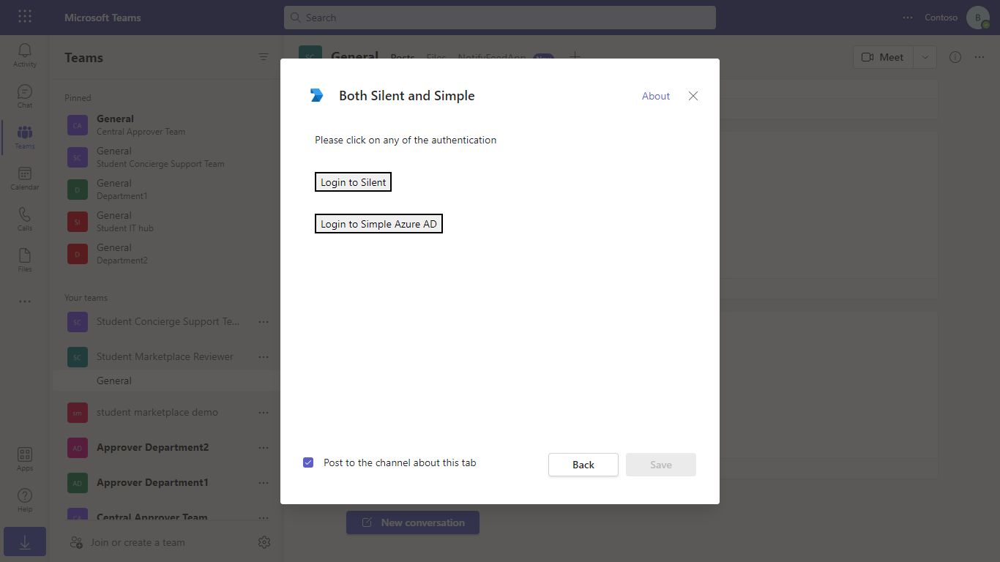
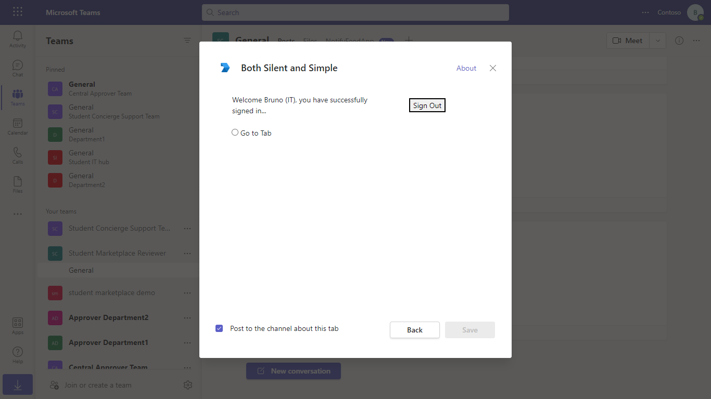
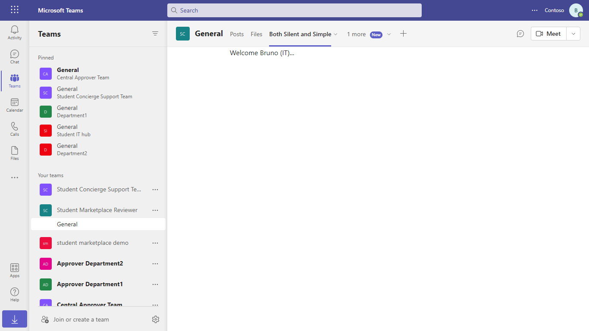

# Config Tab Authentication

## Summary

There are many services that you may wish to consume inside your Teams app, and most of those services require authentication and authorization to get access to the service. Services include Facebook, Twitter, and of course Teams. Users of Teams have user profile information stored in Azure Active Directory (Azure AD) using Microsoft Graph and this article will focus on authentication using Azure AD to get access to this information.

OAuth 2.0 is an open standard for authentication used by Azure AD and many other service providers. Understanding OAuth 2.0 is a prerequisite for working with authentication in Teams and Azure AD. The examples below use the OAuth 2.0 Implicit Grant flow with the goal of eventually reading the user's profile information from Azure AD and Microsoft Graph.

## Interaction with app


## Initiate Silent and Simple Authentication ConfigurableTab using AAD

Authentication flow should be triggered by a user action. You should not open the authentication pop-up automatically because this is likely to trigger the browser's pop-up blocker as well as confuse the user.

Add a button to your [configuration](https://docs.microsoft.com/en-us/microsoftteams/platform/tabs/how-to/create-tab-pages/configuration-page) or [content](https://docs.microsoft.com/en-us/microsoftteams/platform/tabs/how-to/create-tab-pages/content-page) page to enable the user to sign in when needed. This can be done in the tab configuration page or any content page.

Azure AD, like most identity providers, does not allow its content to be placed in an iframe. This means that you will need to add a pop-up page to host the identity provider. In the following example this page is /tab-auth/simple-start. Use the microsoftTeams.authenticate() function of the Microsoft Teams client SDK to launch this page when your button is selected.


## Pre-requisites

- Microsoft Teams is installed and you have an account (not a guest account)
- [.NET Core SDK](https://dotnet.microsoft.com/download) version 3.1

  ```bash
  # determine dotnet version
  dotnet --version
  ```
- [ngrok](https://ngrok.com/) or equivalent tunnelling solution

- Visual Studio

- Asp.net Core

## Setup.

> Note these instructions are for running the sample on your local machine, the tunnelling solution is required because

1) Clone the repository
    git clone https://github.com/OfficeDev/Microsoft-Teams-Samples.git

2) If you are using Visual Studio
    - Launch Visual Studio
    - File -> Open -> Project/Solution
    - Navigate to `tab-channel-group-config-page-auth` folder
    - Select `TabAuthentication.csproj` file
    - Press `F5` to run the project

3) Run ngrok - point to port 3978
    ```bash
    ngrok http -host-header=rewrite 3978
    ```
4) Update the `appsettings.json` configuration for the tab to use the Microsoft App Id in TabAuthentication folder, App Password and Connection Name from the Bot Framework           registration. (Note the App Password is referred to as the "client secret" in the azure portal and you can always create a new client secret anytime.)

### Register an Azure AD Application for both Silent and Simple Authencation

  Your tab needs to run as a registered Azure AD application in order to obtain an access token from Azure AD. In this step you'll register the app in your tenant and give Teams   permission to obtain access tokens on its behalf.

  Create an [AAD application](https://docs.microsoft.com/en-us/microsoftteams/platform/tabs/how-to/authentication/auth-aad-sso#1-create-your-aad-application-in-azure) in           Azure. You can do this by visiting the "Azure AD app registration" portal in Azure.

1) Set your application URI to the same URI you've created in Ngrok.
   - Ex: api://contoso.ngrok.io/{appId} using the application ID that was assigned to your app
                    
2) Setup a client secret. You will need this when you exchange the token for more API permissions from your backend.
   - Visit Manage > Certificates & secrets
   - Create a new client secret.
          
3) Setup your API permissions. This is what your application is allowed to request permission to access.
   - Visit Manage > API Permissions
   - Make sure you have the following Graph permissions enabled: email, offline_access, openid, profile, and User.Read.

4) Set Redirect URIs. Navigate to Authentication from left pane.
    - Click on Add Platform select *Web*.
    - Add URI as https://<<BASE-URI>>/SilentAuthEnd it will look like https://contoso.ngrok.io/SilentAuthEnd
    - Make sure to check *Access tokens* and *ID tokens* checkbox
    - Add one more URI as https://<<BASE-URI>>/SimpleAuthEnd
    - Again, Click on Add Platform and this time select *Single-page application*
    - Enter URI as https://<<BASE-URI>>/AuthEnd


5)  __*This step is specific to Teams.*__
    - **Edit** the `manifest.json` contained in the  `teamsAppManifest` folder to replace your Microsoft App Id (that was created when you registered your tab earlier) *everywhere* you see the place holder string `<<YOUR-MICROSOFT-APP-ID>>` and set your Base URI to the same URI you've created in Ngrok *everywhere* you see the place holder string `<<BASE-URI>>` (depending on the scenario the Microsoft App Id, Base URI may occur multiple times in the `manifest.json`)
    - **Zip** up the contents of the `teamsAppManifest` folder to create a `manifest.zip`
    - **Upload** the `manifest.zip` to Teams (in the Apps view click "Upload a custom app")

6) Run your tab, either from Visual Studio with `F5` or using `dotnet run` in the appropriate folder.

## Running the sample.








## Further Reading.

[Tab-Channle-Group-config-auth](https://learn.microsoft.com/en-us/microsoftteams/platform/tabs/how-to/create-channel-group-tab?pivots=node-java-script)


 


