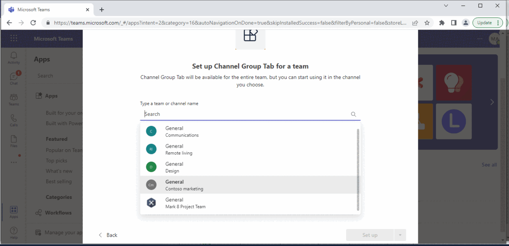
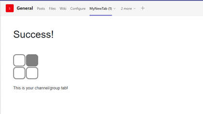
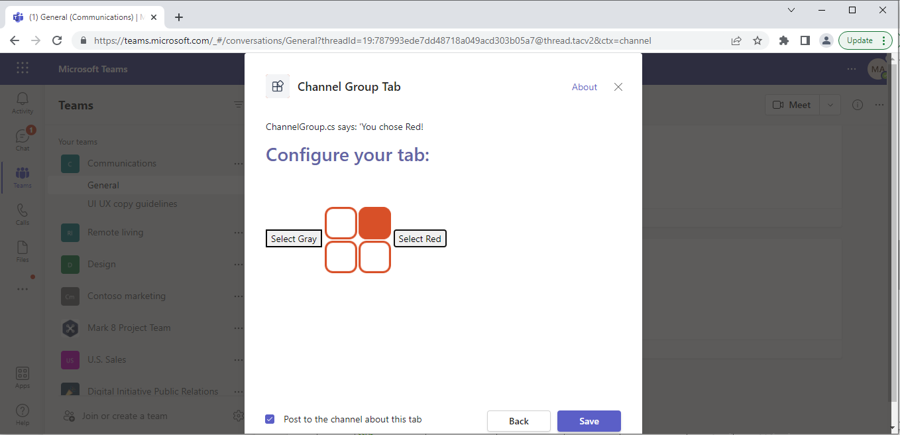
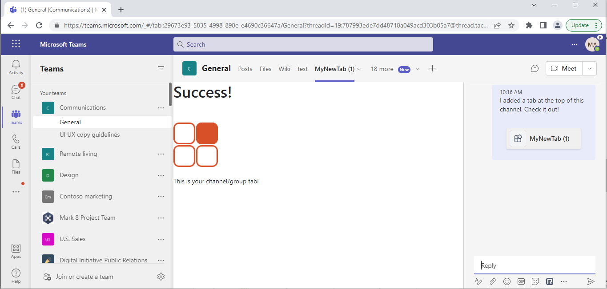

# Channel and group tabs in ASP.NET Core with MVC

In this quickstart we'll walk-through creating a custom channel/group tab with ASP.Net Core and MVC. We'll also use App Studio for Microsoft Teams to finalize your app manifest and deploy your tab to Teams.

## Prerequisites

- [.NET Core SDK](https://dotnet.microsoft.com/download) version 6.0

  determine dotnet version
  ```bash
  dotnet --version
  ```
- [Ngrok](https://ngrok.com/download) (For local environment testing) Latest (any other tunneling software can also be used)
  
- [Teams](https://teams.microsoft.com) Microsoft Teams is installed and you have an account

## Interaction with app



## Setup

## Running the sample








## Further Reading
[Tab-channel-group](https://learn.microsoft.com/en-us/microsoftteams/platform/tabs/what-are-tabs)
[Create a Custom Channel and Group Tab with ASP.NET Core and MVC](https://docs.microsoft.com/en-us/microsoftteams/platform/tabs/how-to/create-channel-group-tab?pivots=mvc-csharp)
