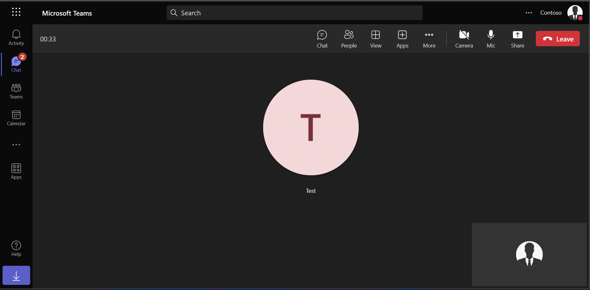
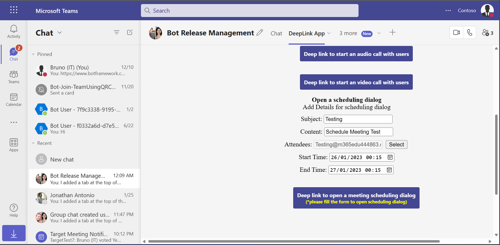
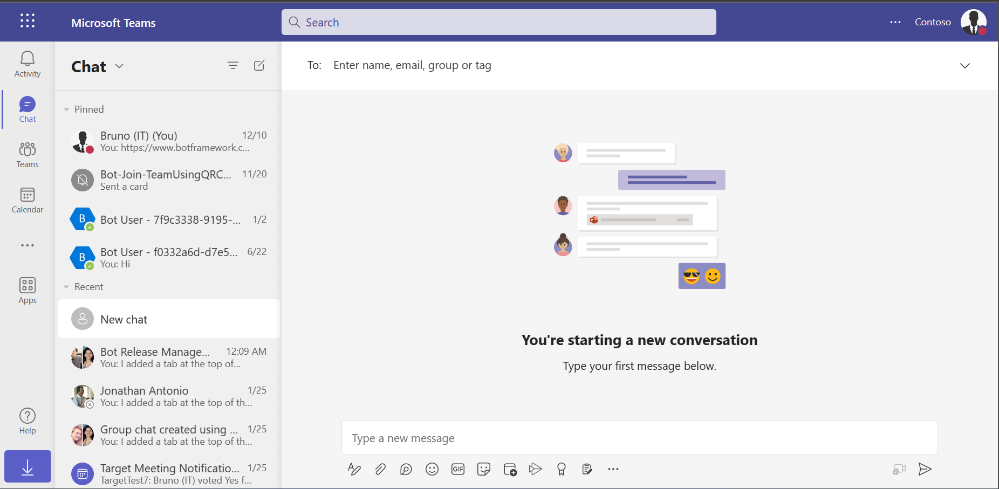

 # DeepLink All Features

 This sample app for demonstrating for deeplink all features using Tab.

- **Interaction with App**

 

 ## Prerequisites

- Microsoft Teams is installed and you have an account (not a guest account)
- [.NET Core SDK](https://dotnet.microsoft.com/download) version 6.0

  ```bash
  # determine dotnet version
  dotnet --version
  ```
- [ngrok](https://ngrok.com/download) or equivalent tunneling solution
- [M365 developer account](https://docs.microsoft.com/en-us/microsoftteams/platform/concepts/build-and-test/prepare-your-o365-tenant) or access to a Teams account with the 

 ## Setup

 > Note these instructions are for running the sample on your local machine, the tunnelling solution is required because
 the Teams service needs to call into the bot.

1. Register a new application in the [Azure Active Directory – App Registrations](https://go.microsoft.com/fwlink/?linkid=2083908) portal.

**NOTE:** When you create app registration, you will create an App ID and App password - make sure you keep these for later.

2. Setup NGROK
  - Run ngrok - point to port 3978

	```bash
	# ngrok http -host-header=rewrite 3978
	```

3. Setup for code

  - Clone the repository

    ```bash
    git clone https://github.com/OfficeDev/Microsoft-Teams-Samples.git
    ```

  - If you are using Visual Studio
    - Launch Visual Studio
    - File -> Open -> Project/Solution
    - Navigate to `samples/tab-deeplink-all-features/csharp` folder
    - Select `DeeplinkAllFeatures.csproj` or `DeeplinkAllFeatures.sln` file
	- Update AppId placeholer `<<Your_App_ID>>` value in your `WWWroot/js/DeepLinkAllFeatures.js` file at line no. 48  with your          particular App Id from any Team in Teams. (You can get it manually form [teams admin portal](https://admin.teams.microsoft.com/).
    - [TeamsAdminPortal-AppID](DeeplinkAllFeatures/Images/11.TeamsAdminPortal.png)
	- Update MicrosoftAppID placeholer `<<Microsoft-App-ID>>` value in your `WWWroot/js/DeepLinkAllFeatures.js` file at line no. 75  with your particular Microsoft-App-ID which you have generated in Step 1 (App Registration creation).


4. __*This step is specific to Teams.*__
    - **Edit** the `manifest.json` contained in the  `AppManifest` folder to replace your Microsoft App Id (that was created when you registered your bot earlier) *everywhere* 
	  you see the place holder string `<<YOUR-MICROSOFT-APP-ID>>` value(depending on the scenario the Microsoft App Id may occur multiple times in the `manifest.json` and `{{domain-name}}` with base Url domain. E.g. if you are using ngrok it would be `1234.ngrok.io`) 
    - **Edit** the `manifest.json` for `validDomains` with base Url domain. E.g. if you are using ngrok it would be `https://1234.ngrok.io` then your domain-name will be `1234.ngrok.io`.
    - **Zip** up the contents of the `Manifest` folder to create a `Manifest.zip` or `Manifest_Hub` folder into a `Manifest_Hub.zip`. (Make sure that zip file does not contains any subfolder otherwise you will get error while uploading your .zip package)
    - **Upload** the `manifest.zip` to Teams (In Teams Apps/Manage your apps click "Upload an app". Browse to and Open the .zip file. At the next dialog, click the Add button.)
    - Add the app to personal/team/groupChat scope (Supported scopes)

 ## Running the sample

**Application Setup**


**DeeplinkTab**


**AppProfilePage**


**AudioCallSelectPeople**


**AudioCallStart**


**AudioCallStarted**


**ScheduleMeeting**


**ScheduleMeetingDeeplink**


**StartNewChat**


**VideoCall**


 ## Further reading

- [Deep link to an application](https://learn.microsoft.com/en-us/microsoftteams/platform/concepts/build-and-test/deep-link-application?tabs=teamsjs-v2)


