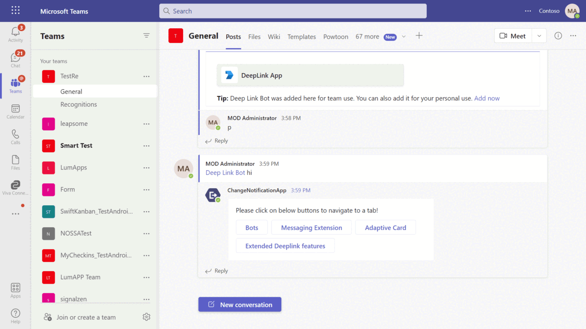

# DeepLink

This sample displays how to consume SubEntity Id to [DeepLink](https://docs.microsoft.com/en-us/microsoftteams/platform/concepts/build-and-test/deep-links#deep-linking-to-your-tab) from Bot to Tab and Tab to Tab.

## Interaction with bot



## Prerequisites

- [Node.js](https://nodejs.org) version 10.14 or higher

    ```bash
    # determine node version
    node --version
    ```
      
 - [Ngrok](https://ngrok.com/download) (Only for devbox testing) Latest (any other tunneling      software       can also be used)
   

## Setup.


 # run ngrok locally

     ```bash
    ngrok http -host-header=localhost 3978
    ```
- [Teams](https://teams.microsoft.com) Microsoft Teams is installed and you have an account

## To try this sample

1. Clone the repository

    ```bash
    git clone https://github.com/OfficeDev/Microsoft-Teams-Samples.git
    ```

    - In a terminal, navigate to `samples/tab-deeplink/nodejs`

        ```bash
        cd samples/tab-deeplink/nodejs
        ```

    - Install modules

        ```bash
        npm install
        ```

    - Start the bot

        ```bash
        npm start
        ```

1. If you are using Visual Studio code
    - Launch Visual Studio code
    - Folder -> Open -> Project/Solution
    - Navigate to ```samples/tab-deeplink/nodejs``` folder
    - Select ```nodejs``` Folder
1. To run the application required  node modules.Please use this command to install modules npm i
1. Run ngrok - point to port 3978 (This is your Base_URL)
   ```ngrok http -host-header=rewrite 3978```
1. Create a new Bot by following steps mentioned in [Build a bot](https://docs.microsoft.com/en-us/microsoftteams/platform/bots/what-are-bots?view=msteams-client-js-latest#build--a-bot-for-teams-with-the-microsoft-bot-framework) documentation.
- Ensure that you've [enabled the Teams Channel](https://docs.microsoft.com/en-us/azure/bot-service/channel-connect-teams?view=azure-bot-service-4.0)
1. Go to .env file  and add ```MicrosoftAppId``` ,  ```MicrosoftAppPassword``` and ```Base_URL``` information.
1. Run your app, either from Visual Studio code  with ``` npm start``` or using ``` Run``` in the Terminal.
1. Update the manifest.json file with ```Microsoft-App-ID```,```ContentUrl```, ```WebsiteUrl``` and ```EntityID``` value.
1. Install the app in Teams.


## Running the sample.

Enter text in the emulator.  The text will be echoed back by the bot.
1. Interact with DeepLink bot by pinging it in personal or channel scope. 


2. Select the option from the options displayed in the adaptive card. This will redirect to the respective Task in the Tab.


3. Click on Back to List to view all the options and additional features of deep link using Microsoft teams SDK v2.0.0. User can select an option which will redirect to the respective Task in the Tab.


4. Add this application in live meeting and stage the content.


5. While it's in stage view, using same [deeplink to open tab](https://docs.microsoft.com/en-us/microsoftteams/platform/concepts/build-and-test/deep-links?tabs=teamsjs-v2#generate-a-deep-link-to-your-tab) will open the meeting side panel tab.


## Further Read.
[Tab Deeplink](https://learn.microsoft.com/en-us/microsoftteams/platform/concepts/build-and-test/deep-links?tabs=teamsjs-v2)

