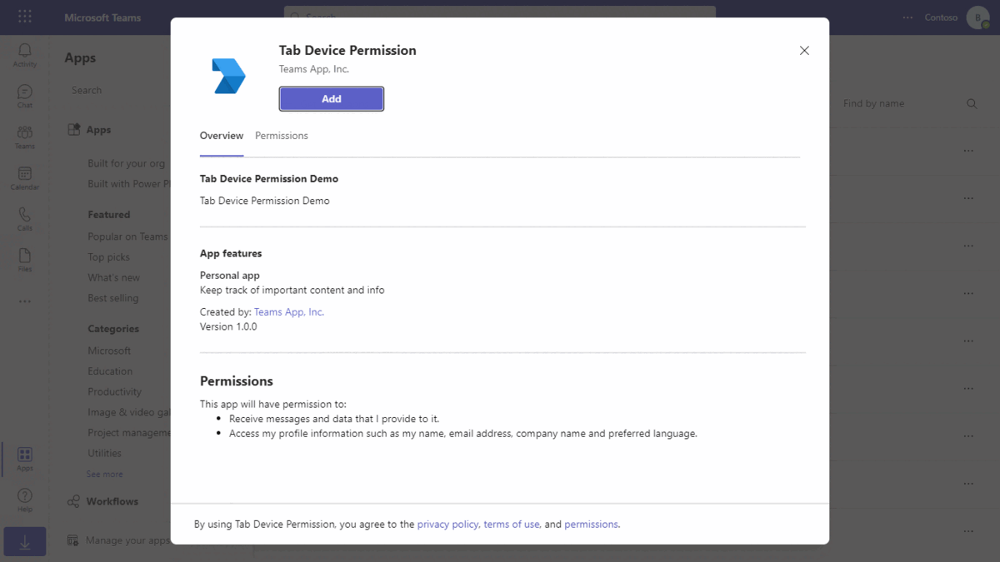
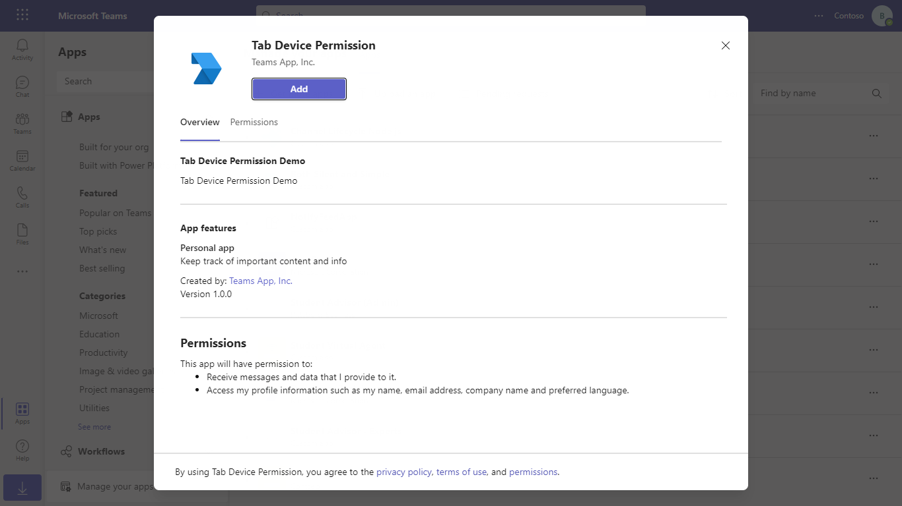
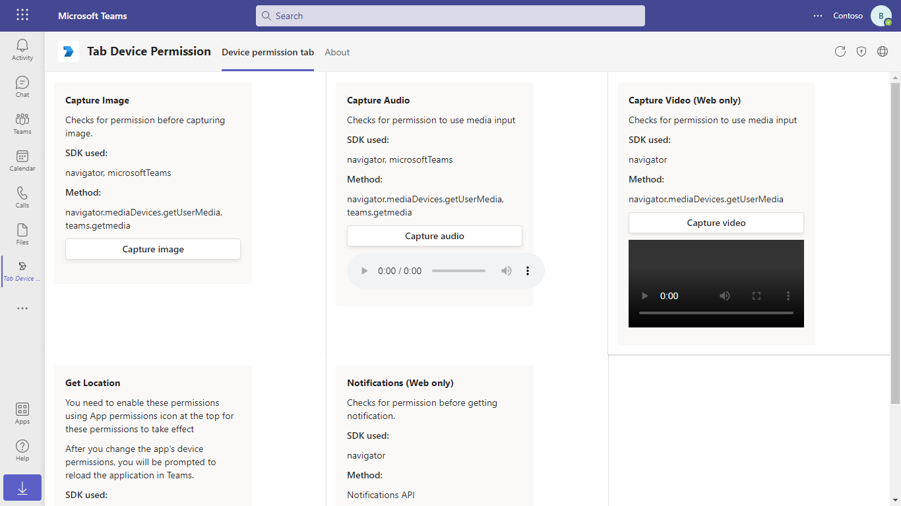
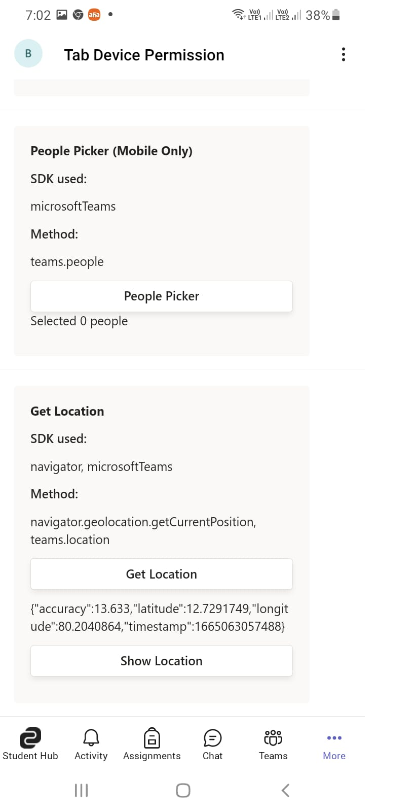

# Tab Device Permission Demo

This sample shows [tab device permissions](https://docs.microsoft.com/microsoftteams/platform/concepts/device-capabilities/device-capabilities-overview).

It also shows Device permissions for the browser. Please refer [Device permissions for browser](https://docs.microsoft.com/en-us/microsoftteams/platform/concepts/device-capabilities/browser-device-permissions) for more information.

```
The latest update on how device permissions are handled in the browser is currently available in public developer preview
only.

This update will be generally available (GA) by February 01, 2022
```
## Interaction with app - Desktop View

 

## Interaction with app - Mobile View


## Prerequisites
 To test locally, [NodeJS](https://nodejs.org/en/download/) must be installed on your development machine (version 16.14.2  or higher).

    ```bash
    # determine node version
    node --version
    ```
- To test locally, you'll need [Ngrok](https://ngrok.com/) installed on your development machine.
Make sure you've downloaded and installed Ngrok on your local machine. ngrok will tunnel requests from the Internet to your local computer and terminate the SSL connection from Teams.

- [M365 developer account](https://docs.microsoft.com/en-us/microsoftteams/platform/concepts/build-and-test/prepare-your-o365-tenant) or access to a Teams account with the appropriate permissions to install an app.
    
## Setup
 NOTE: The free ngrok plan will generate a new URL every time you run it, which requires you to update your Azure AD registration, the Teams app manifest, and the project configuration. A paid account with a permanent ngrok URL is recommended.

### 1. Setup for Bot
- Create a new Bot by following steps mentioned in [Build a bot](https://docs.microsoft.com/en-us/microsoftteams/platform/bots/what-are-bots?view=msteams-client-js-latest#build--a-bot-for-teams-with-the-microsoft-bot-framework) documentation.

- Ensure that you've [enabled the Teams Channel](https://docs.microsoft.com/en-us/azure/bot-service/channel-connect-teams?view=azure-bot-service-4.0)

- [Install the App in Teams Meeting](https://docs.microsoft.com/en-us/microsoftteams/platform/apps-in-teams-meetings/teams-apps-in-meetings?view=msteams-client-js-latest#meeting-lifecycle-scenarios)

 ### 2. Setup NGROK  
    - Run ngrok - point to port `3000`

    ```bash
    ngrok http -host-header=localhost 3000
    ```
### 3. Setup for code   
- Clone the repository

    ```bash
    git clone https://github.com/OfficeDev/Microsoft-Teams-Samples.git
    ```
 - In a terminal, navigate to `samples/tab-device-permissions/nodejs`

- Install modules

    ```bash
    npm install
    ```

- Start the bot

    ```bash
    npm start
    ```
### 4. Setup Manifest for Teams

- **This step is specific to Teams.**
- Modify the `manifest.json` in the `/appPackage` folder and replace the following details
    - **Zip** up the contents of the `appPackage` folder to create a `manifest.zip`
    - **Add** in a meeting to test
         - Select **Apps** from the left panel.
         - Then select **Upload a custom app** from the lower right corner.
         - Then select the `manifest.zip` file from `appPackage`. 

## Running the sample - Desktop View

**Install app:** 



**Device permission tab:** 



**Tab device permission:** 


**Device permission tab:** 


## Running the sample - Mobile View

**Tab device permission(Capture Image and Media):** 


**Tab device permission(Scan Barcode):** 


**Tab device permission(People Picker and Get Location):** 



**Device permission tab:** 


Similary, you can try out for other features.
> [!IMPORTANT]
  > Please take a look at [notes section in Device Permissions](https://docs.microsoft.com/microsoftteams/platform/concepts/device-capabilities/native-device-permissions?tabs=desktop) documentation as not all devices support these permissions.

# Contributing
This project welcomes contributions and suggestions.  Most contributions require you to agree to a
Contributor License Agreement (CLA) declaring that you have the right to, and actually do, grant us
the rights to use your contribution. For details, visit https://cla.microsoft.com.
When you submit a pull request, a CLA-bot will automatically determine whether you need to provide
a CLA and decorate the PR appropriately (e.g., label, comment). Simply follow the instructions
provided by the bot. You will only need to do this once across all repos using our CLA.
This project has adopted the [Microsoft Open Source Code of Conduct](https://opensource.microsoft.com/codeofconduct/).
For more information see the [Code of Conduct FAQ](https://opensource.microsoft.com/codeofconduct/faq/) or
contact [opencode@microsoft.com](mailto:opencode@microsoft.com) with any additional questions or comments.

# Further reading

- [Bot Framework Documentation](https://docs.botframework.com)
- [Bot Basics](https://docs.microsoft.com/azure/bot-service/bot-builder-basics?view=azure-bot-service-4.0)
- [Azure Portal](https://portal.azure.com)
- [Add Authentication to Your Bot Via Azure Bot Service](https://docs.microsoft.com/en-us/azure/bot-service/bot-builder-authentication?view=azure-bot-service-4.0&tabs=csharp)
- [Activity processing](https://docs.microsoft.com/en-us/azure/bot-service/bot-builder-concept-activity-processing?view=azure-bot-service-4.0)
- [Azure Bot Service Introduction](https://docs.microsoft.com/azure/bot-service/bot-service-overview-introduction?view=azure-bot-service-4.0)
- [Azure Bot Service Documentation](https://docs.microsoft.com/azure/bot-service/?view=azure-bot-service-4.0)
- [.NET Core CLI tools](https://docs.microsoft.com/en-us/dotnet/core/tools/?tabs=netcore2x)
- [Azure CLI](https://docs.microsoft.com/cli/azure/?view=azure-cli-latest)
- [Azure Portal](https://portal.azure.com)
- [Language Understanding using LUIS](https://docs.microsoft.com/en-us/azure/cognitive-services/luis/)
- [Channels and Bot Connector Service](https://docs.microsoft.com/en-us/azure/bot-service/bot-concepts?view=azure-bot-service-4.0)
- [Microsoft Teams Developer Platform](https://docs.microsoft.com/en-us/microsoftteams/platform/)

