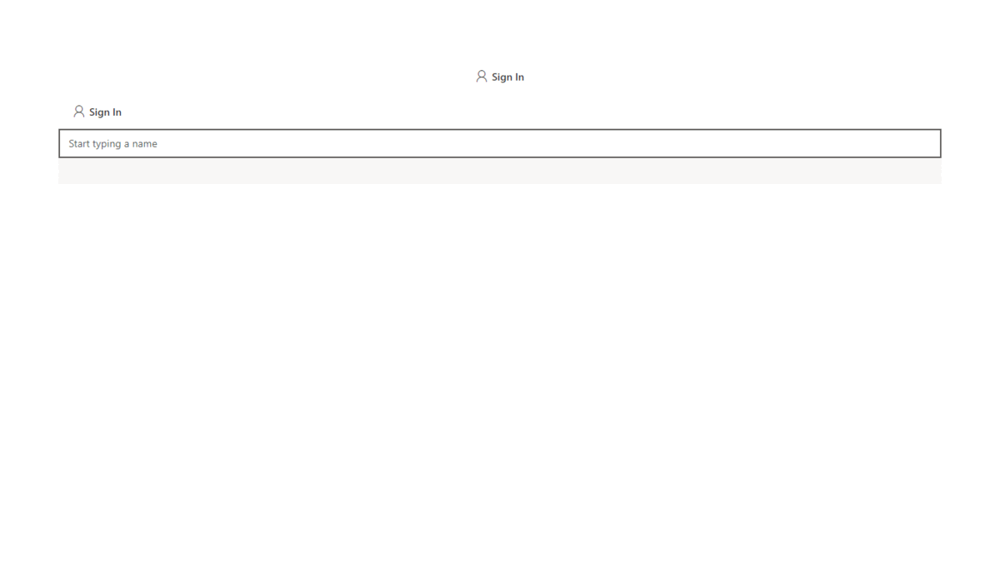
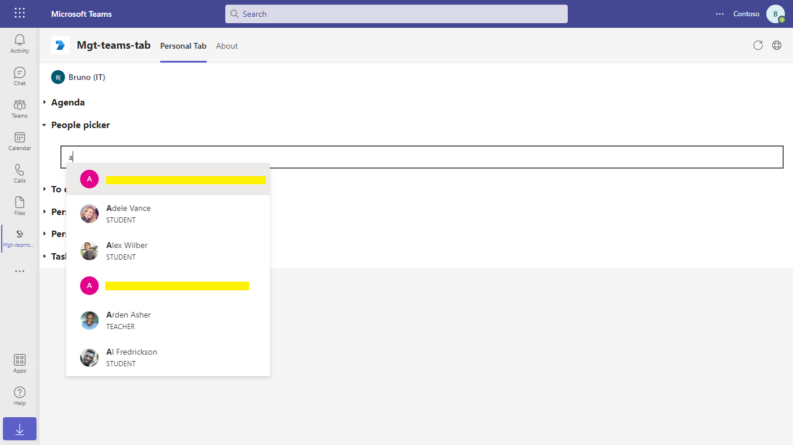

# Teams tab with microsoft graph toolkit

Tabs are Teams-aware webpages embedded in Microsoft Teams. A channel/group tab delivers content to channels and group chats, and are a great way to create collaborative spaces around dedicated web-based content.

 ## Included Features
* Tabs
* Graph Toolkit

## Interaction with app


## Prerequisites
- Microsoft Teams is installed and you have an account (not a guest account)
- To test locally, [NodeJS](https://nodejs.org/en/download/) must be installed on your development machine (version 16.14.2  or higher)
- [dev tunnel](https://learn.microsoft.com/en-us/azure/developer/dev-tunnels/get-started?tabs=windows) or [ngrok](https://ngrok.com/) latest version or equivalent tunneling solution
- [M365 developer account](https://docs.microsoft.com/en-us/microsoftteams/platform/concepts/build-and-test/prepare-your-o365-tenant) or access to a Teams account with the 
- [Teams Toolkit for VS Code](https://marketplace.visualstudio.com/items?itemName=TeamsDevApp.ms-teams-vscode-extension) or [TeamsFx CLI](https://learn.microsoft.com/microsoftteams/platform/toolkit/teamsfx-cli?pivots=version-one)

## Run the app (Using Teams Toolkit for Visual Studio Code)

The simplest way to run this sample in Teams is to use Teams Toolkit for Visual Studio Code.

1. Ensure you have downloaded and installed [Visual Studio Code](https://code.visualstudio.com/docs/setup/setup-overview)
1. Install the [Teams Toolkit extension](https://marketplace.visualstudio.com/items?itemName=TeamsDevApp.ms-teams-vscode-extension)
1. Select **File > Open Folder** in VS Code and choose this samples directory from the repo
1. Using the extension, sign in with your Microsoft 365 account where you have permissions to upload custom apps
1. Select **Debug > Start Debugging** or **F5** to run the app in a Teams web client.
1. In the browser that launches, select the **Add** button to install the app to Teams.

> If you do not have permission to upload custom apps (sideloading), Teams Toolkit will recommend creating and using a Microsoft 365 Developer Program account - a free program to get your own dev environment sandbox that includes Teams.

## Setup

1. Register a new application in the [Azure Active Directory – App Registrations](https://go.microsoft.com/fwlink/?linkid=2083908) portal.
   - Register an App in Azure. Navigate to App registeration click on New registeration.
   - Update your App Name `mgtteamstab`
   - Click on Add a Platform in redirect URI section.
   - Select Single Page Application and add following URL  `<<base-url>>/tabauth`
   - Save and register.
   - Once App is registerd copy the `client_Id` for your app and update in the app.

3. Setup NGROK
-  Run ngrok - point to port 3978

   ```bash
   ngrok http 3978 --host-header="localhost:3978"
   ```  

   Alternatively, you can also use the `dev tunnels`. Please follow [Create and host a dev tunnel](https://learn.microsoft.com/en-us/azure/developer/dev-tunnels/get-started?tabs=windows) and host the tunnel with anonymous user access command as shown below:

   ```bash
   devtunnel host -p 3978 --allow-anonymous
   ```

4. Setup for code

  - Clone the repository

    ```bash
    git clone https://github.com/OfficeDev/Microsoft-Teams-Samples.git
    ```
  - Build and Run

  In the project directory, execute:

     ``` bash
     npm install
     ```

     ``` bash
     npm start
     ```

5. Setup Manifest for Teams
- __*This step is specific to Teams.*__
    - **Edit** the `manifest.json` contained in the ./AppPackage folder to replace your Microsoft App Id (that was created when you registered your app registration earlier) *everywhere* you see the place holder string `{{Microsoft-App-Id}}` (depending on the scenario the Microsoft App Id may occur multiple times in the `manifest.json`)
    - **Edit** the `manifest.json` for `validDomains` and replace `{{domain-name}}` with base Url of your domain. E.g. if you are using ngrok it would be `https://1234.ngrok-free.app` then your domain-name will be `1234.ngrok-free.app` and if you are using dev tunnels then your domain will be like: `12345.devtunnels.ms`.
    - **Zip** up the contents of the `AppPackage` folder to create a `manifest.zip` (Make sure that zip file does not contains any subfolder otherwise you will get error while uploading your .zip package)

- Upload the manifest.zip to Teams (in the Apps view click "Upload a custom app")
   - Go to Microsoft Teams. From the lower left corner, select Apps
   - From the lower left corner, choose Upload a custom App
   - Go to your project directory, the ./AppPackage folder, select the zip folder, and choose Open.
   - Select Add in the pop-up dialog box. Your app is uploaded to Teams.
## User Interaction
- Once you access the Tab within your app you will be able to see following microsoft-graph-toolkit component. 
-<mgt-login>, <mgt-agenda>, <mgt-people-picker>, <mgt-tasks>

## Deploy to Teams
Start debugging the project by hitting the `F5` key or click the debug icon in Visual Studio Code and click the `Start Debugging` green arrow button.

### NOTE: First time debug step
On the first time running and debugging your app you need allow the localhost certificate.  After starting debugging when Chrome is launched and you have installed your app it will fail to load.

- Open a new tab `in the same browser window that was opened`
- Navigate to `https://localhost:3000/`
- Click the `Advanced` button
- Select the `Continue to localhost`

## Running the sample.





### NOTE: Debugging
Ensure you have the Debugger for Chrome/Edge extension installed for Visual Studio Code from the marketplace.

### Build for production
`npm run build`

Builds the app for production to the `build` folder.\
It correctly bundles React in production mode and optimizes the build for the best performance.

The build is minified and the filenames include the hashes.\
Your app is ready to be deployed!

See the section about [deployment](https://facebook.github.io/create-react-app/docs/deployment) for more information.

## Further Reading.
[Tab-graph-toolkit](https://learn.microsoft.com/en-us/graph/toolkit/get-started/build-a-microsoft-teams-tab?tabs=unpkg%2Chtml)


