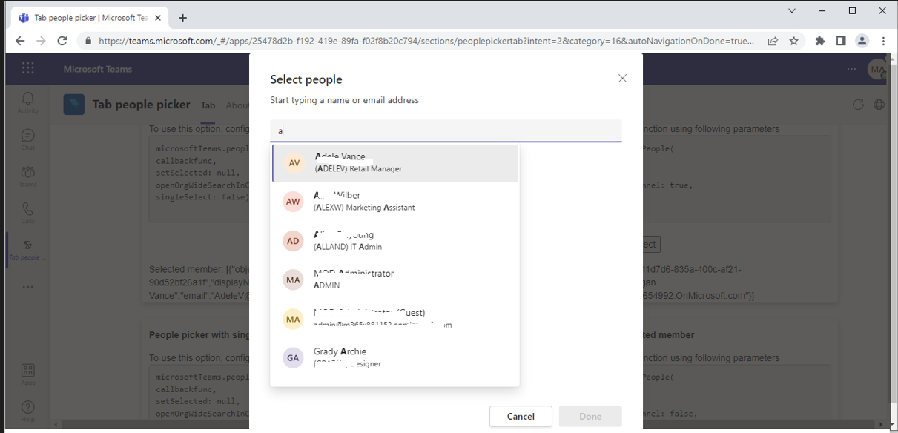
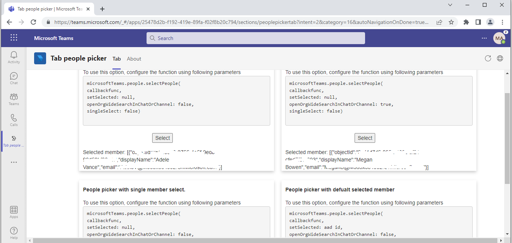

## Interaction with app


## Prerequisites

- [.NET Core SDK](https://dotnet.microsoft.com/download) version 3.1

  determine dotnet version
  ```bash
  dotnet --version
  ```
- [Ngrok](https://ngrok.com/download) (For local environment testing) Latest (any other tunneling software can also be used)
  
- [Teams](https://teams.microsoft.com) Microsoft Teams is installed and you have an account

## Setup

1. Register a new application in the [Azure Active Directory – App Registrations](https://go.microsoft.com/fwlink/?linkid=2083908) portal.
 
2. Setup for Bot
- Also, register a bot with Azure Bot Service, following the instructions [here](https://docs.microsoft.com/en-us/azure/bot-service/bot-service-quickstart-registration?view=azure-bot-service-3.0).
- Ensure that you've [enabled the Teams Channel](https://docs.microsoft.com/en-us/azure/bot-service/channel-connect-teams?view=azure-bot-service-4.0)

    > NOTE: When you create your app registration, you will create an App ID and App password - make sure you keep these for later.

3. Setup NGROK
- Run ngrok - point to port 3978

```bash
# ngrok http -host-header=rewrite 3978
```

4. Setup for code

- Clone the repository

    ```bash
    git clone https://github.com/OfficeDev/Microsoft-Teams-Samples.git
    ```
- Run the bot from a terminal or from Visual Studio:

  - From a terminal, navigate to `samples/samples/tab-people-picker/csharp`

  ```bash
  # run the bot
  dotnet run
  ```
 - Build your solution

  - Launch Visual Studio
  - File -> Open -> Project/Solution
  - Navigate to `samples/tab-people-picker/csharp/TabPeoplePicker/` folder
  - Select `TabPeoplePicker/.csproj` file
  - Press `F5` to run the project
  
5. Setup Manifest for Teams
- __*This step is specific to Teams.*__
    - **Edit** the `manifest.json` contained in the ./Manifest folder to replace your Microsoft App Id (that was created when you registered your app registration earlier) *everywhere* you see the place holder string `{{Microsoft-App-Id}}` (depending on the scenario the Microsoft App Id may occur multiple times in the `manifest.json`)
    - **Edit** the `manifest.json` for `validDomains` and replace `{{domain-name}}` with base Url of your domain. E.g. if you are using ngrok it would be `https://1234.ngrok.io` then your domain-name will be `1234.ngrok.io`.
    - **Zip** up the contents of the `Manifest` folder to create a `manifest.zip` (Make sure that zip file does not contains any subfolder otherwise you will get error while uploading your .zip package)

- Upload the manifest.zip to Teams (in the Apps view click "Upload a custom app")
   - Go to Microsoft Teams. From the lower left corner, select Apps
   - From the lower left corner, choose Upload a custom App
   - Go to your project directory, the ./Manifest folder, select the zip folder, and choose Open.
   - Select Add in the pop-up dialog box. Your app is uploaded to Teams.
   
- [Upload app manifest file](https://docs.microsoft.com/en-us/microsoftteams/platform/concepts/deploy-and-publish/apps-upload#load-your-package-into-teams) (zip file) to your team

## Running the sample

This is an tab app which shows the feature of client sdk people picker.







## Further Reading
[Tab-people-picker](https://learn.microsoft.com/en-us/microsoftteams/platform/concepts/device-capabilities/people-picker-capability?tabs=Samplemobileapp%2Cteamsjs-v2)

