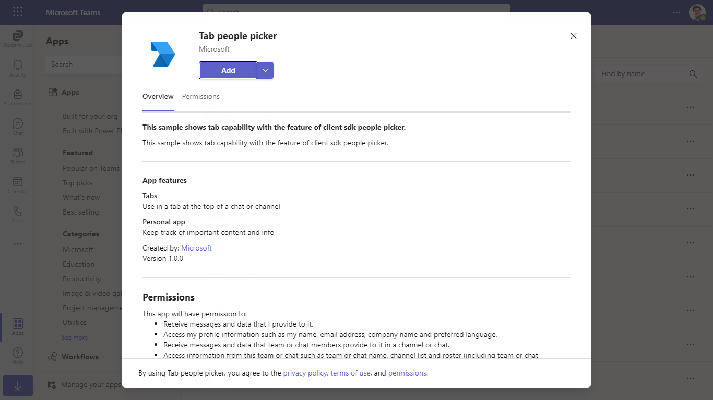
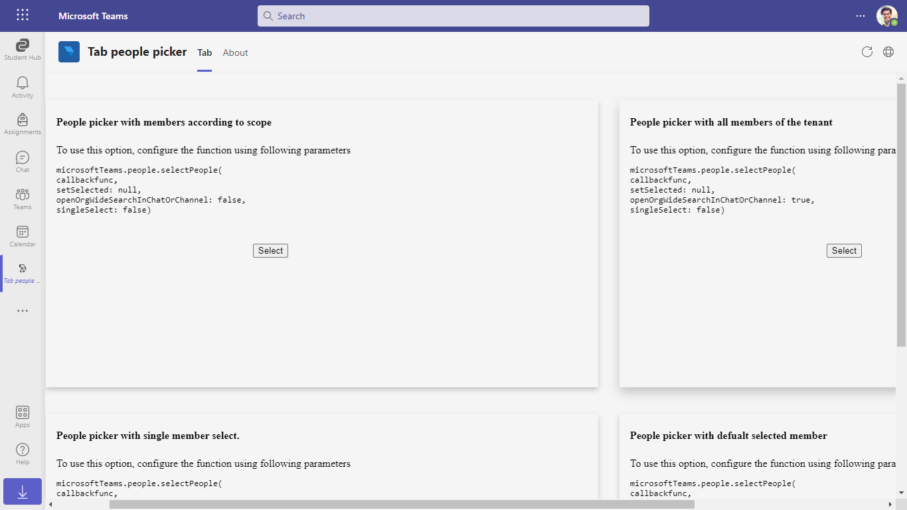

# Tab people picker Node.js

This is an tab app which shows the feature of people picker using teams js client sdk.

 ## Included Features
* Tabs
* People Picker in tabs

## Interaction with app


## Try it yourself - experience the App in your Microsoft Teams client
Please find below demo manifest which is deployed on Microsoft Azure and you can try it yourself by uploading the app package (.zip file link below) to your teams and/or as a personal app. (Sideloading must be enabled for your tenant, [see steps here](https://docs.microsoft.com/microsoftteams/platform/concepts/build-and-test/prepare-your-o365-tenant#enable-custom-teams-apps-and-turn-on-custom-app-uploading)).

**Tab people picker:** [Manifest](/samples/tab-people-picker/csharp/demo-manifest/Tab-People-Picker.zip)

## Prerequisites

 - Office 365 tenant. You can get a free tenant for development use by signing up for the [Office 365 Developer Program](https://developer.microsoft.com/en-us/microsoft-365/dev-program).

- To test locally, [NodeJS](https://nodejs.org/en/download/) must be installed on your development machine (version 16.14.2  or higher).

- [ngrok](https://ngrok.com/) or equivalent tunnelling solution

- [Teams Toolkit for VS Code](https://marketplace.visualstudio.com/items?itemName=TeamsDevApp.ms-teams-vscode-extension) or [TeamsFx CLI](https://learn.microsoft.com/microsoftteams/platform/toolkit/teamsfx-cli?pivots=version-one)

## Run the app (Using Teams Toolkit for Visual Studio Code)

The simplest way to run this sample in Teams is to use Teams Toolkit for Visual Studio Code.

1. Ensure you have downloaded and installed [Visual Studio Code](https://code.visualstudio.com/docs/setup/setup-overview)
1. Install the [Teams Toolkit extension](https://marketplace.visualstudio.com/items?itemName=TeamsDevApp.ms-teams-vscode-extension)
1. Select **File > Open Folder** in VS Code and choose this samples directory from the repo
1. Using the extension, sign in with your Microsoft 365 account where you have permissions to upload custom apps
1. Select **Debug > Start Debugging** or **F5** to run the app in a Teams web client.
1. In the browser that launches, select the **Add** button to install the app to Teams.
> If you do not have permission to upload custom apps (sideloading), Teams Toolkit will recommend creating and using a Microsoft 365 Developer Program account - a free program to get your own dev environment sandbox that includes Teams.

## Setup

1) Setup NGROK
Run ngrok - point to port 3978

    ```bash
    ngrok http 3978 --host-header="localhost:3978"
    
    ```

2) Setup for code    
- Clone the repository

    ```bash
    git clone https://github.com/OfficeDev/Microsoft-Teams-Samples.git
    ```

- In a terminal, navigate to `samples/tab-people-picker/nodejs`

- Install modules

    ```bash
    npm install
    ```

- Run your bot at the command line:

    ```bash
    npm start
    ```

## Setup Manifest for Teams

- **This step is specific to Teams.**

    -  Edit the `manifest.json` contained in the `Manifest` folder to replace {{Manifest-id}} with any GUID
    - `{{base-url}}` with base Url domain. E.g. if you are using ngrok it would be `https://1234.ngrok-free.app` then your domain-name will be `1234.ngrok-free.app`. Replace *everywhere* you see the place holder string `{{base-url}}`
       Note => Update `validDomains` as per your application domain, if needed.

    -  Zip up the contents of the `Manifest` folder to create a `manifest.zip`
    -  Upload the `manifest.zip` to Teams (in the Apps view click "Upload a custom app")

## Running the sample

**Adding tab people picker UI:**



**Tab UI:**



**All Memberes Of Organisation Search:**


**Scope search:**


**Single Select:**


**Set Selected Search:**


## Further reading

- [Tab Pepole picker](https://learn.microsoft.com/microsoftteams/platform/concepts/device-capabilities/people-picker-capability?tabs=Samplemobileapp%2Cteamsjs-v2)

