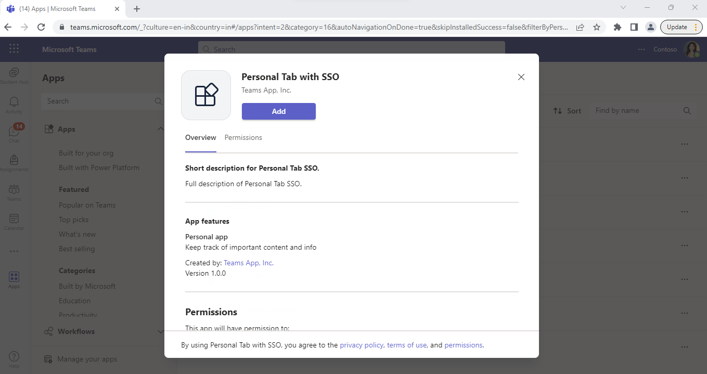

# Teams Tab SSO Authentication

Tabs are Teams-aware webpages embedded in Microsoft Teams. A channel/group tab delivers content to channels and group chats, and are a great way to create collaborative spaces around dedicated web-based content.


## Interaction with app


 ## Prerequisites

- Microsoft Teams is installed and you have an account (not a guest account)
-  [NodeJS](https://nodejs.org/en/)
-  [ngrok](https://ngrok.com/) or equivalent tunneling solution
-  [M365 developer account](https://docs.microsoft.com/en-us/microsoftteams/platform/concepts/build-and-test/prepare-your-o365-tenant) or access to a Teams account with the appropriate permissions to install an app.

## Setup
1) Register a new application in the [Azure Active Directory – App Registrations](https://go.microsoft.com/fwlink/?linkid=2083908) portal.

2) Setup for Bot

   In Azure portal, create a [Azure Bot resource](https://docs.microsoft.com/en-us/azure/bot-service/bot-service-quickstart-registration).
    - For bot handle, make up a name.
    - Select "Use existing app registration" (Create the app registration in Azure Active Directory beforehand.)
    - __*If you don't have an Azure account*__ create an [Azure free account here](https://azure.microsoft.com/en-us/free/)
    
   In the new Azure Bot resource in the Portal, 
    - Ensure that you've [enabled the Teams Channel](https://learn.microsoft.com/en-us/azure/bot-service/channel-connect-teams?view=azure-bot-service-4.0)
    - In Settings/Configuration/Messaging endpoint, enter the current `https` URL you were given by running ngrok. Append with the path `/api/messages`

-  [Create an Azure AD App registration to support SSO and the User.Read Graph API](https://aka.ms/teams-toolkit-sso-appreg)

3. Setup NGROK

- Run ngrok - point to port 3978

    ```bash
    ngrok http -host-header=rewrite 3978
    ```
4. Setup for code
   - Clone the repository

    ```bash
    git clone https://github.com/OfficeDev/Microsoft-Teams-Samples.git
    ```

   - In a terminal, navigate to `samples/tab-personal-sso-quickstart/ts`
   
   - Update the `.env` configuration for the bot to use the `REACT_APP_AZURE_APP_REGISTRATION_ID` and `REACT_APP_BASE_URL` with application base url. For e.g., your ngrok url. (Note the MicrosoftAppId is the AppId created in step 1 (Setup for Bot).

- Build and Run

  -In the root directory, execute:

   `npm install`

    `npm start`
    
5. Setup Manifest for Teams
- __*This step is specific to Teams.*__
    - **Edit** the `manifest.json` contained in the ./AppPackage folder to replace your Microsoft App Id (that was created when you registered your app registration earlier) *everywhere* you see the place holder string `{{Microsoft-App-Id}}` (depending on the scenario the Microsoft App Id may occur multiple times in the `manifest.json`)
    - **Edit** the `manifest.json` for `validDomains` and replace `{{domain-name}}` with base Url of your domain. E.g. if you are using ngrok it would be `https://1234.ngrok.io` then your domain-name will be `1234.ngrok.io`.
    - **Edit** the `manifest.json` for `webApplicationInfo` resource `"api://<<YOUR-NGROK-DOMAIN>>/<<YOUR-MICROSOFT-APP-ID>>"` with MicrosoftAppId. E.g. `"api://1234.ngrok.io/00000000-0000-0000-0000-000000000000"`.
    - **Zip** up the contents of the `AppPackage` folder to create a `manifest.zip` (Make sure that zip file does not contains any subfolder otherwise you will get error while uploading your .zip package)

- Upload the manifest.zip to Teams (in the Apps view click "Upload a custom app")
   - Go to Microsoft Teams. From the lower left corner, select Apps
   - From the lower left corner, choose Upload a custom App
   - Go to your project directory, the ./AppPackage folder, select the zip folder, and choose Open.
   - Select Add in the pop-up dialog box. Your app is uploaded to Teams.
## Build and Run

In the project directory, execute:

`npm install`

`npm start`

## Deploy to Teams
Start debugging the project by hitting the `F5` key or click the debug icon in Visual Studio Code and click the `Start Debugging` green arrow button.

### NOTE: First time debug step
On the first time running and debugging your app you need allow the localhost certificate.  After starting debugging when Chrome is launched and you have installed your app it will fail to load.

- Open a new tab `in the same browser window that was opened`
- Navigate to `https://localhost:3000/tab`
- Click the `Advanced` button
- Select the `Continue to localhost`
- You may also need to enable popups in the browser to see the auth consent page.

### NOTE: Debugging
Ensure you have the Debugger for Chrome/Edge extension installed for Visual Studio Code from the marketplace.

### Build for production
`npm run build`

## Running the sample

**Install App:**



**Tab SSO Authentication UI:**


Builds the app for production to the `build` folder.\
It correctly bundles React in production mode and optimizes the build for the best performance.

The build is minified and the filenames include the hashes.\
Your app is ready to be deployed!

See the section about [deployment](https://facebook.github.io/create-react-app/docs/deployment) for more information.

## Further Reading.
[Tab-personal-quickStart](https://learn.microsoft.com/en-us/microsoftteams/platform/tabs/how-to/authentication/tab-sso-overview)

