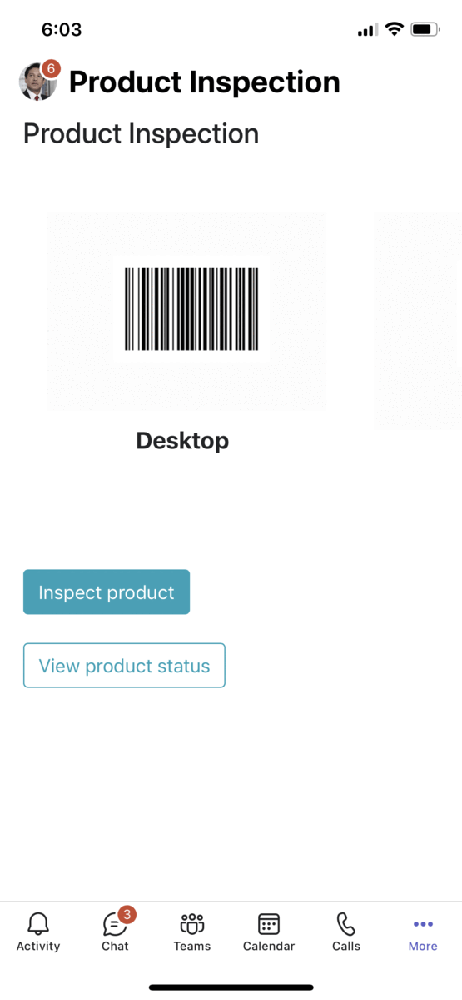
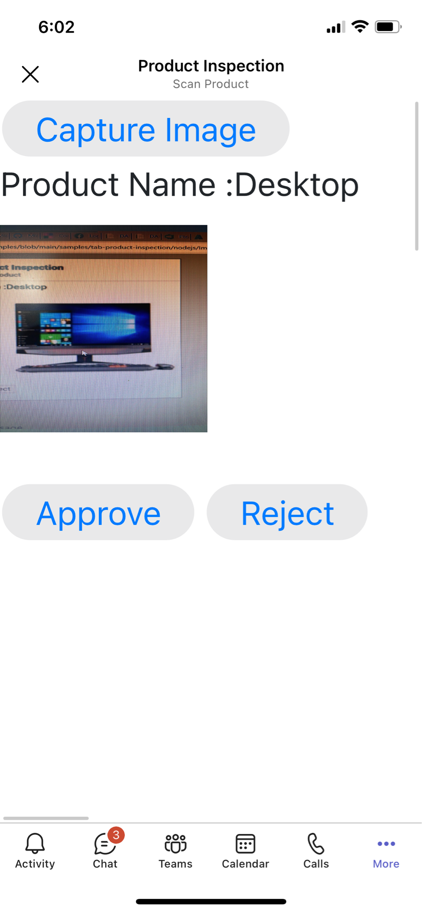
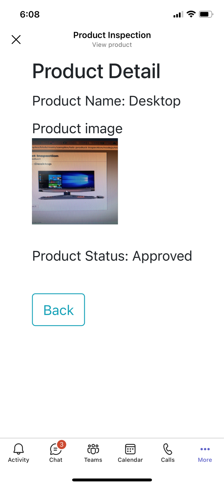

# Product Inspection

This sample app demonstrate a feature where user can scan a product, capture a image and mark it as approved/rejected.
	
	

## Prerequisites

- [NodeJS](https://nodejs.org/en/)
- [ngrok](https://ngrok.com/) or equivalent tunnelling solution

## To try this sample

1) Clone the repository

    ```bash
    git clone https://github.com/OfficeDev/Microsoft-Teams-Samples.git
    ```

1) In a terminal, navigate to `samples/tab-product-inspection/nodejs`

1) Install modules

    ```bash
    npm install
    ```

1) Run ngrok - point to port 3978

    ```bash
    ngrok http -host-header=rewrite 3978
    ```

1) Run your bot at the command line:

    ```bash
    npm start
    ```
## Interacting with the app in Teams Meeting
Interact with Product Inspection by clicking on the App icon.
1. Once the app is clicked, Product Inspection appears with the default product list.

   
   
2. On click on "Inspect product" button, scanner will open when scan the product bar code user can Approve or Reject the product.

	

3. On click on "View product status" button, scanner will open when scan the product bar code and user can view the detail of the product.

   


1) __*This step is specific to Teams.*__
    - **Edit** the `manifest.json` contained in the  `Manifest` folder to replace your Microsoft App Id (that was created when you registered your bot earlier) *everywhere* you see the place holder string `<<Manifest-id>>` (depending on the scenario the Microsoft App Id may occur multiple times in the `manifest.json`)and ngrok url *everywhere* you see the place holder string `<<base-url>>`
    - **Zip** up the contents of the `Manifest` folder to create a `manifest.zip`
    - **Upload** the `manifest.zip` to Teams (in the Apps view click "Upload a custom app")

