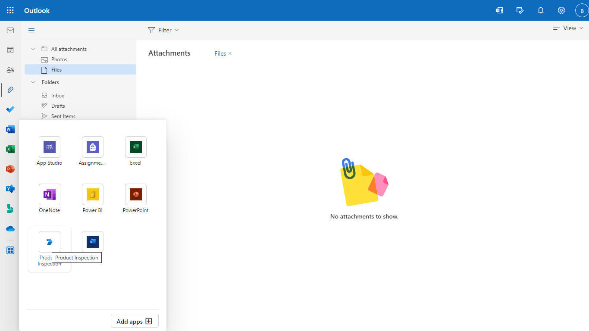
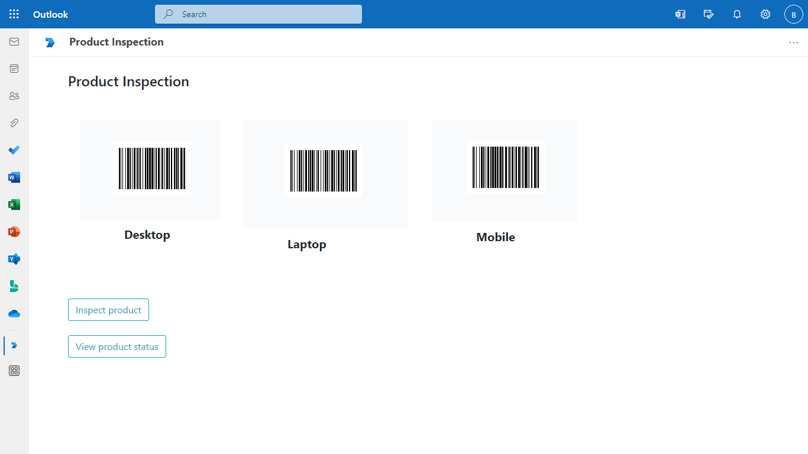
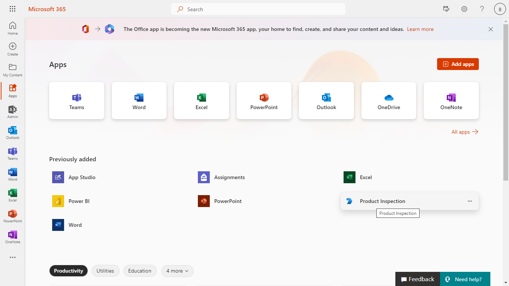
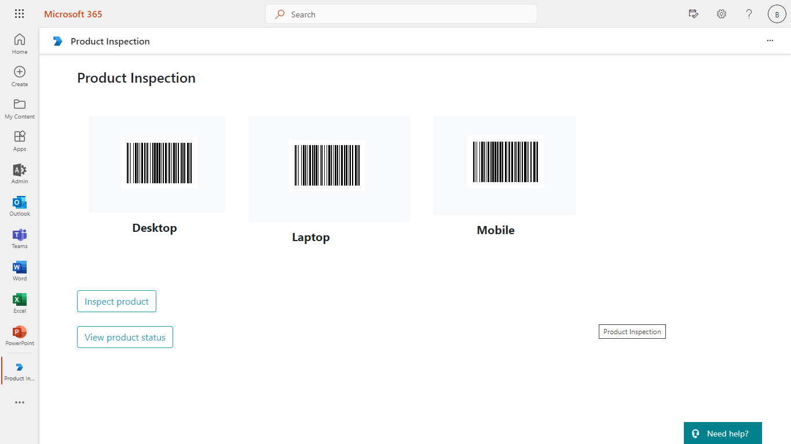

# Product Inspection

This sample app demonstrate a feature where user can scan a product, capture a image and mark it as approved/rejected.

 ## Included Features
* Tabs
* Device Permissions (media)
	
## Interaction with app


## Try it yourself - experience the App in your Microsoft Teams client
Please find below demo manifest which is deployed on Microsoft Azure and you can try it yourself by uploading the app package (.zip file link below) to your teams and/or as a personal app. (Sideloading must be enabled for your tenant, [see steps here](https://docs.microsoft.com/microsoftteams/platform/concepts/build-and-test/prepare-your-o365-tenant#enable-custom-teams-apps-and-turn-on-custom-app-uploading)).

**Product Inspection:** [Manifest](/samples/tab-product-inspection/csharp/demo-manifest/Tab-Product-Inspection.zip)

## Prerequisites

- Microsoft Teams is installed and you have an account (not a guest account)
- To test locally, [NodeJS](https://nodejs.org/en/download/) must be installed on your development machine (version 16.14.2  or higher)
- [devtunnel](https://learn.microsoft.com/en-us/azure/developer/dev-tunnels/get-started?tabs=windows) or [ngrok](https://ngrok.com/) latest version or equivalent tunneling solution
- [M365 developer account](https://docs.microsoft.com/microsoftteams/platform/concepts/build-and-test/prepare-your-o365-tenant) or access to a Teams account with the 
- [Teams Toolkit for VS Code](https://marketplace.visualstudio.com/items?itemName=TeamsDevApp.ms-teams-vscode-extension) or [TeamsFx CLI](https://learn.microsoft.com/microsoftteams/platform/toolkit/teamsfx-cli?pivots=version-one)

## Run the app (Using Teams Toolkit for Visual Studio Code)

The simplest way to run this sample in Teams is to use Teams Toolkit for Visual Studio Code.

1. Ensure you have downloaded and installed [Visual Studio Code](https://code.visualstudio.com/docs/setup/setup-overview)
1. Install the [Teams Toolkit extension](https://marketplace.visualstudio.com/items?itemName=TeamsDevApp.ms-teams-vscode-extension)
1. Select **File > Open Folder** in VS Code and choose this samples directory from the repo
1. Using the extension, sign in with your Microsoft 365 account where you have permissions to upload custom apps
1. Select **Debug > Start Debugging** or **F5** to run the app in a Teams web client.
1. In the browser that launches, select the **Add** button to install the app to Teams.
> If you do not have permission to upload custom apps (sideloading), Teams Toolkit will recommend creating and using a Microsoft 365 Developer Program account - a free program to get your own dev environment sandbox that includes Teams.

## Setup

1. Register a new application in the [Azure Active Directory – App Registrations](https://go.microsoft.com/fwlink/?linkid=2083908) portal.

**NOTE:** When you create app registration, you will create an App ID and App password - make sure you keep these for later.

2. Setup NGROK
 - Run ngrok - point to port 3978

   ```bash
   ngrok http 3978 --host-header="localhost:3978"
   ```  

   Alternatively, you can also use the `dev tunnels`. Please follow [Create and host a dev tunnel](https://learn.microsoft.com/en-us/azure/developer/dev-tunnels/get-started?tabs=windows) and host the tunnel with anonymous user access command as shown below:

   ```bash
   devtunnel host -p 3978 --allow-anonymous
   ```

3. Setup for code

  - Clone the repository

    ```bash
    git clone https://github.com/OfficeDev/Microsoft-Teams-Samples.git
    ```
  
 - In a terminal, navigate to `samples/tab-product-inspection/nodejs`

 - Install modules

    ```bash
    npm install
    ```

 - Run your bot at the command line:

    ```bash
    npm start
    ```
4. Setup Manifest for Teams
- __*This step is specific to Teams.*__
    - **Edit** the `manifest.json` contained in the ./Manifest folder to replace your Microsoft App Id (that was created when you registered your app registration earlier) *everywhere* you see the place holder string `{{Microsoft-App-Id}}` (depending on the scenario the Microsoft App Id may occur multiple times in the `manifest.json`)
    - **Edit** the `manifest.json` for `validDomains` and replace `{{domain-name}}` with base Url of your domain. E.g. if you are using ngrok it would be `https://1234.ngrok-free.app` then your domain-name will be `1234.ngrok-free.app` and if you are using dev tunnels then your domain will be like: `12345.devtunnels.ms`.
    **Note:** If you want to test your app across multi hub like: Outlook/Office.com, please update the `manifest.json` in the `tab-product-inspection\nodejs\Manifest_Hub` folder with the required values.
    - **Zip** up the contents of the `Manifest` folder to create a `Manifest.zip` or `Manifest_Hub` folder to create a `Manifest_Hub.zip` (Make sure that zip file does not contains any subfolder otherwise you will get error while uploading your .zip package)

- Upload the manifest.zip to Teams (in the Apps view click "Upload a custom app")
   - Go to Microsoft Teams. From the lower left corner, select Apps
   - From the lower left corner, choose Upload a custom App
   - Go to your project directory, the ./Manifest folder, select the zip folder, and choose Open.
   - Select Add in the pop-up dialog box. Your app is uploaded to Teams.

## Running the sample

Interact with Product Inspection by clicking on the App icon.

1. Once the app is clicked, Product Inspection appears with the default product list.

   
   
2. On click on "Inspect product" button, scanner will open when scan the product bar code user can Approve or Reject the product.

	

3. On click on "View product status" button, scanner will open when scan the product bar code and user can view the detail of the product.

   

## Outlook on the web

- To view your app in Outlook on the web.

- Go to [Outlook on the web](https://outlook.office.com/mail/)and sign in using your dev tenant account.

**On the side bar, select More Apps. Your sideloaded app title appears among your installed apps**



**Select your app icon to launch and preview your app running in Outlook on the web**



**Note:** Similarly, you can test your application in the Outlook desktop app as well.

## Office on the web

- To preview your app running in Office on the web.

- Log into office.com with test tenant credentials

**Select the Apps icon on the side bar. Your sideloaded app title appears among your installed apps**



**Select your app icon to launch your app in Office on the web**



**Note:** Similarly, you can test your application in the Office 365 desktop app as well.

## Further Reading

[Product inspection](https://learn.microsoft.com/power-apps/teams/inspection)

[Extend Teams apps across Microsoft 365](https://learn.microsoft.com/microsoftteams/platform/m365-apps/overview)

