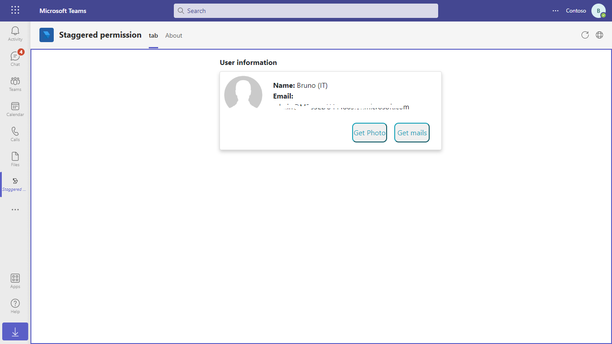
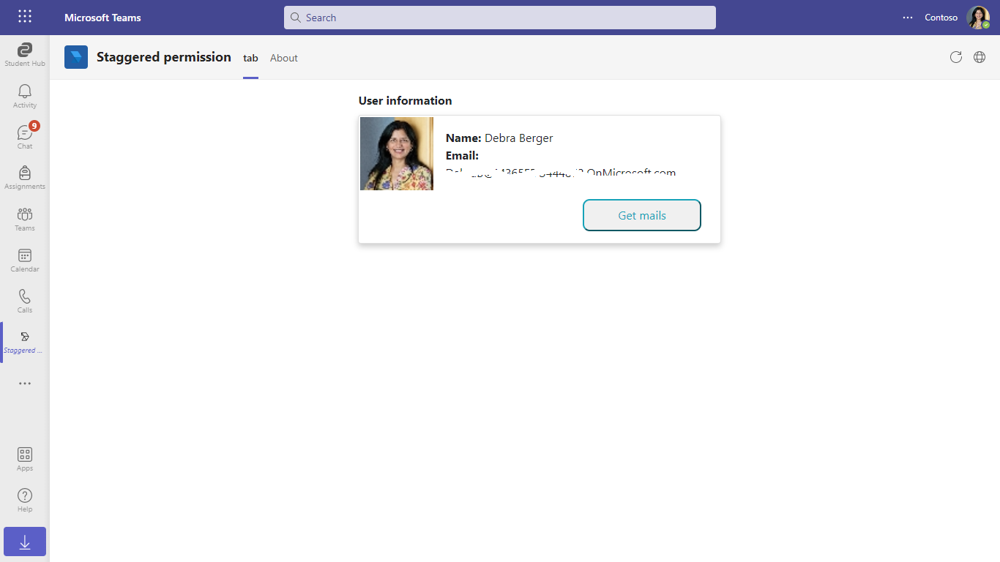

# Staggered permission sample

Using this nodejs sample, you can check how to get staggered graph api permissions

## Interaction with app


## Prerequisites

-  Microsoft Teams is installed and you have an account (not a guest account)
-  To test locally, [NodeJS](https://nodejs.org/en/download/) must be installed on your development machine (version 16.14.2  or higher).
-  [ngrok](https://ngrok.com/) or equivalent tunneling solution
-  [M365 developer account](https://docs.microsoft.com/en-us/microsoftteams/platform/concepts/build-and-test/prepare-your-o365-tenant) or access to a Teams account with the appropriate permissions to install an app.

## Setup

> Note these instructions are for running the sample on your local machine, the tunnelling solution is required because
> the Teams service needs to call into the bot.

### 1. Setup for Bot
- In Azure portal, create a [Azure Bot resource](https://docs.microsoft.com/en-us/azure/bot-service/bot-builder-authentication?view=azure-bot-service-4.0&tabs=csharp%2Caadv2).

- Ensure that you've [enabled the Teams Channel](https://docs.microsoft.com/en-us/azure/bot-service/channel-connect-teams?view=azure-bot-service-4.0)

- To test locally, you'll need [Ngrok](https://ngrok.com/) installed on your development machine.
Make sure you've downloaded and installed Ngrok on your local machine. ngrok will tunnel requests from the Internet to your local computer and terminate the SSL connection from Teams.

### 2. Setup NGROK  
1) Run ngrok - point to port 3978

    ```bash
    ngrok http -host-header=rewrite 3978
    ```
2) Once started you should see URL  `https://41ed-abcd-e125.ngrok.io`. Copy it, this is your baseUrl that will used as endpoint for Azure bot and webhook.

### 3. Setup for code  
1) Clone the repository

    ```bash
    git clone https://github.com/OfficeDev/Microsoft-Teams-Samples.git
    ```

2) In the folder where repository is cloned navigate to `samples\tab-staggered-permission\nodejs`

3) Install node modules

   Inside node js folder, open your local terminal and run the below command to install node modules. You can do the same in Visual studio code terminal by opening the project in Visual studio code 

    ```bash
    npm install
    ```

4)  Modify the `.env` file in your project folder (or in Visual Studio Code) and fill in below details:
   - `MicrosoftAppId` - Generated from Step 3 (Application (client) ID)is the application app id
   - `MicrosoftAppPassword` - Generated from Step 14, also referred to as Client secret

5) Run your app

    ```bash
    npm start
    ```

### 4. Register your Teams Auth SSO with Azure AD

1. Register a new application in the [Azure Active Directory – App Registrations](https://go.microsoft.com/fwlink/?linkid=2083908) portal.
2. Select **New Registration** and on the *register an application page*, set following values:
    * Set **name** to your app name.
    * Choose the **supported account types** (any account type will work)
    * Leave **Redirect URI** empty.
    * Choose **Register**.
3. On the overview page, copy and save the **Application (client) ID, Directory (tenant) ID**. You’ll need those later when updating your Teams application manifest and in the appsettings.json.
4. Under **Manage**, select **Expose an API**. 
5. Select the **Set** link to generate the Application ID URI in the form of `api://{AppID}`. Insert your fully qualified domain name (with a forward slash "/" appended to the end) between the double forward slashes and the GUID. The entire ID should have the form of: `api://fully-qualified-domain-name/{AppID}`
    * ex: `api://%ngrokDomain%.ngrok.io/00000000-0000-0000-0000-000000000000`.
6. Select the **Add a scope** button. In the panel that opens, enter `access_as_user` as the **Scope name**.
7. Set **Who can consent?** to `Admins and users`
8. Fill in the fields for configuring the admin and user consent prompts with values that are appropriate for the `access_as_user` scope:
    * **Admin consent title:** Teams can access the user’s profile.
    * **Admin consent description**: Allows Teams to call the app’s web APIs as the current user.
    * **User consent title**: Teams can access the user profile and make requests on the user's behalf.
    * **User consent description:** Enable Teams to call this app’s APIs with the same rights as the user.
9. Ensure that **State** is set to **Enabled**
10. Select **Add scope**
    * The domain part of the **Scope name** displayed just below the text field should automatically match the **Application ID** URI set in the previous step, with `/access_as_user` appended to the end:
        * `api://[ngrokDomain].ngrok.io/00000000-0000-0000-0000-000000000000/access_as_user.
11. In the **Authorized client applications** section, identify the applications that you want to authorize for your app’s web application. Each of the following IDs needs to be entered:
    * `1fec8e78-bce4-4aaf-ab1b-5451cc387264` (Teams mobile/desktop application)
    * `5e3ce6c0-2b1f-4285-8d4b-75ee78787346` (Teams web application)
12. Navigate to **API Permissions**, and make sure to add the follow permissions:
-   Select Add a permission
-   Select Microsoft Graph -\> Delegated permissions.
    - `User.Read` (enabled by default)
-   Click on Add permissions. Please make sure to grant the admin consent for the required permissions.
13. Navigate to **Authentication**
    If an app hasn't been granted IT admin consent, users will have to provide consent the first time they use an app.
    Set a redirect URI:
    * Select **Add a platform**.
    * Select **web**.
    * Enter the **redirect URI** for the app in the following format: `https://{Base_Url}/auth-end`. This will be the page where a successful implicit grant flow will redirect the user.
    Enable implicit grant by checking the following boxes:  
    ✔ ID Token  
    ✔ Access Token  
14.  Navigate to the **Certificates & secrets**. In the Client secrets section, click on "+ New client secret". Add a description(Name of the secret) for the secret and select “Never” for Expires. Click "Add". Once the client secret is created, copy its value, it need to be placed in the appsettings.json. 

### 5. Setup Manifest for Teams

- **This step is specific to Teams.**
    Modify the `manifest.json` in the `/AppPackage` folder and replace the following details:
   - `{{Microsoft-App-Id}}` with Application id generated from Step 3
   - `{Base_URL}}` - Your application's base url. E.g. https://12345.ngrok.io if you are using ngrok.
   - `{{domain-name}}` with base Url domain. E.g. if you are using ngrok it would be `https://1234.ngrok.io` then your domain-name will be `1234.ngrok.io`.

## Running the sample

**Install App:**


**Tab:** 



**Consent popup for staggered permission:**
 


**User emails:**


**Get photo:**



**Get photo and User emails:**


## Deploy the bot to Azure

To learn more about deploying a bot to Azure, see [Deploy your bot to Azure](https://aka.ms/azuredeployment) for a complete list of deployment instructions.

## Further reading

- [Authentication basics](https://docs.microsoft.com/en-us/microsoftteams/platform/concepts/authentication/authentication)
- [List Meeting Attendance Reports](https://docs.microsoft.com/en-us/graph/api/meetingattendancereport-list?view=graph-rest-1.0&tabs=http)
- [List Attendance Records](https://docs.microsoft.com/en-us/graph/api/attendancerecord-list?view=graph-rest-1.0&tabs=http)
- [Configure application access policy](https://docs.microsoft.com/en-us/graph/cloud-communication-online-meeting-application-access-policy)
- [Bot Framework Documentation](https://docs.botframework.com)
- [Bot Basics](https://docs.microsoft.com/azure/bot-service/bot-builder-basics?view=azure-bot-service-4.0)
- [Azure Portal](https://portal.azure.com)
- [Add Authentication to Your Bot Via Azure Bot Service](https://docs.microsoft.com/en-us/azure/bot-service/bot-builder-authentication?view=azure-bot-service-4.0&tabs=csharp)
- [Activity processing](https://docs.microsoft.com/en-us/azure/bot-service/bot-builder-concept-activity-processing?view=azure-bot-service-4.0)
- [Azure Bot Service Introduction](https://docs.microsoft.com/azure/bot-service/bot-service-overview-introduction?view=azure-bot-service-4.0)
- [Azure Bot Service Documentation](https://docs.microsoft.com/azure/bot-service/?view=azure-bot-service-4.0)
- [.NET Core CLI tools](https://docs.microsoft.com/en-us/dotnet/core/tools/?tabs=netcore2x)
- [Azure CLI](https://docs.microsoft.com/cli/azure/?view=azure-cli-latest)
- [Azure Portal](https://portal.azure.com)
- [Language Understanding using LUIS](https://docs.microsoft.com/en-us/azure/cognitive-services/luis/)
- [Channels and Bot Connector Service](https://docs.microsoft.com/en-us/azure/bot-service/bot-concepts?view=azure-bot-service-4.0)
- [Microsoft Teams Developer Platform](https://docs.microsoft.com/en-us/microsoftteams/platform/)