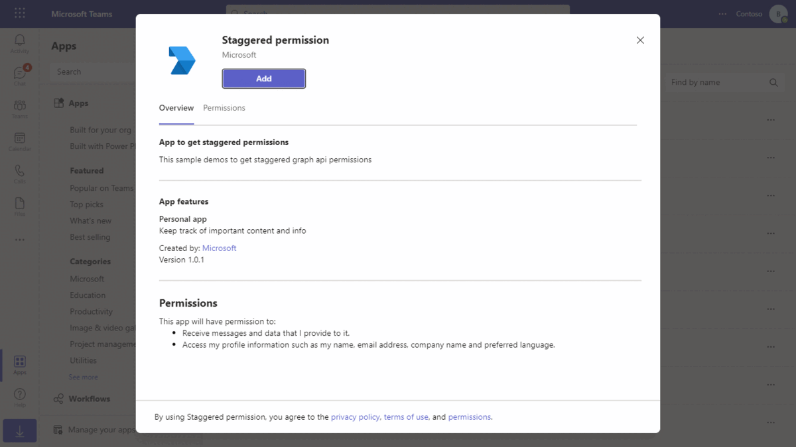
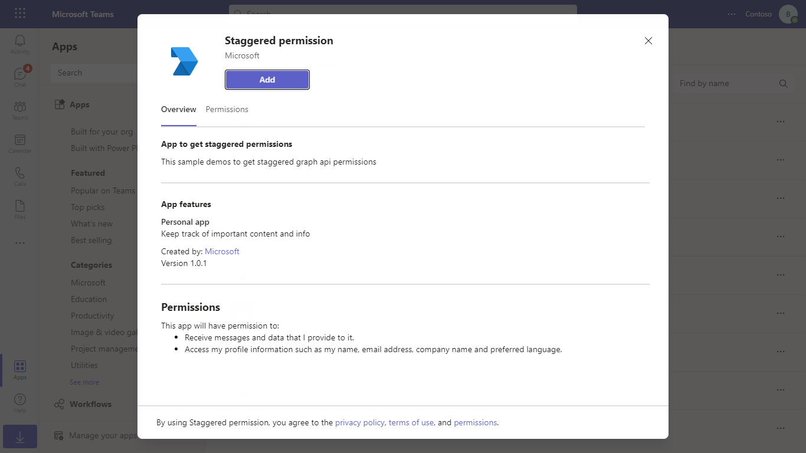
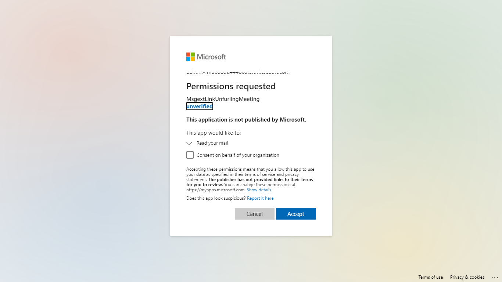
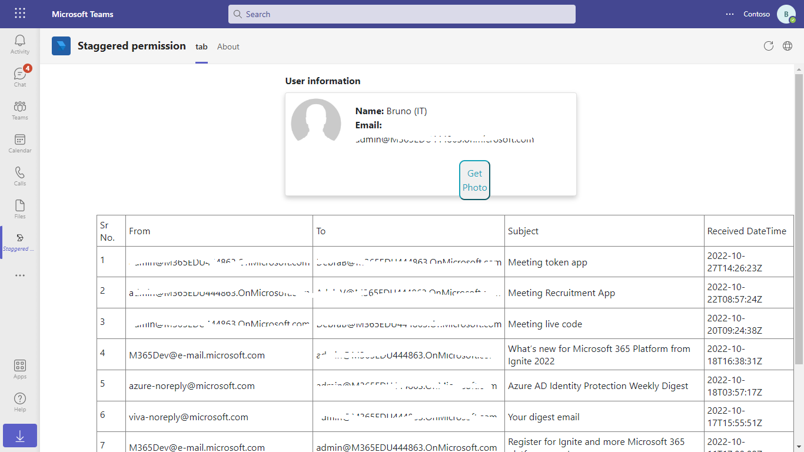
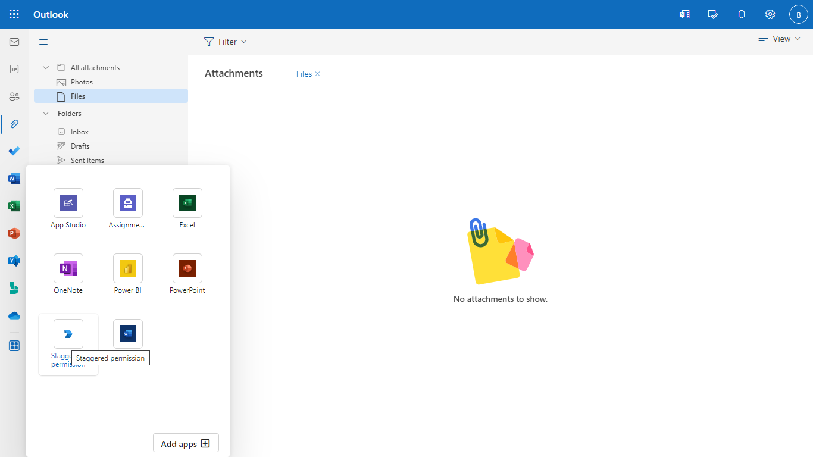
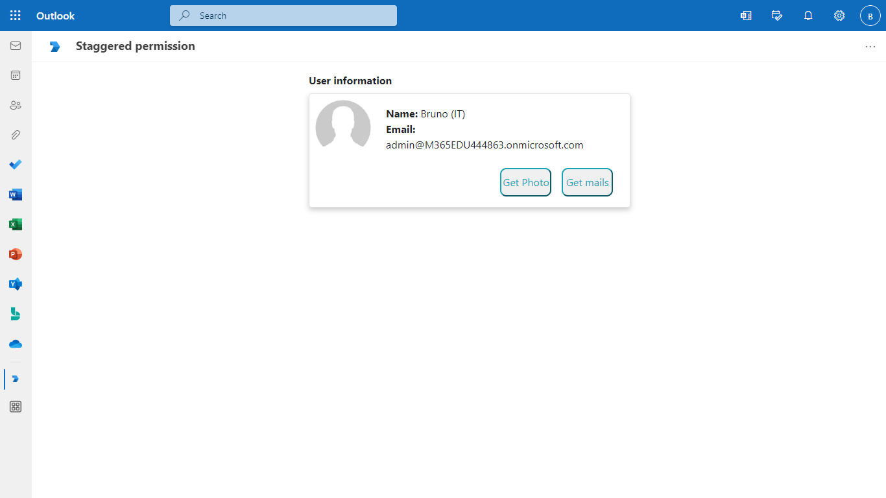
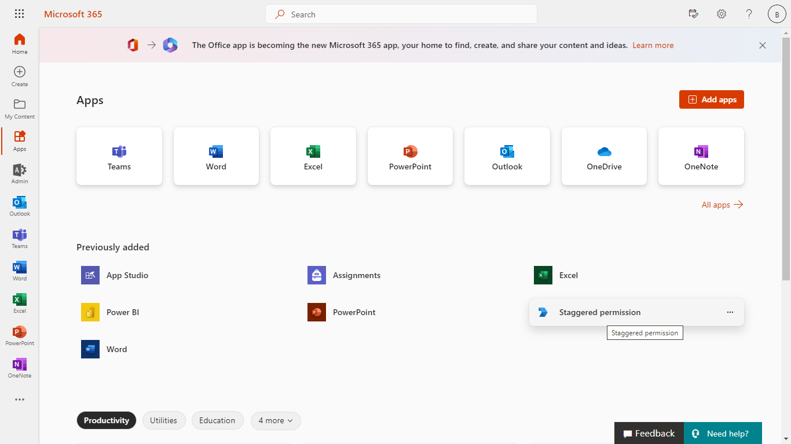
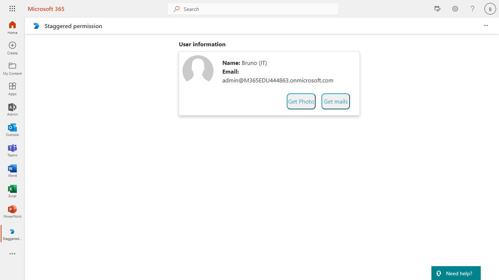
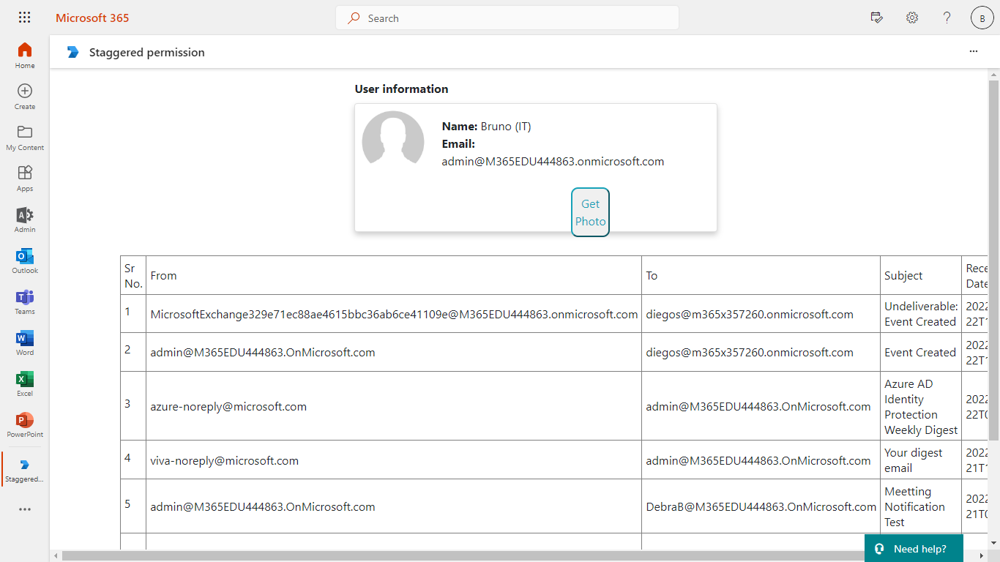

# Staggered permission sample

Using this nodejs sample, you can check how to get staggered graph api permissions

## Included Features
* Teams SSO (tabs)
* MSAL.js 2.0 support
* Graph API

## Interaction with app



## Try it yourself - experience the App in your Microsoft Teams client
Please find below demo manifest which is deployed on Microsoft Azure and you can try it yourself by uploading the app package (.zip file link below) to your teams and/or as a personal app. (Sideloading must be enabled for your tenant, [see steps here](https://docs.microsoft.com/microsoftteams/platform/concepts/build-and-test/prepare-your-o365-tenant#enable-custom-teams-apps-and-turn-on-custom-app-uploading)).

**Staggered Permission sample:** [Manifest](/samples/tab-staggered-permission/csharp/demo-manifest/tab-staggered-permission.zip)

## Prerequisites

-  Microsoft Teams is installed and you have an account (not a guest account)
-  To test locally, [NodeJS](https://nodejs.org/en/download/) must be installed on your development machine (version 16.14.2  or higher).
-  [ngrok](https://ngrok.com/download) or equivalent tunneling solution
-  [M365 developer account](https://docs.microsoft.com/microsoftteams/platform/concepts/build-and-test/prepare-your-o365-tenant) or access to a Teams account with the appropriate permissions to install an app.
- [Teams Toolkit for VS Code](https://marketplace.visualstudio.com/items?itemName=TeamsDevApp.ms-teams-vscode-extension) or [TeamsFx CLI](https://learn.microsoft.com/microsoftteams/platform/toolkit/teamsfx-cli?pivots=version-one)

## Run the app (Using Teams Toolkit for Visual Studio Code)

The simplest way to run this sample in Teams is to use Teams Toolkit for Visual Studio Code.

1. Ensure you have downloaded and installed [Visual Studio Code](https://code.visualstudio.com/docs/setup/setup-overview)
1. Install the [Teams Toolkit extension](https://marketplace.visualstudio.com/items?itemName=TeamsDevApp.ms-teams-vscode-extension)
1. Select **File > Open Folder** in VS Code and choose this samples directory from the repo
1. Using the extension, sign in with your Microsoft 365 account where you have permissions to upload custom apps
1. Select **Debug > Start Debugging** or **F5** to run the app in a Teams web client.
1. In the browser that launches, select the **Add** button to install the app to Teams.
> If you do not have permission to upload custom apps (sideloading), Teams Toolkit will recommend creating and using a Microsoft 365 Developer Program account - a free program to get your own dev environment sandbox that includes Teams.

## Setup
1. Register a new application in the [Azure Active Directory – App Registrations](https://go.microsoft.com/fwlink/?linkid=2083908) portal.
  - Select **New Registration** and on the *register an application page*, set following values:
    * Set **name** to your app name.
    * Choose the **supported account types** (any account type will work)
    * Leave **Redirect URI** empty.
    * Choose **Register**.
  - On the overview page, copy and save the **Application (client) ID, Directory (tenant) ID**. You’ll need those later when updating your Teams application manifest and in the appsettings.json.
 - Under **Manage**, select **Expose an API**. 
 - Select the **Set** link to generate the Application ID URI in the form of `api://{AppID}`. Insert your fully qualified domain name (with a forward slash "/" appended to the end) between the double forward slashes and the GUID. The entire ID should have the form of: `api://fully-qualified-domain-name/{AppID}`
    * ex: `api://%ngrokDomain%.ngrok-free.app/00000000-0000-0000-0000-000000000000`.
 - Select the **Add a scope** button. In the panel that opens, enter `access_as_user` as the **Scope name**.
 - Set **Who can consent?** to `Admins and users`
 - Fill in the fields for configuring the admin and user consent prompts with values that are appropriate for the `access_as_user` scope:
    * **Admin consent title:** Teams can access the user’s profile.
    * **Admin consent description**: Allows Teams to call the app’s web APIs as the current user.
    * **User consent title**: Teams can access the user profile and make requests on the user's behalf.
    * **User consent description:** Enable Teams to call this app’s APIs with the same rights as the user.
 - Ensure that **State** is set to **Enabled**
 - Select **Add scope**
    * The domain part of the **Scope name** displayed just below the text field should automatically match the **Application ID** URI set in the previous step, with `/access_as_user` appended to the end:
        * `api://[ngrokDomain].ngrok-free.app/00000000-0000-0000-0000-000000000000/access_as_user.
- In the **Authorized client applications** section, identify the applications that you want to authorize for your app’s web application. Each of the following IDs needs to be entered:
    * `1fec8e78-bce4-4aaf-ab1b-5451cc387264` (Teams mobile/desktop application)
    * `5e3ce6c0-2b1f-4285-8d4b-75ee78787346` (Teams web application)
**Note** If you want to test or extend your Teams apps across Office and Outlook, kindly add below client application identifiers while doing Azure AD app registration in your tenant:
   * `4765445b-32c6-49b0-83e6-1d93765276ca` (Office web)
   * `0ec893e0-5785-4de6-99da-4ed124e5296c` (Office desktop)
   * `bc59ab01-8403-45c6-8796-ac3ef710b3e3` (Outlook web)
   * `d3590ed6-52b3-4102-aeff-aad2292ab01c` (Outlook desktop)    
 - Navigate to **API Permissions**, and make sure to add the follow permissions:
 -   Select Add a permission
 -   Select Microsoft Graph -\> Delegated permissions.
    - `User.Read` (enabled by default)
 -   Click on Add permissions. Please make sure to grant the admin consent for the required permissions.
 - Navigate to **Authentication**
    If an app hasn't been granted IT admin consent, users will have to provide consent the first time they use an app.
    Set a redirect URI:
    * Select **Add a platform**.
    * Select **Single Page Application**.
    * Enter the **redirect URI** for the app in the following format: `https://{Base_Url}/auth-end`.

 - Navigate to the **Certificates & secrets**. In the Client secrets section, click on "+ New client secret". Add a description(Name of the secret) for the secret and select “Never” for Expires. Click "Add". Once the client secret is created, copy its value, it need to be placed in the appsettings.json. 

2. Setup for Bot
- In Azure portal, create a [Azure Bot resource](https://docs.microsoft.com/azure/bot-service/bot-builder-authentication?view=azure-bot-service-4.0&tabs=csharp%2Caadv2).

- Ensure that you've [enabled the Teams Channel](https://docs.microsoft.com/azure/bot-service/channel-connect-teams?view=azure-bot-service-4.0)

- To test locally, you'll need [Ngrok](https://ngrok.com/) installed on your development machine.
Make sure you've downloaded and installed Ngrok on your local machine. ngrok will tunnel requests from the Internet to your local computer and terminate the SSL connection from Teams.

3. Setup NGROK  
  Run ngrok - point to port 3978

    ```bash
    ngrok http 3978 --host-header="localhost:3978"
    ```

4. Setup for code  
  - Clone the repository

    ```bash
    git clone https://github.com/OfficeDev/Microsoft-Teams-Samples.git
    ```

  - In the folder where repository is cloned navigate to `samples\tab-staggered-permission\nodejs`
  
  -Update the `.env` configuration for the bot to use the `MicrosoftAppId`, `MicrosoftAppPassword` and `TenantId` (Note the MicrosoftAppId is the AppId created in step 1 (Setup for Bot), the MicrosoftAppPassword is referred to as the "client secret" in step 1 (Setup for Bot) and you can always create a new client secret anytime. TenantId is the id of the tenant where app is registered.) 

  - Install node modules

   Inside node js folder, open your local terminal and run the below command to install node modules. You can do the same in Visual studio code terminal by opening the project in Visual studio code 

    ```bash
    npm install
    ```

 - Run your app
 
    ```bash
    npm start
    ```

5. Setup Manifest for Teams
- __*This step is specific to Teams.*__
    - **Edit** the `manifest.json` contained in the ./Manifest folder to replace your Microsoft App Id (that was created when you registered your app registration earlier) *everywhere* you see the place holder string `{{Microsoft-App-Id}}` (depending on the scenario the Microsoft App Id may occur multiple times in the `manifest.json`)
    - **Edit** the `manifest.json` for `validDomains` and replace `{{domain-name}}` with base Url of your domain. E.g. if you are using ngrok it would be `https://1234.ngrok-free.app` then your domain-name will be `1234.ngrok-free.app`.
    -  **Edit** the `manifest.json` for `webApplicationInfo` resource `"api://{{domain-name}}/{{Microsoft-App-Id}}"` with MicrosoftAppId. E.g. `"api://ngrok-free.app/00000-0000-0000"`
    - **Note:** If you want to test your app across multi hub like: Outlook/Office.com, please update the `manifest.json` in the `tab-staggered-permission\nodejs\Manifest_Hub` folder with the required values.
    - **Zip** up the contents of the `Manifest` folder to create a `Manifest.zip` or `Manifest_Hub` folder to create a `Manifest_Hub.zip` (Make sure that zip file does not contains any subfolder otherwise you will get error while uploading your .zip package)

- Upload the manifest.zip to Teams (in the Apps view click "Upload a custom app")
   - Go to Microsoft Teams. From the lower left corner, select Apps
   - From the lower left corner, choose Upload a custom App
   - Go to your project directory, the ./Manifest folder, select the zip folder, and choose Open.
   - Select Add in the pop-up dialog box. Your app is uploaded to Teams.

## Running the sample

**Install App:**



**Tab:** 


**Consent popup for staggered permission:**
 


**User emails:**



**Get photo:**


**Get photo and User emails:**


## Outlook on the web

- To view your app in Outlook on the web.

- Go to [Outlook on the web](https://outlook.office.com/mail/)and sign in using your dev tenant account.

**On the side bar, select More Apps. Your sideloaded app title appears among your installed apps**



**Select your app icon to launch and preview your app running in Outlook on the web**



**User Info**


**Note:** Similarly, you can test your application in the Outlook desktop app as well.

## Office on the web

- To preview your app running in Office on the web.

- Log into office.com with test tenant credentials

**Select the Apps icon on the side bar. Your sideloaded app title appears among your installed apps**



**Select your app icon to launch your app in Office on the web**

 

**User Info**



**Note:** Similarly, you can test your application in the Office 365 desktop app as well.

## Deploy the bot to Azure

To learn more about deploying a bot to Azure, see [Deploy your bot to Azure](https://aka.ms/azuredeployment) for a complete list of deployment instructions.

## Further reading

- [Tabs](https://learn.microsoft.com/microsoftteams/platform/tabs/what-are-tabs)
- [Authentication basics](https://docs.microsoft.com/microsoftteams/platform/concepts/authentication/authentication)
- [Extend Teams apps across Microsoft 365](https://learn.microsoft.com/microsoftteams/platform/m365-apps/overview)


